<html><head>
<meta http-equiv="Content-Type" content="text/html; charset=windows-1252">
<meta name="Generator" content="Microsoft Word 15 (filtered)">

<!--
 /* Font Definitions */
 @font-face
	{font-family:"Cambria Math";
	panose-1:2 4 5 3 5 4 6 3 2 4;}
@font-face
	{font-family:Calibri;
	panose-1:2 15 5 2 2 2 4 3 2 4;}
@font-face
	{font-family:"Segoe UI";
	panose-1:2 11 5 2 4 2 4 2 2 3;}
@font-face
	{font-family:"Lucida Console";
	panose-1:2 11 6 9 4 5 4 2 2 4;}
 /* Style Definitions */
 p.MsoNormal, li.MsoNormal, div.MsoNormal
	{margin:0in;
	margin-bottom:.0001pt;
	font-size:12.0pt;
	font-family:"Times New Roman",serif;}
a:link, span.MsoHyperlink
	{color:blue;
	text-decoration:underline;}
a:visited, span.MsoHyperlinkFollowed
	{color:#954F72;
	text-decoration:underline;}
pre
	{mso-style-link:"HTML Preformatted Char";
	margin:0in;
	margin-bottom:.0001pt;
	font-size:10.0pt;
	font-family:"Courier New";}
p.MsoListParagraph, li.MsoListParagraph, div.MsoListParagraph
	{margin-top:0in;
	margin-right:0in;
	margin-bottom:0in;
	margin-left:.5in;
	margin-bottom:.0001pt;
	font-size:12.0pt;
	font-family:"Times New Roman",serif;}
p.MsoListParagraphCxSpFirst, li.MsoListParagraphCxSpFirst, div.MsoListParagraphCxSpFirst
	{margin-top:0in;
	margin-right:0in;
	margin-bottom:0in;
	margin-left:.5in;
	margin-bottom:.0001pt;
	font-size:12.0pt;
	font-family:"Times New Roman",serif;}
p.MsoListParagraphCxSpMiddle, li.MsoListParagraphCxSpMiddle, div.MsoListParagraphCxSpMiddle
	{margin-top:0in;
	margin-right:0in;
	margin-bottom:0in;
	margin-left:.5in;
	margin-bottom:.0001pt;
	font-size:12.0pt;
	font-family:"Times New Roman",serif;}
p.MsoListParagraphCxSpLast, li.MsoListParagraphCxSpLast, div.MsoListParagraphCxSpLast
	{margin-top:0in;
	margin-right:0in;
	margin-bottom:0in;
	margin-left:.5in;
	margin-bottom:.0001pt;
	font-size:12.0pt;
	font-family:"Times New Roman",serif;}
span.HTMLPreformattedChar
	{mso-style-name:"HTML Preformatted Char";
	mso-style-link:"HTML Preformatted";
	font-family:"Courier New";}
p.msonormal0, li.msonormal0, div.msonormal0
	{mso-style-name:msonormal;
	margin-right:0in;
	margin-left:0in;
	font-size:12.0pt;
	font-family:"Times New Roman",serif;}
span.gnkrckgcmrb
	{mso-style-name:gnkrckgcmrb;}
span.gnkrckgcgsb
	{mso-style-name:gnkrckgcgsb;}
span.gnkrckgcmsb
	{mso-style-name:gnkrckgcmsb;}
.MsoChpDefault
	{font-size:10.0pt;}
@page WordSection1
	{size:8.5in 11.0in;
	margin:1.0in 1.0in 1.0in 1.0in;}
div.WordSection1
	{page:WordSection1;}
 /* List Definitions */
 ol
	{margin-bottom:0in;}
ul
	{margin-bottom:0in;}
-->

<!--
 /* Font Definitions */
 @font-face
	{font-family:"Cambria Math";
	panose-1:2 4 5 3 5 4 6 3 2 4;
	mso-font-charset:0;
	mso-generic-font-family:roman;
	mso-font-pitch:variable;
	mso-font-signature:-536870145 1107305727 0 0 415 0;}
@font-face
	{font-family:Calibri;
	panose-1:2 15 5 2 2 2 4 3 2 4;
	mso-font-charset:0;
	mso-generic-font-family:swiss;
	mso-font-pitch:variable;
	mso-font-signature:-536859905 1073786111 1 0 511 0;}
@font-face
	{font-family:"Segoe UI";
	panose-1:2 11 5 2 4 2 4 2 2 3;
	mso-font-charset:0;
	mso-generic-font-family:swiss;
	mso-font-pitch:variable;
	mso-font-signature:-469750017 -1073683329 9 0 511 0;}
 /* Style Definitions */
 p.MsoNormal, li.MsoNormal, div.MsoNormal
	{mso-style-unhide:no;
	mso-style-qformat:yes;
	mso-style-parent:"";
	margin-top:0in;
	margin-right:0in;
	margin-bottom:8.0pt;
	margin-left:0in;
	line-height:107%;
	mso-pagination:widow-orphan;
	font-size:11.0pt;
	font-family:"Calibri",sans-serif;
	mso-ascii-font-family:Calibri;
	mso-ascii-theme-font:minor-latin;
	mso-fareast-font-family:Calibri;
	mso-fareast-theme-font:minor-latin;
	mso-hansi-font-family:Calibri;
	mso-hansi-theme-font:minor-latin;
	mso-bidi-font-family:"Times New Roman";
	mso-bidi-theme-font:minor-bidi;}
h1
	{mso-style-priority:9;
	mso-style-unhide:no;
	mso-style-qformat:yes;
	mso-style-link:"Heading 1 Char";
	mso-margin-top-alt:auto;
	margin-right:0in;
	mso-margin-bottom-alt:auto;
	margin-left:0in;
	mso-pagination:widow-orphan;
	mso-outline-level:1;
	font-size:24.0pt;
	font-family:"Times New Roman",serif;
	mso-fareast-font-family:"Times New Roman";
	font-weight:bold;}
a:link, span.MsoHyperlink
	{mso-style-noshow:yes;
	mso-style-priority:99;
	color:blue;
	text-decoration:underline;
	text-underline:single;}
a:visited, span.MsoHyperlinkFollowed
	{mso-style-noshow:yes;
	mso-style-priority:99;
	color:#954F72;
	mso-themecolor:followedhyperlink;
	text-decoration:underline;
	text-underline:single;}
p
	{mso-style-noshow:yes;
	mso-style-priority:99;
	mso-margin-top-alt:auto;
	margin-right:0in;
	mso-margin-bottom-alt:auto;
	margin-left:0in;
	mso-pagination:widow-orphan;
	font-size:12.0pt;
	font-family:"Times New Roman",serif;
	mso-fareast-font-family:"Times New Roman";}
pre
	{mso-style-noshow:yes;
	mso-style-priority:99;
	mso-style-link:"HTML Preformatted Char";
	margin:0in;
	margin-bottom:.0001pt;
	mso-pagination:widow-orphan;
	tab-stops:45.8pt 91.6pt 137.4pt 183.2pt 229.0pt 274.8pt 320.6pt 366.4pt 412.2pt 458.0pt 503.8pt 549.6pt 595.4pt 641.2pt 687.0pt 732.8pt;
	font-size:10.0pt;
	font-family:"Courier New";
	mso-fareast-font-family:"Times New Roman";}
span.HTMLPreformattedChar
	{mso-style-name:"HTML Preformatted Char";
	mso-style-noshow:yes;
	mso-style-priority:99;
	mso-style-unhide:no;
	mso-style-locked:yes;
	mso-style-link:"HTML Preformatted";
	mso-ansi-font-size:10.0pt;
	mso-bidi-font-size:10.0pt;
	font-family:"Courier New";
	mso-ascii-font-family:"Courier New";
	mso-fareast-font-family:"Times New Roman";
	mso-hansi-font-family:"Courier New";
	mso-bidi-font-family:"Courier New";}
span.gnkrckgcgsb
	{mso-style-name:gnkrckgcgsb;
	mso-style-unhide:no;}
span.Heading1Char
	{mso-style-name:"Heading 1 Char";
	mso-style-priority:9;
	mso-style-unhide:no;
	mso-style-locked:yes;
	mso-style-link:"Heading 1";
	mso-ansi-font-size:24.0pt;
	mso-bidi-font-size:24.0pt;
	font-family:"Times New Roman",serif;
	mso-ascii-font-family:"Times New Roman";
	mso-fareast-font-family:"Times New Roman";
	mso-hansi-font-family:"Times New Roman";
	mso-bidi-font-family:"Times New Roman";
	mso-font-kerning:18.0pt;
	font-weight:bold;}
span.SpellE
	{mso-style-name:"";
	mso-spl-e:yes;}
.MsoChpDefault
	{mso-style-type:export-only;
	mso-default-props:yes;
	font-family:"Calibri",sans-serif;
	mso-ascii-font-family:Calibri;
	mso-ascii-theme-font:minor-latin;
	mso-fareast-font-family:Calibri;
	mso-fareast-theme-font:minor-latin;
	mso-hansi-font-family:Calibri;
	mso-hansi-theme-font:minor-latin;
	mso-bidi-font-family:"Times New Roman";
	mso-bidi-theme-font:minor-bidi;}
.MsoPapDefault
	{mso-style-type:export-only;
	margin-bottom:8.0pt;
	line-height:107%;}
@page WordSection1
	{size:8.5in 11.0in;
	margin:1.0in 1.0in 1.0in 1.0in;
	mso-header-margin:.5in;
	mso-footer-margin:.5in;
	mso-paper-source:0;}
div.WordSection1
	{page:WordSection1;}
-->
</head>

<body vlink="#954F72" link="blue" lang="EN-US">

<b>Telco
Churn</b>

<b>Story: 14% customers left (483 of 3,333), </b>Can we use machine
learning (ML) to help inform on why they may have churned/left and reduce
future churn?<b> </b>

<b>Approach:</b>&nbsp; Use exploratory data analysis
(EDA), visualizations ML to understanding data relating to Telco churn.
Demonstrate understanding of key churn data variables and provide prediction
model for churn.

<b>Data</b> set from: <a href="https://www.kaggle.com/pangkw/telco-churn/version/3">https://www.kaggle.com/pangkw/telco-churn/version/3</a>

Understand
using ML which data features in the Telco churn are significant to predicting
churn. The data we have is 33 features with 3,333 rows/observations, of Telco
data with churn results. The data provided has <b>14% (483)</b> of the total
records that churned so this will be somewhat of a constraint in our ML
research. First to understand the data we will use tools such as R and excel to
explore. 

The
dependent variable in our exercise is the Churn value of ‘Yes’ or ‘No’, the
independent variables are the remaining data elements that may have an impact
on the dependent variable. One independent variable we can rule out is the
Phone service data element which is set to ‘Yes’ in every record, indicating it
would have no impact on the Churn since it is the same value each time. What
will be of key importance to us is will one or more independent variables show
more important than the rest.

<b>Model results</b>

<table class="MsoTableGrid" style="border-collapse:collapse;border:none" cellspacing="0" cellpadding="0" border="1">
 <tbody><tr style="height:29.2pt">
  <td style="width:2.6in;border:solid windowtext 1.0pt;
  background:#9CC2E5;padding:0in 5.4pt 0in 5.4pt;height:29.2pt" width="77" valign="top">
  
<b>Model
  Type</b>

  </td>
  <td style="width:2.6in;border:solid windowtext 1.0pt;
  border-left:none;background:#9CC2E5;padding:0in 5.4pt 0in 5.4pt;height:29.2pt" width="508" valign="top">
  
<b>Random Forest</b>

  </td>
  <td style="width:187.25pt;border:solid windowtext 1.0pt;
  border-left:none;background:#9CC2E5;padding:0in 5.4pt 0in 5.4pt;height:29.2pt" width="518" valign="top">
  
<b>‘rpart’ decision
  tree</b>

  </td>
  <td style="width:209.05pt;border:solid windowtext 1.0pt;
  border-left:none;background:#9CC2E5;padding:0in 5.4pt 0in 5.4pt;height:29.2pt" width="483" valign="top">
  
<b>Tree_model decision
  tree</b>

  </td>
 </tr>
 <tr style="height:27.65pt">
  <td style="width:2.6in;border:solid windowtext 1.0pt;
  border-top:none;background:#D0CECE;padding:0in 5.4pt 0in 5.4pt;height:27.65pt" width="77" valign="top">
  
<b>Prediction
  Accuracy</b>

  </td>
  <td style="width:2.6in;border-top:none;border-left:none;
  border-bottom:solid windowtext 1.0pt;border-right:solid windowtext 1.0pt;
  padding:0in 5.4pt 0in 5.4pt;height:27.65pt" width="508" valign="top">
  
<b>97.1%</b>

  </td>
  <td style="width:187.25pt;border-top:none;border-left:
  none;border-bottom:solid windowtext 1.0pt;border-right:solid windowtext 1.0pt;
  padding:0in 5.4pt 0in 5.4pt;height:27.65pt" width="518" valign="top">
  
<b>95.4%</b>

  </td>
  <td style="width:209.05pt;border-top:none;border-left:
  none;border-bottom:solid windowtext 1.0pt;border-right:solid windowtext 1.0pt;
  padding:0in 5.4pt 0in 5.4pt;height:27.65pt" width="483" valign="top">
  
<b>92.6%</b>

  </td>
 </tr>
 <tr style="height:86.15pt">
  <td style="width:2.6in;border:solid windowtext 1.0pt;
  border-top:none;background:#D0CECE;padding:0in 5.4pt 0in 5.4pt;height:86.15pt" width="77" valign="top">
  
<b>Most
  relevant Variables</b>

  
<b>&nbsp;</b>

  </td>
  <td style="width:2.6in;border-top:none;border-left:none;
  border-bottom:solid windowtext 1.0pt;border-right:solid windowtext 1.0pt;
  padding:0in 5.4pt 0in 5.4pt;height:86.15pt" width="508" valign="top">
  
<b>1.&nbsp;&nbsp;&nbsp;&nbsp;&nbsp;&nbsp; </b><b>Total Day minutes</b>

  
<b>2.&nbsp;&nbsp;&nbsp;&nbsp;&nbsp;&nbsp; </b><b>Customer service
  calls</b>

  
3.&nbsp;&nbsp;&nbsp;&nbsp;&nbsp;&nbsp; International plan

  
4.&nbsp;&nbsp;&nbsp;&nbsp;&nbsp;&nbsp; Tenure

  
5.&nbsp;&nbsp;&nbsp;&nbsp;&nbsp;&nbsp; Total revenue

  </td>
  <td style="width:187.25pt;border-top:none;border-left:
  none;border-bottom:solid windowtext 1.0pt;border-right:solid windowtext 1.0pt;
  padding:0in 5.4pt 0in 5.4pt;height:86.15pt" width="518" valign="top">
  
<b>1.&nbsp;&nbsp;&nbsp;&nbsp;&nbsp;&nbsp; </b><b>Total Day minutes</b>

  
<b>2.&nbsp;&nbsp;&nbsp;&nbsp;&nbsp;&nbsp; </b><b>Total Eve minutes</b>

  
3.&nbsp;&nbsp;&nbsp;&nbsp;&nbsp;&nbsp; International plan

  
4.&nbsp;&nbsp;&nbsp;&nbsp;&nbsp;&nbsp; Total International
  minutes/calls

  
<b>5.&nbsp;&nbsp;&nbsp;&nbsp;&nbsp;&nbsp; </b><b>Customer service
  calls</b>

  
&nbsp;

  </td>
  <td style="width:209.05pt;border-top:none;border-left:
  none;border-bottom:solid windowtext 1.0pt;border-right:solid windowtext 1.0pt;
  padding:0in 5.4pt 0in 5.4pt;height:86.15pt" width="483" valign="top">
  
1.&nbsp;&nbsp;&nbsp;&nbsp;&nbsp;&nbsp; Contract

  
<b>2.&nbsp;&nbsp;&nbsp;&nbsp;&nbsp;&nbsp; </b><b>Total day minutes</b>

  
<b>3.&nbsp;&nbsp;&nbsp;&nbsp;&nbsp;&nbsp; </b><b>Customer service
  calls</b>

  
<b>4.&nbsp;&nbsp;&nbsp;&nbsp;&nbsp;&nbsp; </b><b>Total Eve minutes</b>

  
5.&nbsp;&nbsp;&nbsp;&nbsp;&nbsp;&nbsp; Voice mail plan

  </td>
 </tr>
 <tr style="height:86.15pt">
  <td style="width:2.6in;border:solid windowtext 1.0pt;
  border-top:none;background:#D0CECE;padding:0in 5.4pt 0in 5.4pt;height:86.15pt" width="77" valign="top">
  
<b>Confusion
  matrix:</b>

  </td>
  <td style="width:2.6in;border-top:none;border-left:none;
  border-bottom:solid windowtext 1.0pt;border-right:solid windowtext 1.0pt;
  padding:0in 5.4pt 0in 5.4pt;height:86.15pt" width="508" valign="top">
  <table class="MsoNormalTable" style="width:290.0pt;border-collapse:collapse" width="0" cellspacing="0" cellpadding="0" border="0">
   <tbody><tr style="height:29.2pt">
    <td colspan="2" style="width:151.0pt;border:solid white 1.0pt;
    border-bottom:solid white 3.0pt;padding:.05in .1in .05in .1in;height:29.2pt" width="252" valign="top">
    
<b><u>Random Forest: Churn</u></b>

    </td>
    <td colspan="2" style="width:139.0pt;border-top:solid white 1.0pt;
    border-left:none;border-bottom:solid white 3.0pt;border-right:solid white 1.0pt;
    padding:.05in .1in .05in .1in;height:29.2pt" width="241" valign="top">
    
<b>Predicted</b>

    </td>
   </tr>
   <tr style="height:29.2pt">
    <td style="width:91.0pt;border:solid white 1.0pt;
    border-top:none;padding:.05in .1in .05in .1in;height:29.2pt" width="142" valign="top"></td>
    <td style="width:60.0pt;border-top:none;border-left:
    none;border-bottom:solid white 1.0pt;border-right:solid white 1.0pt;
    padding:.05in .1in .05in .1in;height:29.2pt" width="110" valign="top"></td>
    <td style="width:69.0pt;border-top:none;border-left:
    none;border-bottom:solid white 1.0pt;border-right:solid white 1.0pt;
    background:#9DC3E6;padding:.05in .1in .05in .1in;height:29.2pt" width="126" valign="top">
    
<b>No</b>

    </td>
    <td style="width:71.0pt;border-top:none;border-left:
    none;border-bottom:solid white 1.0pt;border-right:solid white 1.0pt;
    background:#9DC3E6;padding:.05in .1in .05in .1in;height:29.2pt" width="115" valign="top">
    
<b>Yes</b>

    </td>
   </tr>
   <tr style="height:29.2pt">
    <td rowspan="2" style="width:91.0pt;border:solid white 1.0pt;
    border-top:none;background:#9DC3E6;padding:.05in .1in .05in .1in;
    height:29.2pt" width="142" valign="top">
    
<b>Actual</b>

    </td>
    <td style="width:60.0pt;border-top:none;border-left:
    none;border-bottom:solid white 1.0pt;border-right:solid white 1.0pt;
    background:#9DC3E6;padding:.05in .1in .05in .1in;height:29.2pt" width="110" valign="top">
    
<b>No</b>

    </td>
    <td style="width:69.0pt;border-top:none;border-left:
    none;border-bottom:solid white 1.0pt;border-right:solid white 1.0pt;
    background:#22698C;padding:.05in .1in .05in .1in;height:29.2pt" width="126" valign="top">
    
<b>1,970</b>

    </td>
    <td style="width:71.0pt;border-top:none;border-left:
    none;border-bottom:solid white 1.0pt;border-right:solid white 1.0pt;
    background:black;padding:.05in .1in .05in .1in;height:29.2pt" width="115" valign="top">
    
<b>31</b>

    </td>
   </tr>
   <tr style="height:27.55pt">
    <td style="width:60.0pt;border-top:none;border-left:
    none;border-bottom:solid white 1.0pt;border-right:solid white 1.0pt;
    background:#9DC3E6;padding:.05in .1in .05in .1in;height:27.55pt" width="110" valign="top">
    
<b>Yes</b>

    </td>
    <td style="width:69.0pt;border-top:none;border-left:
    none;border-bottom:solid white 1.0pt;border-right:solid white 1.0pt;
    background:black;padding:.05in .1in .05in .1in;height:27.55pt" width="126" valign="top">
    
<b>132</b>

    </td>
    <td style="width:71.0pt;border-top:none;border-left:
    none;border-bottom:solid white 1.0pt;border-right:solid white 1.0pt;
    background:#22698C;padding:.05in .1in .05in .1in;height:27.55pt" width="115" valign="top">
    
<b>200</b>

    </td>
   </tr>
   <tr style="height:27.55pt">
    <td colspan="4" style="width:290.0pt;border:solid white 1.0pt;
    border-top:none;padding:.05in .1in .05in .1in;height:27.55pt" width="492" valign="top">
    
<b>Total&nbsp; 2,233</b>

    </td>
   </tr>
   <tr style="height:27.55pt">
    <td colspan="4" style="width:290.0pt;border:solid white 1.0pt;
    border-top:none;padding:.05in .1in .05in .1in;height:27.55pt" width="492" valign="top">
    
<b>&nbsp;</b>

    

    </td>
   </tr>
  </tbody></table>
  </td>
  <td style="width:187.25pt;border-top:none;border-left:
  none;border-bottom:solid windowtext 1.0pt;border-right:solid windowtext 1.0pt;
  padding:0in 5.4pt 0in 5.4pt;height:86.15pt" width="518" valign="top">
  <table class="MsoNormalTable" style="width:290.0pt;border-collapse:collapse" width="0" cellspacing="0" cellpadding="0" border="0">
   <tbody><tr style="height:29.2pt">
    <td colspan="2" style="width:151.0pt;border:solid white 1.0pt;
    border-bottom:solid white 3.0pt;padding:.05in .1in .05in .1in;height:29.2pt" width="257" valign="top">
    
<b><u>Rpart: Churn</u></b>

    </td>
    <td colspan="2" style="width:139.0pt;border-top:solid white 1.0pt;
    border-left:none;border-bottom:solid white 3.0pt;border-right:solid white 1.0pt;
    padding:.05in .1in .05in .1in;height:29.2pt" width="246" valign="top">
    
<b>Predicted</b>

    </td>
   </tr>
   <tr style="height:29.2pt">
    <td style="width:91.0pt;border:solid white 1.0pt;
    border-top:none;padding:.05in .1in .05in .1in;height:29.2pt" width="145" valign="top"></td>
    <td style="width:60.0pt;border-top:none;border-left:
    none;border-bottom:solid white 1.0pt;border-right:solid white 1.0pt;
    padding:.05in .1in .05in .1in;height:29.2pt" width="112" valign="top"></td>
    <td style="width:69.0pt;border-top:none;border-left:
    none;border-bottom:solid white 1.0pt;border-right:solid white 1.0pt;
    background:#9DC3E6;padding:.05in .1in .05in .1in;height:29.2pt" width="128" valign="top">
    
<b>No</b>

    </td>
    <td style="width:71.0pt;border-top:none;border-left:
    none;border-bottom:solid white 1.0pt;border-right:solid white 1.0pt;
    background:#9DC3E6;padding:.05in .1in .05in .1in;height:29.2pt" width="117" valign="top">
    
<b>Yes</b>

    </td>
   </tr>
   <tr style="height:29.2pt">
    <td rowspan="2" style="width:91.0pt;border:solid white 1.0pt;
    border-top:none;background:#9DC3E6;padding:.05in .1in .05in .1in;
    height:29.2pt" width="145" valign="top">
    
<b>Actual</b>

    </td>
    <td style="width:60.0pt;border-top:none;border-left:
    none;border-bottom:solid white 1.0pt;border-right:solid white 1.0pt;
    background:#9DC3E6;padding:.05in .1in .05in .1in;height:29.2pt" width="112" valign="top">
    
<b>No</b>

    </td>
    <td style="width:69.0pt;border-top:none;border-left:
    none;border-bottom:solid white 1.0pt;border-right:solid white 1.0pt;
    background:#22698C;padding:.05in .1in .05in .1in;height:29.2pt" width="128" valign="top">
    
<b>1,409</b>

    </td>
    <td style="width:71.0pt;border-top:none;border-left:
    none;border-bottom:solid white 1.0pt;border-right:solid white 1.0pt;
    background:black;padding:.05in .1in .05in .1in;height:29.2pt" width="117" valign="top">
    
<b>16</b>

    </td>
   </tr>
   <tr style="height:27.55pt">
    <td style="width:60.0pt;border-top:none;border-left:
    none;border-bottom:solid white 1.0pt;border-right:solid white 1.0pt;
    background:#9DC3E6;padding:.05in .1in .05in .1in;height:27.55pt" width="112" valign="top">
    
<b>Yes</b>

    </td>
    <td style="width:69.0pt;border-top:none;border-left:
    none;border-bottom:solid white 1.0pt;border-right:solid white 1.0pt;
    background:black;padding:.05in .1in .05in .1in;height:27.55pt" width="128" valign="top">
    
<b>60</b>

    </td>
    <td style="width:71.0pt;border-top:none;border-left:
    none;border-bottom:solid white 1.0pt;border-right:solid white 1.0pt;
    background:#22698C;padding:.05in .1in .05in .1in;height:27.55pt" width="117" valign="top">
    
<b>182</b>

    </td>
   </tr>
   <tr style="height:27.55pt">
    <td colspan="4" style="width:290.0pt;border:solid white 1.0pt;
    border-top:none;padding:.05in .1in .05in .1in;height:27.55pt" width="502" valign="top">
    
<b>Total&nbsp; 1,667</b>

    </td>
   </tr>
   <tr style="height:27.55pt">
    <td colspan="4" style="width:290.0pt;border:solid white 1.0pt;
    border-top:none;padding:.05in .1in .05in .1in;height:27.55pt" width="502" valign="top">
    
<b>&nbsp;</b>

    
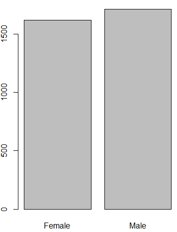

    </td>
   </tr>
  </tbody></table>
  </td>
  <td style="width:209.05pt;border-top:none;border-left:
  none;border-bottom:solid windowtext 1.0pt;border-right:solid windowtext 1.0pt;
  padding:0in 5.4pt 0in 5.4pt;height:86.15pt" width="483" valign="top">
  <table class="MsoNormalTable" style="width:290.0pt;border-collapse:collapse" width="0" cellspacing="0" cellpadding="0" border="0">
   <tbody><tr style="height:29.2pt">
    <td colspan="2" style="width:151.0pt;border:solid white 1.0pt;
    border-bottom:solid white 3.0pt;padding:.05in .1in .05in .1in;height:29.2pt" width="196" valign="top">
    
<u>Tree Model: Churn</u>

    </td>
    <td colspan="2" style="width:139.0pt;border-top:solid white 1.0pt;
    border-left:none;border-bottom:solid white 3.0pt;border-right:solid white 1.0pt;
    padding:.05in .1in .05in .1in;height:29.2pt" width="191" valign="top">
    
<b>Predicted</b>

    </td>
   </tr>
   <tr style="height:29.2pt">
    <td style="width:91.0pt;border:solid white 1.0pt;
    border-top:none;padding:.05in .1in .05in .1in;height:29.2pt" width="108" valign="top"></td>
    <td style="width:60.0pt;border-top:none;border-left:
    none;border-bottom:solid white 1.0pt;border-right:solid white 1.0pt;
    padding:.05in .1in .05in .1in;height:29.2pt" width="88" valign="top"></td>
    <td style="width:69.0pt;border-top:none;border-left:
    none;border-bottom:solid white 1.0pt;border-right:solid white 1.0pt;
    background:#9DC3E6;padding:.05in .1in .05in .1in;height:29.2pt" width="101" valign="top">
    
<b>No</b>

    </td>
    <td style="width:71.0pt;border-top:none;border-left:
    none;border-bottom:solid white 1.0pt;border-right:solid white 1.0pt;
    background:#9DC3E6;padding:.05in .1in .05in .1in;height:29.2pt" width="90" valign="top">
    
<b>Yes</b>

    </td>
   </tr>
   <tr style="height:29.2pt">
    <td rowspan="2" style="width:91.0pt;border:solid white 1.0pt;
    border-top:none;background:#9DC3E6;padding:.05in .1in .05in .1in;
    height:29.2pt" width="108" valign="top">
    
<b>Actual</b>

    </td>
    <td style="width:60.0pt;border-top:none;border-left:
    none;border-bottom:solid white 1.0pt;border-right:solid white 1.0pt;
    background:#9DC3E6;padding:.05in .1in .05in .1in;height:29.2pt" width="88" valign="top">
    
<b>No</b>

    </td>
    <td style="width:69.0pt;border-top:none;border-left:
    none;border-bottom:solid white 1.0pt;border-right:solid white 1.0pt;
    background:#22698C;padding:.05in .1in .05in .1in;height:29.2pt" width="101" valign="top">
    
<b>1,371</b>

    </td>
    <td style="width:71.0pt;border-top:none;border-left:
    none;border-bottom:solid white 1.0pt;border-right:solid white 1.0pt;
    background:black;padding:.05in .1in .05in .1in;height:29.2pt" width="90" valign="top">
    
<b>54</b>

    </td>
   </tr>
   <tr style="height:27.55pt">
    <td style="width:60.0pt;border-top:none;border-left:
    none;border-bottom:solid white 1.0pt;border-right:solid white 1.0pt;
    background:#9DC3E6;padding:.05in .1in .05in .1in;height:27.55pt" width="88" valign="top">
    
<b>Yes</b>

    </td>
    <td style="width:69.0pt;border-top:none;border-left:
    none;border-bottom:solid white 1.0pt;border-right:solid white 1.0pt;
    background:black;padding:.05in .1in .05in .1in;height:27.55pt" width="101" valign="top">
    
<b>68</b>

    </td>
    <td style="width:71.0pt;border-top:none;border-left:
    none;border-bottom:solid white 1.0pt;border-right:solid white 1.0pt;
    background:#22698C;padding:.05in .1in .05in .1in;height:27.55pt" width="90" valign="top">
    
<b>174</b>

    </td>
   </tr>
   <tr style="height:27.55pt">
    <td colspan="4" style="width:290.0pt;border:solid white 1.0pt;
    border-top:none;padding:.05in .1in .05in .1in;height:27.55pt" width="387" valign="top">
    
<b>Total&nbsp; 1,667</b>

    
<b>&nbsp;</b>

    
<b>&nbsp;</b>

    </td>
   </tr>
  </tbody></table>
  

  </td>
 </tr>
</tbody></table>

&nbsp;

<b>Recommendations and usage scenarios:</b>

<b>1.&nbsp;&nbsp;&nbsp;&nbsp;&nbsp; </b>The
models could be used on new customers to understand if they may be more likely
to churn

<b>2.&nbsp;&nbsp;&nbsp;&nbsp;&nbsp; </b>The
models agree on many of the same data elements having significance to churn

<b>a.&nbsp;&nbsp;&nbsp;&nbsp;&nbsp; </b>Understand
and promote those features that are significant factors to churn behavior.

<b>Follow up and additional recommended work:</b>

1.&nbsp;&nbsp;&nbsp;&nbsp;&nbsp; Principle
Component Analysis (PCA) code is included and working

2.&nbsp;&nbsp;&nbsp;&nbsp;&nbsp; Next
step of combining the PCA and sending PCA data in the Tree based models is a
next step

3.&nbsp;&nbsp;&nbsp;&nbsp;&nbsp; Logistics
regression code is included. Model was run but accuracy was so low that it
isn’t included in the results

a.&nbsp;&nbsp;&nbsp;&nbsp;&nbsp;&nbsp; Accuracy
could be low because of the number of independent variables in the data. 

b.&nbsp;&nbsp;&nbsp;&nbsp;&nbsp; Research
indicated that with so many independent variables the Tree based models would
be the best approach for machine learning.

<b>References:</b>

1.&nbsp;&nbsp;&nbsp;&nbsp;&nbsp;
Cirillo, A. (2017). <i>R Data Mining.</i> Birmingham, UK. Packt
Publishing

2.&nbsp;&nbsp;&nbsp;&nbsp;&nbsp;
Lantz, B. (2015). <i>Machine Learning with R - Second Edition.</i>
Birmingham, UK. Packt Publishing

3.&nbsp;&nbsp;&nbsp;&nbsp;&nbsp;
Schmuller, J. (2018). <i>R Projects For Dummies</i>.
Hoboken, NJ. John Wiley &amp; Sons Inc.

4.&nbsp;&nbsp;&nbsp;&nbsp;&nbsp;
PCA example<b> </b><a href="https://www.analyticsvidhya.com/blog/2016/03/practical-guide-principal-component-analysis-python/">https://www.analyticsvidhya.com/blog/2016/03/practical-guide-principal-component-analysis-python/</a>

<b>5.&nbsp;&nbsp;&nbsp;&nbsp;&nbsp;
</b>Logistic regression sample <b>&nbsp;</b><a href="https://www.r-bloggers.com/how-to-perform-a-logistic-regression-in-r/">https://www.r-bloggers.com/how-to-perform-a-logistic-regression-in-r/</a>

6.&nbsp;&nbsp;&nbsp;&nbsp;&nbsp;
Tree based modeling tutorial <a href="https://www.analyticsvidhya.com/blog/2016/04/complete-tutorial-tree-based-modeling-scratch-in-python/">https://www.analyticsvidhya.com/blog/2016/04/complete-tutorial-tree-based-modeling-scratch-in-python/</a>&nbsp;&nbsp; --- Tree base modeling tutorial

7.&nbsp;&nbsp;&nbsp;&nbsp;&nbsp;
Titanic Tutorial for R uses cool examples and graphics for decision
trees: <a href="https://trevorstephens.com/kaggle-titanic-tutorial/getting-started-with-r/">https://trevorstephens.com/kaggle-titanic-tutorial/getting-started-with-r/</a>

8.&nbsp;&nbsp;&nbsp;&nbsp;&nbsp;
Example project from past practicum that I am using as a layout
reference. Please advise if this example has issues you would recommend
improvements on. 

<a href="https://github.com/KeanuNotReeves/practicum-trad-projections">https://github.com/KeanuNotReeves/practicum-trad-projections</a>

9.&nbsp;&nbsp;&nbsp;&nbsp;&nbsp;
Basic R example for decision tree:&nbsp; <a href="https://rpubs.com/SANPANDE/221595">https://rpubs.com/SANPANDE/221595</a>

10.&nbsp; My
Github for Practicum 2: <a href="https://github.com/mdegrado/TelcoChurn">https://github.com/mdegrado/TelcoChurn</a>&nbsp;
- In Progress

11.&nbsp; My
Gibhub for Practicum 1: <a href="https://github.com/mdegrado/Wine-reviews-analysis-and-visualization">https://github.com/mdegrado/Wine-reviews-analysis-and-visualization</a>

<b>Appendix</b>

<b>&nbsp;</b>

<b>The Data: Results from EDA:</b>

<table class="MsoTableGrid" style="border-collapse:collapse;border:none" cellspacing="0" cellpadding="0" border="1">
 <tbody><tr style="height:15.75pt">
  <td style="width:131.0pt;border:solid windowtext 1.0pt;
  padding:0in 5.4pt 0in 5.4pt;height:15.75pt" width="175" valign="top" nowrap="nowrap">
  
<b>Data
  fields</b>

  </td>
  <td style="width:202.0pt;border:solid windowtext 1.0pt;
  border-left:none;padding:0in 5.4pt 0in 5.4pt;height:15.75pt" width="269" valign="top" nowrap="nowrap">
  
<b>Definition</b>

  </td>
  <td style="width:141.0pt;border:solid windowtext 1.0pt;
  border-left:none;padding:0in 5.4pt 0in 5.4pt;height:15.75pt" width="188" valign="top" nowrap="nowrap">
  
<b>Example
  data</b>

  </td>
 </tr>
 <tr style="height:15.0pt">
  <td style="width:131.0pt;border:solid windowtext 1.0pt;
  border-top:none;padding:0in 5.4pt 0in 5.4pt;height:15.0pt" width="175" valign="top" nowrap="nowrap">
  
<b>customerID</b>

  </td>
  <td style="width:202.0pt;border-top:none;
  border-left:none;border-bottom:solid windowtext 1.0pt;border-right:solid windowtext 1.0pt;
  padding:0in 5.4pt 0in 5.4pt;height:15.0pt" width="269" valign="top" nowrap="nowrap">
  
Unique
  ID for customer

  </td>
  <td style="width:141.0pt;border-top:none;border-left:
  none;border-bottom:solid windowtext 1.0pt;border-right:solid windowtext 1.0pt;
  padding:0in 5.4pt 0in 5.4pt;height:15.0pt" width="188" valign="top">
  
0002-ORFBO

  </td>
 </tr>
 <tr style="height:15.0pt">
  <td style="width:131.0pt;border:solid windowtext 1.0pt;
  border-top:none;padding:0in 5.4pt 0in 5.4pt;height:15.0pt" width="175" valign="top" nowrap="nowrap">
  
<b>gender</b>

  </td>
  <td style="width:202.0pt;border-top:none;
  border-left:none;border-bottom:solid windowtext 1.0pt;border-right:solid windowtext 1.0pt;
  padding:0in 5.4pt 0in 5.4pt;height:15.0pt" width="269" valign="top" nowrap="nowrap">
  
has:&nbsp;
  Male or Female

  </td>
  <td style="width:141.0pt;border-top:none;border-left:
  none;border-bottom:solid windowtext 1.0pt;border-right:solid windowtext 1.0pt;
  padding:0in 5.4pt 0in 5.4pt;height:15.0pt" width="188" valign="top">
  
Female

  </td>
 </tr>
 <tr style="height:15.0pt">
  <td style="width:131.0pt;border:solid windowtext 1.0pt;
  border-top:none;padding:0in 5.4pt 0in 5.4pt;height:15.0pt" width="175" valign="top" nowrap="nowrap">
  
<b>SeniorCitizen</b>

  </td>
  <td style="width:202.0pt;border-top:none;
  border-left:none;border-bottom:solid windowtext 1.0pt;border-right:solid windowtext 1.0pt;
  padding:0in 5.4pt 0in 5.4pt;height:15.0pt" width="269" valign="top" nowrap="nowrap">
  
has:
  0 or 1

  </td>
  <td style="width:141.0pt;border-top:none;border-left:
  none;border-bottom:solid windowtext 1.0pt;border-right:solid windowtext 1.0pt;
  padding:0in 5.4pt 0in 5.4pt;height:15.0pt" width="188" valign="top">
  
0

  </td>
 </tr>
 <tr style="height:15.0pt">
  <td style="width:131.0pt;border:solid windowtext 1.0pt;
  border-top:none;padding:0in 5.4pt 0in 5.4pt;height:15.0pt" width="175" valign="top" nowrap="nowrap">
  
<b>MaritalStatus</b>

  </td>
  <td style="width:202.0pt;border-top:none;
  border-left:none;border-bottom:solid windowtext 1.0pt;border-right:solid windowtext 1.0pt;
  padding:0in 5.4pt 0in 5.4pt;height:15.0pt" width="269" valign="top" nowrap="nowrap">
  
has
  Yes or No

  </td>
  <td style="width:141.0pt;border-top:none;border-left:
  none;border-bottom:solid windowtext 1.0pt;border-right:solid windowtext 1.0pt;
  padding:0in 5.4pt 0in 5.4pt;height:15.0pt" width="188" valign="top">
  
Yes

  </td>
 </tr>
 <tr style="height:15.0pt">
  <td style="width:131.0pt;border:solid windowtext 1.0pt;
  border-top:none;padding:0in 5.4pt 0in 5.4pt;height:15.0pt" width="175" valign="top" nowrap="nowrap">
  
<b>Dependents</b>

  </td>
  <td style="width:202.0pt;border-top:none;
  border-left:none;border-bottom:solid windowtext 1.0pt;border-right:solid windowtext 1.0pt;
  padding:0in 5.4pt 0in 5.4pt;height:15.0pt" width="269" valign="top" nowrap="nowrap">
  
has
  Yes or No

  </td>
  <td style="width:141.0pt;border-top:none;border-left:
  none;border-bottom:solid windowtext 1.0pt;border-right:solid windowtext 1.0pt;
  padding:0in 5.4pt 0in 5.4pt;height:15.0pt" width="188" valign="top">
  
Yes

  </td>
 </tr>
 <tr style="height:15.0pt">
  <td style="width:131.0pt;border:solid windowtext 1.0pt;
  border-top:none;padding:0in 5.4pt 0in 5.4pt;height:15.0pt" width="175" valign="top" nowrap="nowrap">
  
<b>tenure</b>

  </td>
  <td style="width:202.0pt;border-top:none;
  border-left:none;border-bottom:solid windowtext 1.0pt;border-right:solid windowtext 1.0pt;
  padding:0in 5.4pt 0in 5.4pt;height:15.0pt" width="269" valign="top" nowrap="nowrap">
  
ranges
  from 0 to 72

  </td>
  <td style="width:141.0pt;border-top:none;border-left:
  none;border-bottom:solid windowtext 1.0pt;border-right:solid windowtext 1.0pt;
  padding:0in 5.4pt 0in 5.4pt;height:15.0pt" width="188" valign="top">
  
9

  </td>
 </tr>
 <tr style="height:15.0pt">
  <td style="width:131.0pt;border:solid windowtext 1.0pt;
  border-top:none;padding:0in 5.4pt 0in 5.4pt;height:15.0pt" width="175" valign="top" nowrap="nowrap">
  
<b>PhoneService</b>

  </td>
  <td style="width:202.0pt;border-top:none;
  border-left:none;border-bottom:solid windowtext 1.0pt;border-right:solid windowtext 1.0pt;
  padding:0in 5.4pt 0in 5.4pt;height:15.0pt" width="269" valign="top" nowrap="nowrap">
  
all
  records set to yes

  </td>
  <td style="width:141.0pt;border-top:none;border-left:
  none;border-bottom:solid windowtext 1.0pt;border-right:solid windowtext 1.0pt;
  padding:0in 5.4pt 0in 5.4pt;height:15.0pt" width="188" valign="top">
  
Yes

  </td>
 </tr>
 <tr style="height:15.0pt">
  <td style="width:131.0pt;border:solid windowtext 1.0pt;
  border-top:none;padding:0in 5.4pt 0in 5.4pt;height:15.0pt" width="175" valign="top" nowrap="nowrap">
  
<b>MultipleLines</b>

  </td>
  <td style="width:202.0pt;border-top:none;
  border-left:none;border-bottom:solid windowtext 1.0pt;border-right:solid windowtext 1.0pt;
  padding:0in 5.4pt 0in 5.4pt;height:15.0pt" width="269" valign="top" nowrap="nowrap">
  
has
  Yes or No

  </td>
  <td style="width:141.0pt;border-top:none;border-left:
  none;border-bottom:solid windowtext 1.0pt;border-right:solid windowtext 1.0pt;
  padding:0in 5.4pt 0in 5.4pt;height:15.0pt" width="188" valign="top">
  
No

  </td>
 </tr>
 <tr style="height:15.0pt">
  <td style="width:131.0pt;border:solid windowtext 1.0pt;
  border-top:none;padding:0in 5.4pt 0in 5.4pt;height:15.0pt" width="175" valign="top" nowrap="nowrap">
  
<b>InternetService</b>

  </td>
  <td style="width:202.0pt;border-top:none;
  border-left:none;border-bottom:solid windowtext 1.0pt;border-right:solid windowtext 1.0pt;
  padding:0in 5.4pt 0in 5.4pt;height:15.0pt" width="269" valign="top" nowrap="nowrap">
  
has
  DSL, Fiber optic, No

  </td>
  <td style="width:141.0pt;border-top:none;border-left:
  none;border-bottom:solid windowtext 1.0pt;border-right:solid windowtext 1.0pt;
  padding:0in 5.4pt 0in 5.4pt;height:15.0pt" width="188" valign="top">
  
DSL

  </td>
 </tr>
 <tr style="height:15.0pt">
  <td style="width:131.0pt;border:solid windowtext 1.0pt;
  border-top:none;padding:0in 5.4pt 0in 5.4pt;height:15.0pt" width="175" valign="top" nowrap="nowrap">
  
<b>OnlineSecurity</b>

  </td>
  <td style="width:202.0pt;border-top:none;
  border-left:none;border-bottom:solid windowtext 1.0pt;border-right:solid windowtext 1.0pt;
  padding:0in 5.4pt 0in 5.4pt;height:15.0pt" width="269" valign="top" nowrap="nowrap">
  
has
  No, No Internet service, Yes

  </td>
  <td style="width:141.0pt;border-top:none;border-left:
  none;border-bottom:solid windowtext 1.0pt;border-right:solid windowtext 1.0pt;
  padding:0in 5.4pt 0in 5.4pt;height:15.0pt" width="188" valign="top">
  
No

  </td>
 </tr>
 <tr style="height:15.0pt">
  <td style="width:131.0pt;border:solid windowtext 1.0pt;
  border-top:none;padding:0in 5.4pt 0in 5.4pt;height:15.0pt" width="175" valign="top" nowrap="nowrap">
  
<b>OnlineBackup</b>

  </td>
  <td style="width:202.0pt;border-top:none;
  border-left:none;border-bottom:solid windowtext 1.0pt;border-right:solid windowtext 1.0pt;
  padding:0in 5.4pt 0in 5.4pt;height:15.0pt" width="269" valign="top" nowrap="nowrap">
  
has
  No, No Internet service, Yes

  </td>
  <td style="width:141.0pt;border-top:none;border-left:
  none;border-bottom:solid windowtext 1.0pt;border-right:solid windowtext 1.0pt;
  padding:0in 5.4pt 0in 5.4pt;height:15.0pt" width="188" valign="top">
  
Yes

  </td>
 </tr>
 <tr style="height:15.0pt">
  <td style="width:131.0pt;border:solid windowtext 1.0pt;
  border-top:none;padding:0in 5.4pt 0in 5.4pt;height:15.0pt" width="175" valign="top" nowrap="nowrap">
  
<b>DeviceProtection</b>

  </td>
  <td style="width:202.0pt;border-top:none;
  border-left:none;border-bottom:solid windowtext 1.0pt;border-right:solid windowtext 1.0pt;
  padding:0in 5.4pt 0in 5.4pt;height:15.0pt" width="269" valign="top" nowrap="nowrap">
  
has
  No, No Internet service, Yes

  </td>
  <td style="width:141.0pt;border-top:none;border-left:
  none;border-bottom:solid windowtext 1.0pt;border-right:solid windowtext 1.0pt;
  padding:0in 5.4pt 0in 5.4pt;height:15.0pt" width="188" valign="top">
  
No

  </td>
 </tr>
 <tr style="height:15.0pt">
  <td style="width:131.0pt;border:solid windowtext 1.0pt;
  border-top:none;padding:0in 5.4pt 0in 5.4pt;height:15.0pt" width="175" valign="top" nowrap="nowrap">
  
<b>TechSupport</b>

  </td>
  <td style="width:202.0pt;border-top:none;
  border-left:none;border-bottom:solid windowtext 1.0pt;border-right:solid windowtext 1.0pt;
  padding:0in 5.4pt 0in 5.4pt;height:15.0pt" width="269" valign="top" nowrap="nowrap">
  
has
  No, No Internet service, Yes

  </td>
  <td style="width:141.0pt;border-top:none;border-left:
  none;border-bottom:solid windowtext 1.0pt;border-right:solid windowtext 1.0pt;
  padding:0in 5.4pt 0in 5.4pt;height:15.0pt" width="188" valign="top">
  
Yes

  </td>
 </tr>
 <tr style="height:15.0pt">
  <td style="width:131.0pt;border:solid windowtext 1.0pt;
  border-top:none;padding:0in 5.4pt 0in 5.4pt;height:15.0pt" width="175" valign="top" nowrap="nowrap">
  
<b>StreamingTV</b>

  </td>
  <td style="width:202.0pt;border-top:none;
  border-left:none;border-bottom:solid windowtext 1.0pt;border-right:solid windowtext 1.0pt;
  padding:0in 5.4pt 0in 5.4pt;height:15.0pt" width="269" valign="top" nowrap="nowrap">
  
has
  No, No Internet service, Yes

  </td>
  <td style="width:141.0pt;border-top:none;border-left:
  none;border-bottom:solid windowtext 1.0pt;border-right:solid windowtext 1.0pt;
  padding:0in 5.4pt 0in 5.4pt;height:15.0pt" width="188" valign="top">
  
Yes

  </td>
 </tr>
 <tr style="height:15.0pt">
  <td style="width:131.0pt;border:solid windowtext 1.0pt;
  border-top:none;padding:0in 5.4pt 0in 5.4pt;height:15.0pt" width="175" valign="top" nowrap="nowrap">
  
<b>StreamingMovies</b>

  </td>
  <td style="width:202.0pt;border-top:none;
  border-left:none;border-bottom:solid windowtext 1.0pt;border-right:solid windowtext 1.0pt;
  padding:0in 5.4pt 0in 5.4pt;height:15.0pt" width="269" valign="top" nowrap="nowrap">
  
has
  No, No Internet service, Yes

  </td>
  <td style="width:141.0pt;border-top:none;border-left:
  none;border-bottom:solid windowtext 1.0pt;border-right:solid windowtext 1.0pt;
  padding:0in 5.4pt 0in 5.4pt;height:15.0pt" width="188" valign="top">
  
No

  </td>
 </tr>
 <tr style="height:15.0pt">
  <td style="width:131.0pt;border:solid windowtext 1.0pt;
  border-top:none;padding:0in 5.4pt 0in 5.4pt;height:15.0pt" width="175" valign="top" nowrap="nowrap">
  
<b>Contract</b>

  </td>
  <td style="width:202.0pt;border-top:none;
  border-left:none;border-bottom:solid windowtext 1.0pt;border-right:solid windowtext 1.0pt;
  padding:0in 5.4pt 0in 5.4pt;height:15.0pt" width="269" valign="top" nowrap="nowrap">
  
has
  Month-to-month, One year, Two year

  </td>
  <td style="width:141.0pt;border-top:none;border-left:
  none;border-bottom:solid windowtext 1.0pt;border-right:solid windowtext 1.0pt;
  padding:0in 5.4pt 0in 5.4pt;height:15.0pt" width="188" valign="top">
  
One
  year

  </td>
 </tr>
 <tr style="height:15.0pt">
  <td style="width:131.0pt;border:solid windowtext 1.0pt;
  border-top:none;padding:0in 5.4pt 0in 5.4pt;height:15.0pt" width="175" valign="top" nowrap="nowrap">
  
<b>PaperlessBilling</b>

  </td>
  <td style="width:202.0pt;border-top:none;
  border-left:none;border-bottom:solid windowtext 1.0pt;border-right:solid windowtext 1.0pt;
  padding:0in 5.4pt 0in 5.4pt;height:15.0pt" width="269" valign="top" nowrap="nowrap">
  
has
  Yes or No

  </td>
  <td style="width:141.0pt;border-top:none;border-left:
  none;border-bottom:solid windowtext 1.0pt;border-right:solid windowtext 1.0pt;
  padding:0in 5.4pt 0in 5.4pt;height:15.0pt" width="188" valign="top">
  
Yes

  </td>
 </tr>
 <tr style="height:45.0pt">
  <td style="width:131.0pt;border:solid windowtext 1.0pt;
  border-top:none;padding:0in 5.4pt 0in 5.4pt;height:45.0pt" width="175" valign="top" nowrap="nowrap">
  
<b>PaymentMethod</b>

  </td>
  <td style="width:202.0pt;border-top:none;border-left:
  none;border-bottom:solid windowtext 1.0pt;border-right:solid windowtext 1.0pt;
  padding:0in 5.4pt 0in 5.4pt;height:45.0pt" width="269" valign="top">
  
has
  Bank transfer (automatic), Credit card (automatic), Electronic check, Mailed
  check

  </td>
  <td style="width:141.0pt;border-top:none;border-left:
  none;border-bottom:solid windowtext 1.0pt;border-right:solid windowtext 1.0pt;
  padding:0in 5.4pt 0in 5.4pt;height:45.0pt" width="188" valign="top">
  
Mailed
  check

  </td>
 </tr>
 <tr style="height:15.0pt">
  <td style="width:131.0pt;border:solid windowtext 1.0pt;
  border-top:none;padding:0in 5.4pt 0in 5.4pt;height:15.0pt" width="175" valign="top" nowrap="nowrap">
  
<b>InternationalPlan</b>

  </td>
  <td style="width:202.0pt;border-top:none;
  border-left:none;border-bottom:solid windowtext 1.0pt;border-right:solid windowtext 1.0pt;
  padding:0in 5.4pt 0in 5.4pt;height:15.0pt" width="269" valign="top" nowrap="nowrap">
  
has
  Yes or No

  </td>
  <td style="width:141.0pt;border-top:none;border-left:
  none;border-bottom:solid windowtext 1.0pt;border-right:solid windowtext 1.0pt;
  padding:0in 5.4pt 0in 5.4pt;height:15.0pt" width="188" valign="top">
  
No

  </td>
 </tr>
 <tr style="height:15.0pt">
  <td style="width:131.0pt;border:solid windowtext 1.0pt;
  border-top:none;padding:0in 5.4pt 0in 5.4pt;height:15.0pt" width="175" valign="top" nowrap="nowrap">
  
<b>VoiceMailPlan</b>

  </td>
  <td style="width:202.0pt;border-top:none;
  border-left:none;border-bottom:solid windowtext 1.0pt;border-right:solid windowtext 1.0pt;
  padding:0in 5.4pt 0in 5.4pt;height:15.0pt" width="269" valign="top" nowrap="nowrap">
  
has
  Yes or No

  </td>
  <td style="width:141.0pt;border-top:none;border-left:
  none;border-bottom:solid windowtext 1.0pt;border-right:solid windowtext 1.0pt;
  padding:0in 5.4pt 0in 5.4pt;height:15.0pt" width="188" valign="top">
  
No

  </td>
 </tr>
 <tr style="height:15.0pt">
  <td style="width:131.0pt;border:solid windowtext 1.0pt;
  border-top:none;padding:0in 5.4pt 0in 5.4pt;height:15.0pt" width="175" valign="top" nowrap="nowrap">
  
<b>NumbervMailMessages</b>

  </td>
  <td style="width:202.0pt;border-top:none;
  border-left:none;border-bottom:solid windowtext 1.0pt;border-right:solid windowtext 1.0pt;
  padding:0in 5.4pt 0in 5.4pt;height:15.0pt" width="269" valign="top" nowrap="nowrap">
  
ranges
  0 to 51

  </td>
  <td style="width:141.0pt;border-top:none;border-left:
  none;border-bottom:solid windowtext 1.0pt;border-right:solid windowtext 1.0pt;
  padding:0in 5.4pt 0in 5.4pt;height:15.0pt" width="188" valign="top">
  
0

  </td>
 </tr>
 <tr style="height:15.0pt">
  <td style="width:131.0pt;border:solid windowtext 1.0pt;
  border-top:none;padding:0in 5.4pt 0in 5.4pt;height:15.0pt" width="175" valign="top" nowrap="nowrap">
  
<b>TotalDayMinutes</b>

  </td>
  <td style="width:202.0pt;border-top:none;
  border-left:none;border-bottom:solid windowtext 1.0pt;border-right:solid windowtext 1.0pt;
  padding:0in 5.4pt 0in 5.4pt;height:15.0pt" width="269" valign="top" nowrap="nowrap">
  
ranges
  0 to 350.8

  </td>
  <td style="width:141.0pt;border-top:none;border-left:
  none;border-bottom:solid windowtext 1.0pt;border-right:solid windowtext 1.0pt;
  padding:0in 5.4pt 0in 5.4pt;height:15.0pt" width="188" valign="top">
  
168.8

  </td>
 </tr>
 <tr style="height:15.0pt">
  <td style="width:131.0pt;border:solid windowtext 1.0pt;
  border-top:none;padding:0in 5.4pt 0in 5.4pt;height:15.0pt" width="175" valign="top" nowrap="nowrap">
  
<b>TotalDayCalls</b>

  </td>
  <td style="width:202.0pt;border-top:none;
  border-left:none;border-bottom:solid windowtext 1.0pt;border-right:solid windowtext 1.0pt;
  padding:0in 5.4pt 0in 5.4pt;height:15.0pt" width="269" valign="top" nowrap="nowrap">
  
ranges
  0 to 165

  </td>
  <td style="width:141.0pt;border-top:none;border-left:
  none;border-bottom:solid windowtext 1.0pt;border-right:solid windowtext 1.0pt;
  padding:0in 5.4pt 0in 5.4pt;height:15.0pt" width="188" valign="top">
  
137

  </td>
 </tr>
 <tr style="height:15.0pt">
  <td style="width:131.0pt;border:solid windowtext 1.0pt;
  border-top:none;padding:0in 5.4pt 0in 5.4pt;height:15.0pt" width="175" valign="top" nowrap="nowrap">
  
<b>TotalEveMinutes</b>

  </td>
  <td style="width:202.0pt;border-top:none;
  border-left:none;border-bottom:solid windowtext 1.0pt;border-right:solid windowtext 1.0pt;
  padding:0in 5.4pt 0in 5.4pt;height:15.0pt" width="269" valign="top" nowrap="nowrap">
  
ranges
  0 to 363.7

  </td>
  <td style="width:141.0pt;border-top:none;border-left:
  none;border-bottom:solid windowtext 1.0pt;border-right:solid windowtext 1.0pt;
  padding:0in 5.4pt 0in 5.4pt;height:15.0pt" width="188" valign="top">
  
241.4

  </td>
 </tr>
 <tr style="height:15.0pt">
  <td style="width:131.0pt;border:solid windowtext 1.0pt;
  border-top:none;padding:0in 5.4pt 0in 5.4pt;height:15.0pt" width="175" valign="top" nowrap="nowrap">
  
<b>TotalEveCalls</b>

  </td>
  <td style="width:202.0pt;border-top:none;
  border-left:none;border-bottom:solid windowtext 1.0pt;border-right:solid windowtext 1.0pt;
  padding:0in 5.4pt 0in 5.4pt;height:15.0pt" width="269" valign="top" nowrap="nowrap">
  
ranges
  0-170

  </td>
  <td style="width:141.0pt;border-top:none;border-left:
  none;border-bottom:solid windowtext 1.0pt;border-right:solid windowtext 1.0pt;
  padding:0in 5.4pt 0in 5.4pt;height:15.0pt" width="188" valign="top">
  
107

  </td>
 </tr>
 <tr style="height:15.0pt">
  <td style="width:131.0pt;border:solid windowtext 1.0pt;
  border-top:none;padding:0in 5.4pt 0in 5.4pt;height:15.0pt" width="175" valign="top" nowrap="nowrap">
  
<b>TotalNightMinutes</b>

  </td>
  <td style="width:202.0pt;border-top:none;
  border-left:none;border-bottom:solid windowtext 1.0pt;border-right:solid windowtext 1.0pt;
  padding:0in 5.4pt 0in 5.4pt;height:15.0pt" width="269" valign="top" nowrap="nowrap">
  
ranges
  23.2 to 395

  </td>
  <td style="width:141.0pt;border-top:none;border-left:
  none;border-bottom:solid windowtext 1.0pt;border-right:solid windowtext 1.0pt;
  padding:0in 5.4pt 0in 5.4pt;height:15.0pt" width="188" valign="top">
  
204.8

  </td>
 </tr>
 <tr style="height:15.0pt">
  <td style="width:131.0pt;border:solid windowtext 1.0pt;
  border-top:none;padding:0in 5.4pt 0in 5.4pt;height:15.0pt" width="175" valign="top" nowrap="nowrap">
  
<b>TotalNightCalls</b>

  </td>
  <td style="width:202.0pt;border-top:none;
  border-left:none;border-bottom:solid windowtext 1.0pt;border-right:solid windowtext 1.0pt;
  padding:0in 5.4pt 0in 5.4pt;height:15.0pt" width="269" valign="top" nowrap="nowrap">
  
ranges
  33 to 175

  </td>
  <td style="width:141.0pt;border-top:none;border-left:
  none;border-bottom:solid windowtext 1.0pt;border-right:solid windowtext 1.0pt;
  padding:0in 5.4pt 0in 5.4pt;height:15.0pt" width="188" valign="top">
  
106

  </td>
 </tr>
 <tr style="height:15.0pt">
  <td style="width:131.0pt;border:solid windowtext 1.0pt;
  border-top:none;padding:0in 5.4pt 0in 5.4pt;height:15.0pt" width="175" valign="top" nowrap="nowrap">
  
<b>TotalIntlMinutes</b>

  </td>
  <td style="width:202.0pt;border-top:none;
  border-left:none;border-bottom:solid windowtext 1.0pt;border-right:solid windowtext 1.0pt;
  padding:0in 5.4pt 0in 5.4pt;height:15.0pt" width="269" valign="top" nowrap="nowrap">
  
ranges
  0 to 20

  </td>
  <td style="width:141.0pt;border-top:none;border-left:
  none;border-bottom:solid windowtext 1.0pt;border-right:solid windowtext 1.0pt;
  padding:0in 5.4pt 0in 5.4pt;height:15.0pt" width="188" valign="top">
  
15.5

  </td>
 </tr>
 <tr style="height:15.0pt">
  <td style="width:131.0pt;border:solid windowtext 1.0pt;
  border-top:none;padding:0in 5.4pt 0in 5.4pt;height:15.0pt" width="175" valign="top" nowrap="nowrap">
  
<b>TotalIntlCalls</b>

  </td>
  <td style="width:202.0pt;border-top:none;
  border-left:none;border-bottom:solid windowtext 1.0pt;border-right:solid windowtext 1.0pt;
  padding:0in 5.4pt 0in 5.4pt;height:15.0pt" width="269" valign="top" nowrap="nowrap">
  
range
  0 to 20

  </td>
  <td style="width:141.0pt;border-top:none;border-left:
  none;border-bottom:solid windowtext 1.0pt;border-right:solid windowtext 1.0pt;
  padding:0in 5.4pt 0in 5.4pt;height:15.0pt" width="188" valign="top">
  
4

  </td>
 </tr>
 <tr style="height:15.0pt">
  <td style="width:131.0pt;border:solid windowtext 1.0pt;
  border-top:none;padding:0in 5.4pt 0in 5.4pt;height:15.0pt" width="175" valign="top" nowrap="nowrap">
  
<b>CustomerServiceCalls</b>

  </td>
  <td style="width:202.0pt;border-top:none;
  border-left:none;border-bottom:solid windowtext 1.0pt;border-right:solid windowtext 1.0pt;
  padding:0in 5.4pt 0in 5.4pt;height:15.0pt" width="269" valign="top" nowrap="nowrap">
  
ranges
  0 to 20

  </td>
  <td style="width:141.0pt;border-top:none;border-left:
  none;border-bottom:solid windowtext 1.0pt;border-right:solid windowtext 1.0pt;
  padding:0in 5.4pt 0in 5.4pt;height:15.0pt" width="188" valign="top">
  
0

  </td>
 </tr>
 <tr style="height:15.0pt">
  <td style="width:131.0pt;border:solid windowtext 1.0pt;
  border-top:none;padding:0in 5.4pt 0in 5.4pt;height:15.0pt" width="175" valign="top" nowrap="nowrap">
  
<b>TotalCall</b>

  </td>
  <td style="width:202.0pt;border-top:none;
  border-left:none;border-bottom:solid windowtext 1.0pt;border-right:solid windowtext 1.0pt;
  padding:0in 5.4pt 0in 5.4pt;height:15.0pt" width="269" valign="top" nowrap="nowrap">
  
ranges
  194 to 418

  </td>
  <td style="width:141.0pt;border-top:none;border-left:
  none;border-bottom:solid windowtext 1.0pt;border-right:solid windowtext 1.0pt;
  padding:0in 5.4pt 0in 5.4pt;height:15.0pt" width="188" valign="top">
  
354

  </td>
 </tr>
 <tr style="height:15.0pt">
  <td style="width:131.0pt;border:solid windowtext 1.0pt;
  border-top:none;padding:0in 5.4pt 0in 5.4pt;height:15.0pt" width="175" valign="top" nowrap="nowrap">
  
<b>TotalRevenue</b>

  </td>
  <td style="width:202.0pt;border-top:none;
  border-left:none;border-bottom:solid windowtext 1.0pt;border-right:solid windowtext 1.0pt;
  padding:0in 5.4pt 0in 5.4pt;height:15.0pt" width="269" valign="top" nowrap="nowrap">
  
ranges
  18.8 to 8476.5, 5 NA's

  </td>
  <td style="width:141.0pt;border-top:none;border-left:
  none;border-bottom:solid windowtext 1.0pt;border-right:solid windowtext 1.0pt;
  padding:0in 5.4pt 0in 5.4pt;height:15.0pt" width="188" valign="top">
  
593.3

  </td>
 </tr>
 <tr style="height:15.75pt">
  <td style="width:131.0pt;border:solid windowtext 1.0pt;
  border-top:none;padding:0in 5.4pt 0in 5.4pt;height:15.75pt" width="175" valign="top" nowrap="nowrap">
  
<b>Churn</b>

  </td>
  <td style="width:202.0pt;border-top:none;
  border-left:none;border-bottom:solid windowtext 1.0pt;border-right:solid windowtext 1.0pt;
  padding:0in 5.4pt 0in 5.4pt;height:15.75pt" width="269" valign="top" nowrap="nowrap">
  
has
  Yes or No

  </td>
  <td style="width:141.0pt;border-top:none;border-left:
  none;border-bottom:solid windowtext 1.0pt;border-right:solid windowtext 1.0pt;
  padding:0in 5.4pt 0in 5.4pt;height:15.75pt" width="188" valign="top">
  
No

  </td>
 </tr>
</tbody></table>

&nbsp;

<b>R code and graphics from the EDA activities</b>

&nbsp;

<table class="MsoTableGrid" style="width:499.25pt;border-collapse:collapse;border:none" width="0" cellspacing="0" cellpadding="0" border="1">
 <tbody><tr>
  <td colspan="3" style="width:499.25pt;border:solid windowtext 1.0pt;
  padding:0in 5.4pt 0in 5.4pt" width="666" valign="top">
  
Exploratory
  Data Analysis (EDA)

  </td>
 </tr>
 <tr>
  <td style="width:93.5pt;border:solid windowtext 1.0pt;
  border-top:none;padding:0in 5.4pt 0in 5.4pt" width="125" valign="top">
  
&nbsp;

  </td>
  <td style="width:177.3pt;border-top:none;border-left:
  none;border-bottom:solid windowtext 1.0pt;border-right:solid windowtext 1.0pt;
  padding:0in 5.4pt 0in 5.4pt" width="236" valign="top">
  
Excel
  pivot

  </td>
  <td style="width:228.45pt;border-top:none;border-left:
  none;border-bottom:solid windowtext 1.0pt;border-right:solid windowtext 1.0pt;
  padding:0in 5.4pt 0in 5.4pt" width="305" valign="top">
  
<b><u>#R
  plot</u></b>

  
TCD
  &lt;- read.csv("C:/Users/mdegra200/Documents/P2/TCD.csv")

  
df_TCD
  = data.frame(TCD)

  
attach(df_TCD)

  
plot(gender)

  
&nbsp;

  </td>
 </tr>
 <tr>
  <td style="width:93.5pt;border:solid windowtext 1.0pt;
  border-top:none;padding:0in 5.4pt 0in 5.4pt" width="125" valign="top">
  
Gender

  
&nbsp;

  </td>
  <td style="width:177.3pt;border-top:none;border-left:
  none;border-bottom:solid windowtext 1.0pt;border-right:solid windowtext 1.0pt;
  padding:0in 5.4pt 0in 5.4pt" width="236" valign="top">
  

  </td>
  <td style="width:228.45pt;border-top:none;border-left:
  none;border-bottom:solid windowtext 1.0pt;border-right:solid windowtext 1.0pt;
  padding:0in 5.4pt 0in 5.4pt" width="305" valign="top">
  
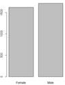

  </td>
 </tr>
 <tr>
  <td style="width:93.5pt;border:solid windowtext 1.0pt;
  border-top:none;padding:0in 5.4pt 0in 5.4pt" width="125" valign="top">
  
SeniorCitizen

  </td>
  <td style="width:177.3pt;border-top:none;border-left:
  none;border-bottom:solid windowtext 1.0pt;border-right:solid windowtext 1.0pt;
  padding:0in 5.4pt 0in 5.4pt" width="236" valign="top">
  
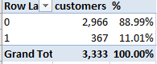

  </td>
  <td style="width:228.45pt;border-top:none;border-left:
  none;border-bottom:solid windowtext 1.0pt;border-right:solid windowtext 1.0pt;
  padding:0in 5.4pt 0in 5.4pt" width="305" valign="top">
  
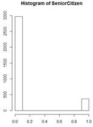

  
Hist(SeniorCitizen)

  </td>
 </tr>
 <tr>
  <td style="width:93.5pt;border:solid windowtext 1.0pt;
  border-top:none;padding:0in 5.4pt 0in 5.4pt" width="125" valign="top">
  
MaritalStatus

  </td>
  <td style="width:177.3pt;border-top:none;border-left:
  none;border-bottom:solid windowtext 1.0pt;border-right:solid windowtext 1.0pt;
  padding:0in 5.4pt 0in 5.4pt" width="236" valign="top">
  

  </td>
  <td style="width:228.45pt;border-top:none;border-left:
  none;border-bottom:solid windowtext 1.0pt;border-right:solid windowtext 1.0pt;
  padding:0in 5.4pt 0in 5.4pt" width="305" valign="top">
  

  </td>
 </tr>
 <tr>
  <td style="width:93.5pt;border:solid windowtext 1.0pt;
  border-top:none;padding:0in 5.4pt 0in 5.4pt" width="125" valign="top">
  
&nbsp;

  </td>
  <td style="width:177.3pt;border-top:none;border-left:
  none;border-bottom:solid windowtext 1.0pt;border-right:solid windowtext 1.0pt;
  padding:0in 5.4pt 0in 5.4pt" width="236" valign="top">
  
&nbsp;

  </td>
  <td style="width:228.45pt;border-top:none;border-left:
  none;border-bottom:solid windowtext 1.0pt;border-right:solid windowtext 1.0pt;
  padding:0in 5.4pt 0in 5.4pt" width="305" valign="top">
  
&nbsp;

  </td>
 </tr>
 <tr>
  <td style="width:93.5pt;border:solid windowtext 1.0pt;
  border-top:none;padding:0in 5.4pt 0in 5.4pt" width="125" valign="top">
  
&nbsp;

  </td>
  <td style="width:177.3pt;border-top:none;border-left:
  none;border-bottom:solid windowtext 1.0pt;border-right:solid windowtext 1.0pt;
  padding:0in 5.4pt 0in 5.4pt" width="236" valign="top">
  
&nbsp;

  </td>
  <td style="width:228.45pt;border-top:none;border-left:
  none;border-bottom:solid windowtext 1.0pt;border-right:solid windowtext 1.0pt;
  padding:0in 5.4pt 0in 5.4pt" width="305" valign="top">
  
&nbsp;

  </td>
 </tr>
</tbody></table>

&nbsp;

&nbsp;

&nbsp;

&nbsp;

<table class="MsoTableGrid" style="border-collapse:collapse;border:none" cellspacing="0" cellpadding="0" border="1">
 <tbody><tr>
  <td style="width:467.5pt;border:solid windowtext 1.0pt;
  padding:0in 5.4pt 0in 5.4pt" width="1126" valign="top">
  
This
  could take all day. So instead I run the following command:

  
summary(df_TCD)
  #Summarizes the data in the data frame

  
&nbsp;

  
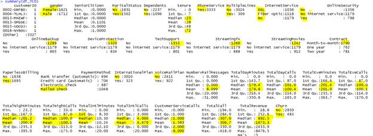

  
Gives
  me the contents and breakdown for the categorical fields

  
Gives
  me some interesting stats like Min,Max and quartiles on the continuous fields

  
Removed
  Nulls from Total revenue manually since there were only 5 of them. I set them
  to 0.

  
&nbsp;

  </td>
 </tr>
 <tr>
  <td style="width:467.5pt;border:solid windowtext 1.0pt;
  border-top:none;padding:0in 5.4pt 0in 5.4pt" width="1126" valign="top">
  <table class="MsoNormalTable" style="width:633.75pt;background:white" width="0" cellspacing="0" cellpadding="0" border="0">
   <tbody><tr>
    <td style="padding:0in 0in 6.0pt 4.5pt" valign="top">
    
str(df_TCD)

    
'data.frame':&nbsp; 3333 obs.
    of&nbsp; 33 variables:

    
&nbsp;$ customerID&nbsp;&nbsp;&nbsp;&nbsp;&nbsp;&nbsp;&nbsp;&nbsp;&nbsp; :
    Factor w/ 3333 levels "0002-ORFBO","0004-TLHLJ",..: 1 2
    3 4 5 6 7 8 9 10 ...

    
&nbsp;$ gender&nbsp;&nbsp;&nbsp;&nbsp;&nbsp;&nbsp;&nbsp;&nbsp;&nbsp;&nbsp;&nbsp;&nbsp;&nbsp; :
    Factor w/ 2 levels "Female","Male": 1 2 1 1 1 1 1 2 1 1
    ...

    
&nbsp;$ SeniorCitizen&nbsp;&nbsp;&nbsp;&nbsp;&nbsp;&nbsp; :
    int&nbsp; 0 0 0 1 1 0 1 1 0 0 ...

    
&nbsp;$ MaritalStatus&nbsp;&nbsp;&nbsp;&nbsp;&nbsp;&nbsp; :
    Factor w/ 2 levels "No","Yes": 2 1 1 2 1 2 1 1 1 2 ...

    
&nbsp;$ Dependents&nbsp;&nbsp;&nbsp;&nbsp;&nbsp;&nbsp;&nbsp;&nbsp;&nbsp; :
    Factor w/ 2 levels "No","Yes": 2 1 2 1 1 1 1 1 1 2 ...

    
&nbsp;$ tenure&nbsp;&nbsp;&nbsp;&nbsp;&nbsp;&nbsp;&nbsp;&nbsp;&nbsp;&nbsp;&nbsp;&nbsp;&nbsp; :
    int&nbsp; 9 4 9 71 7 5 1 45 3 4 ...

    
&nbsp;$ PhoneService&nbsp;&nbsp;&nbsp;&nbsp;&nbsp;&nbsp;&nbsp; :
    Factor w/ 1 level "Yes": 1 1 1 1 1 1 1 1 1 1 ...

    
&nbsp;$ MultipleLines&nbsp;&nbsp;&nbsp;&nbsp;&nbsp;&nbsp; :
    Factor w/ 2 levels "No","Yes": 1 1 1 1 1 1 2 1 1 1 ...

    
&nbsp;$ InternetService&nbsp;&nbsp;&nbsp;&nbsp; :
    Factor w/ 3 levels "DSL","Fiber optic",..: 1 2 1 2 1 2
    2 1 3 3 ...

    
&nbsp;$ OnlineSecurity&nbsp;&nbsp;&nbsp;&nbsp;&nbsp; :
    Factor w/ 3 levels "No","No internet service",..: 1 1 1
    3 3 1 1 3 2 2 ...

    
&nbsp;$ OnlineBackup&nbsp;&nbsp;&nbsp;&nbsp;&nbsp;&nbsp;&nbsp; :
    Factor w/ 3 levels "No","No internet service",..: 3 1 1
    3 1 1 1 1 2 2 ...

    
&nbsp;$ DeviceProtection&nbsp;&nbsp;&nbsp; :
    Factor w/ 3 levels "No","No internet service",..: 1 3 1
    3 1 1 1 3 2 2 ...

    
&nbsp;$ TechSupport&nbsp;&nbsp;&nbsp;&nbsp;&nbsp;&nbsp;&nbsp;&nbsp; :
    Factor w/ 3 levels "No","No internet service",..: 3 1 3
    3 1 1 1 1 2 2 ...

    
&nbsp;$ StreamingTV&nbsp;&nbsp;&nbsp;&nbsp;&nbsp;&nbsp;&nbsp;&nbsp; :
    Factor w/ 3 levels "No","No internet service",..: 3 1 3
    3 1 1 1 1 2 2 ...

    
&nbsp;$ StreamingMovies&nbsp;&nbsp;&nbsp;&nbsp; :
    Factor w/ 3 levels "No","No internet service",..: 1 1 3
    3 1 1 1 3 2 2 ...

    
&nbsp;$ Contract&nbsp;&nbsp;&nbsp;&nbsp;&nbsp;&nbsp;&nbsp;&nbsp;&nbsp;&nbsp;&nbsp; :
    Factor w/ 3 levels "Month-to-month",..: 2 1 1 3 1 1 1 2 1 1 ...

    
&nbsp;$ PaperlessBilling&nbsp;&nbsp;&nbsp; :
    Factor w/ 2 levels "No","Yes": 2 2 2 2 2 2 2 1 1 1 ...

    
&nbsp;$ PaymentMethod&nbsp;&nbsp;&nbsp;&nbsp;&nbsp;&nbsp; :
    Factor w/ 4 levels "Bank transfer (automatic)",..: 4 3 2 1 3 3 3
    2 4 4 ...

    
&nbsp;$ InternationalPlan&nbsp;&nbsp; :
    Factor w/ 2 levels "No","Yes": 1 2 1 1 1 1 2 1 1 1 ...

    
&nbsp;$ VoiceMailPlan&nbsp;&nbsp;&nbsp;&nbsp;&nbsp;&nbsp; :
    Factor w/ 2 levels "No","Yes": 1 1 2 1 1 1 1 1 1 1 ...

    
&nbsp;$ NumbervMailMessages :
    int&nbsp; 0 0 36 0 0 0 0 0 0 0 ...

    
&nbsp;$ TotalDayMinutes&nbsp;&nbsp;&nbsp;&nbsp; :
    num&nbsp; 168.8 122.2 178.7 190.2 67.7 ...

    
&nbsp;$ TotalDayCalls&nbsp;&nbsp;&nbsp;&nbsp;&nbsp;&nbsp; :
    int&nbsp; 137 112 134 68 68 95 55 133 158 99 ...

    
&nbsp;$ TotalEveMinutes&nbsp;&nbsp;&nbsp;&nbsp; :
    num&nbsp; 241 132 179 262 196 ...

    
&nbsp;$ TotalEveCalls&nbsp;&nbsp;&nbsp;&nbsp;&nbsp;&nbsp; :
    int&nbsp; 107 94 102 64 86 128 124 86 120 93 ...

    
&nbsp;$ TotalNightMinutes&nbsp;&nbsp; :
    num&nbsp; 205 170 127 130 236 ...

    
&nbsp;$ TotalNightCalls&nbsp;&nbsp;&nbsp;&nbsp; :
    int&nbsp; 106 106 82 92 137 105 81 80 46 106 ...

    
&nbsp;$ TotalIntlMinutes&nbsp;&nbsp;&nbsp; :
    num&nbsp; 15.5 10.3 8 8.8 12 12.9 10 11.5 12.4 8 ...

    
&nbsp;$ TotalIntlCalls&nbsp;&nbsp;&nbsp;&nbsp;&nbsp; :
    int&nbsp; 4 9 4 4 2 5 7 3 3 4 ...

    
&nbsp;$ CustomerServiceCalls:
    int&nbsp; 0 5 2 0 1 3 3 0 1 1 ...

    
&nbsp;$ TotalCall&nbsp;&nbsp;&nbsp;&nbsp;&nbsp;&nbsp;&nbsp;&nbsp;&nbsp;&nbsp; :
    int&nbsp; 354 326 324 228 294 336 270 302 328 303 ...

    
&nbsp;$ TotalRevenue&nbsp;&nbsp;&nbsp;&nbsp;&nbsp;&nbsp;&nbsp; :
    num&nbsp; 593 281 572 7904 340 ...

    
&nbsp;$ Churn&nbsp;&nbsp;&nbsp;&nbsp;&nbsp;&nbsp;&nbsp;&nbsp;&nbsp;&nbsp;&nbsp;&nbsp;&nbsp;&nbsp; :
    Factor w/ 2 levels "No","Yes": 1 2 1 1 1 1 1 2 1 2 ...

    </td>
   </tr>
   <tr>
    <td style="padding:0in 0in 6.0pt 4.5pt" valign="top"></td>
   </tr>
   <tr>
    <td style="padding:0in 0in 6.0pt 4.5pt" valign="top">
    <table class="MsoNormalTable" style="width:629.25pt" width="0" cellspacing="0" cellpadding="0" border="0">
     <tbody><tr>
      <td style="width:.75pt;padding:0in 0in 0in 0in" width="839" valign="top">
      
&nbsp;

      </td>
     </tr>
    </tbody></table>
    </td>
   </tr>
  </tbody></table>
  </td>
 </tr>
 <tr>
  <td style="width:467.5pt;border:solid windowtext 1.0pt;
  border-top:none;padding:0in 5.4pt 0in 5.4pt" width="1126" valign="top">
  
describe(df_TCD) # advantage
  over summary()? Shows distinct,missing,descriptive

  
&nbsp;

  
Sample:

  
&nbsp;

  
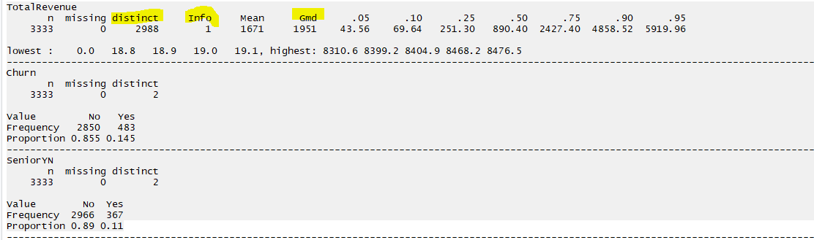

  
&nbsp;

  
&nbsp;

  <pre style="line-height:11.25pt;background:white;word-break:break-all">var(df_TCD_thin) #shows variance within the data</pre>
  
&nbsp;

  </td>
 </tr>
</tbody></table>

&nbsp;

<b>Data cleansing needed</b>

1.&nbsp;&nbsp;&nbsp;&nbsp;&nbsp; <b>SeniorCitizen
</b>is stored as 1 or 0, I would like that to change to Yes or No to fit with
rest of Y/N attributes like Marital status, Children etc.

<b>2.&nbsp;&nbsp;&nbsp;&nbsp;&nbsp; </b><b>PhoneService
</b>is always set to know which is possibly responsible for my decision tree
error of needing more factor levels. I am going to remove it and try.

<b>3.&nbsp;&nbsp;&nbsp;&nbsp;&nbsp; </b><b>TotalRevenue
</b>has some Null values which I need to replace with zeros or averages.

&nbsp;

Simple tree comparison, playing around

<table class="MsoTableGrid" style="border-collapse:collapse;border:none" cellspacing="0" cellpadding="0" border="1">
 <tbody><tr>
  <td style="width:233.75pt;border:solid windowtext 1.0pt;
  padding:0in 5.4pt 0in 5.4pt" width="583" valign="top">
  
Splits
  on Contract

  
$SeniorYN+$gender+$MaritalStatus+$Dependents+$MultipleLines+$InternetService+$OnlineSecurity

  
+$OnlineBackup+$DeviceProtection+$TechSupport+$StreamingTV+$StreamingMovies+$Contract

  
+$PaperlessBilling+$PaymentMethod+$InternationalPlan+$VoiceMailPlan

  </td>
  <td style="width:233.75pt;border:solid windowtext 1.0pt;
  border-left:none;padding:0in 5.4pt 0in 5.4pt" width="724" valign="top">
  
Removed
  Contract

  
Splits
  on Tech support

  </td>
 </tr>
 <tr>
  <td style="width:233.75pt;border:solid windowtext 1.0pt;
  border-top:none;padding:0in 5.4pt 0in 5.4pt" width="583" valign="top">
  
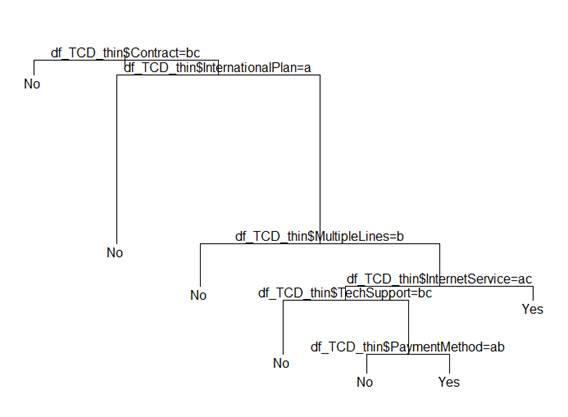

  </td>
  <td style="width:233.75pt;border-top:none;border-left:
  none;border-bottom:solid windowtext 1.0pt;border-right:solid windowtext 1.0pt;
  padding:0in 5.4pt 0in 5.4pt" width="724" valign="top">
  

  </td>
 </tr>
</tbody></table>

&nbsp;

&nbsp;

Simple tree results

<table class="MsoTableGrid" style="border-collapse:collapse;border:none" cellspacing="0" cellpadding="0" border="1">
 <tbody><tr>
  <td style="width:233.75pt;border:solid windowtext 1.0pt;
  padding:0in 5.4pt 0in 5.4pt" width="125" valign="top">
  
From
  SimpleTree_TCD.R

  </td>
  <td style="width:637.8pt;border:solid windowtext 1.0pt;
  border-left:none;padding:0in 5.4pt 0in 5.4pt" width="890" valign="top">
  
Tree
  plot output

  
plot(fit)
  and text(fit)

  </td>
 </tr>
 <tr>
  <td style="width:233.75pt;border:solid windowtext 1.0pt;
  border-top:none;padding:0in 5.4pt 0in 5.4pt" width="125" valign="top">
  
Using
  rpart

  </td>
  <td style="width:637.8pt;border-top:none;border-left:
  none;border-bottom:solid windowtext 1.0pt;border-right:solid windowtext 1.0pt;
  padding:0in 5.4pt 0in 5.4pt" width="890" valign="top">
  
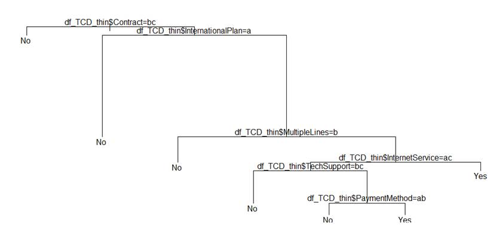

  </td>
 </tr>
 <tr>
  <td style="width:233.75pt;border:solid windowtext 1.0pt;
  border-top:none;padding:0in 5.4pt 0in 5.4pt" width="125" valign="top">
  
Using
  the fancyRpartPlot

  </td>
  <td style="width:637.8pt;border-top:none;border-left:
  none;border-bottom:solid windowtext 1.0pt;border-right:solid windowtext 1.0pt;
  padding:0in 5.4pt 0in 5.4pt" width="890" valign="top">
  
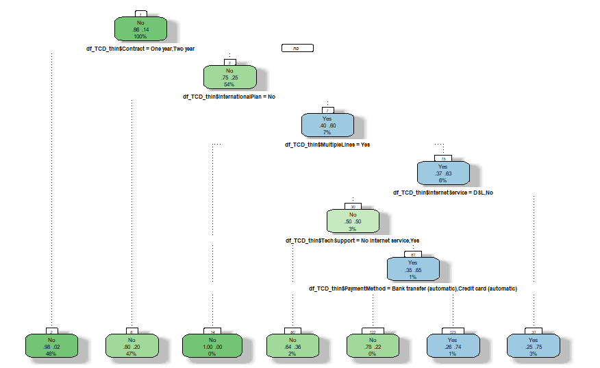

  </td>
 </tr>
 <tr>
  <td style="width:233.75pt;border:solid windowtext 1.0pt;
  border-top:none;padding:0in 5.4pt 0in 5.4pt" width="125" valign="top">
  
Using
  prp(fit) part of rpart

  
&nbsp;

  </td>
  <td style="width:637.8pt;border-top:none;border-left:
  none;border-bottom:solid windowtext 1.0pt;border-right:solid windowtext 1.0pt;
  padding:0in 5.4pt 0in 5.4pt" width="890" valign="top">
  
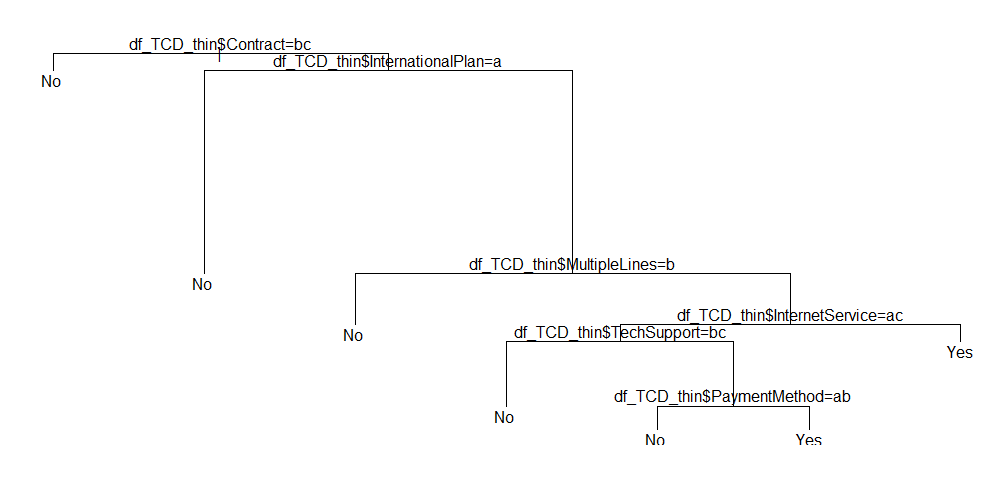

  </td>
 </tr>
 <tr>
  <td style="width:233.75pt;border:solid windowtext 1.0pt;
  border-top:none;padding:0in 5.4pt 0in 5.4pt" width="125" valign="top">
  
Using
  all the data for decision tree

  
&nbsp;

  </td>
  <td style="width:637.8pt;border-top:none;border-left:
  none;border-bottom:solid windowtext 1.0pt;border-right:solid windowtext 1.0pt;
  padding:0in 5.4pt 0in 5.4pt" width="890" valign="top">
  
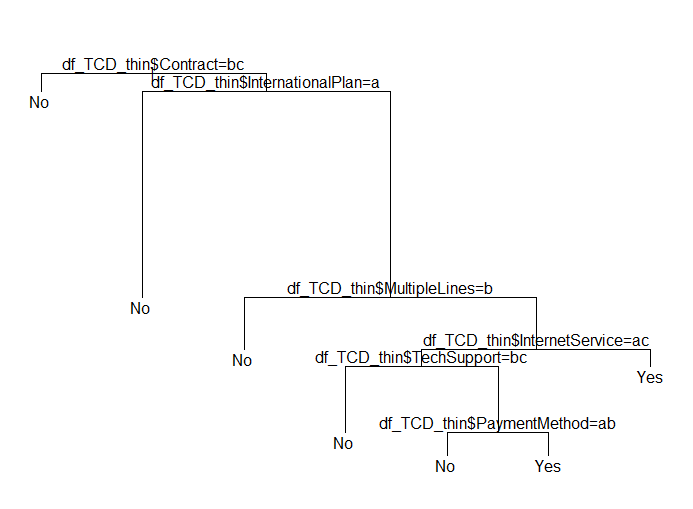

  </td>
 </tr>
</tbody></table>

&nbsp;

<table class="MsoTableGrid" style="border-collapse:collapse;border:none" cellspacing="0" cellpadding="0" border="1">
 <tbody><tr>
  <td style="width:467.5pt;border:solid windowtext 1.0pt;
  padding:0in 5.4pt 0in 5.4pt" width="734" valign="top">
  

  </td>
 </tr>
 <tr>
  <td style="width:467.5pt;border:solid windowtext 1.0pt;
  border-top:none;padding:0in 5.4pt 0in 5.4pt" width="734" valign="top">
  
rsq.rpart(fit_all)
  #major improvements end after 7 splits

  </td>
 </tr>
 <tr>
  <td style="width:467.5pt;border:solid windowtext 1.0pt;
  border-top:none;padding:0in 5.4pt 0in 5.4pt" width="734" valign="top">
  
&nbsp;

  </td>
 </tr>
 <tr>
  <td style="width:467.5pt;border:solid windowtext 1.0pt;
  border-top:none;padding:0in 5.4pt 0in 5.4pt" width="734" valign="top"><pre style="line-height:11.25pt;
  background:white;word-break:break-all">&gt; summary(fit_all)</pre><pre style="line-height:11.25pt;background:white;word-break:break-all">Call:</pre><pre style="line-height:11.25pt;
  background:white;word-break:break-all">rpart(formula = Churn ~ SeniorYN + gender + MaritalStatus + Dependents + </pre><pre style="line-height:11.25pt;background:white;word-break:break-all">&nbsp;&nbsp;&nbsp;&nbsp;tenure + PhoneService + MultipleLines + InternetService + </pre><pre style="line-height:11.25pt;background:white;word-break:break-all">&nbsp;&nbsp;&nbsp;&nbsp;OnlineSecurity + OnlineBackup + DeviceProtection + TechSupport + </pre><pre style="line-height:11.25pt;background:white;word-break:break-all">&nbsp;&nbsp;&nbsp;&nbsp;StreamingTV + StreamingMovies + Contract + PaperlessBilling + </pre><pre style="line-height:11.25pt;background:white;word-break:break-all">&nbsp;&nbsp;&nbsp;&nbsp;PaymentMethod + InternationalPlan + VoiceMailPlan + NumbervMailMessages + </pre><pre style="line-height:11.25pt;background:white;word-break:break-all">&nbsp;&nbsp;&nbsp;&nbsp;TotalDayMinutes + TotalDayCalls + TotalEveMinutes + TotalEveCalls + </pre><pre style="line-height:11.25pt;background:white;word-break:break-all">&nbsp;&nbsp;&nbsp;&nbsp;TotalNightMinutes + TotalNightCalls + TotalIntlMinutes + </pre><pre style="line-height:11.25pt;background:white;word-break:break-all">&nbsp;&nbsp;&nbsp;&nbsp;TotalIntlCalls + CustomerServiceCalls + TotalCall + TotalRevenue, </pre><pre style="line-height:11.25pt;background:white;word-break:break-all">&nbsp;&nbsp;&nbsp;&nbsp;data = df_TCD_thin, method = "class")</pre><pre style="line-height:11.25pt;background:white;word-break:break-all">&nbsp; n= 3333 </pre><pre style="line-height:11.25pt;background:white;word-break:break-all">&nbsp;</pre><pre style="line-height:11.25pt;background:white;word-break:break-all">&nbsp;&nbsp;&nbsp;&nbsp;&nbsp;&nbsp;&nbsp;&nbsp;&nbsp; CP nsplit rel error&nbsp;&nbsp;&nbsp; xerror&nbsp;&nbsp;&nbsp;&nbsp;&nbsp;&nbsp; xstd</pre><pre style="line-height:11.25pt;background:white;word-break:break-all">1 0.09316770&nbsp;&nbsp;&nbsp;&nbsp;&nbsp; 0 1.0000000 1.0000000 0.04207569</pre><pre style="line-height:11.25pt;background:white;word-break:break-all">2 0.07867495&nbsp;&nbsp;&nbsp;&nbsp;&nbsp; 2 0.8136646 0.8219462 0.03871761</pre><pre style="line-height:11.25pt;background:white;word-break:break-all">3 0.05279503&nbsp;&nbsp;&nbsp;&nbsp;&nbsp; 4 0.6563147 0.6749482 0.03550673</pre><pre style="line-height:11.25pt;background:white;word-break:break-all">4 0.02277433&nbsp;&nbsp;&nbsp;&nbsp;&nbsp; 7 0.4616977 0.4803313 0.03041796</pre><pre style="line-height:11.25pt;background:white;word-break:break-all">5 0.01863354&nbsp;&nbsp;&nbsp;&nbsp;&nbsp; 8 0.4389234 0.4575569 0.02974070</pre><pre style="line-height:11.25pt;background:white;word-break:break-all">6 0.01759834&nbsp;&nbsp;&nbsp;&nbsp;&nbsp; 9 0.4202899 0.4409938 0.02923495</pre><pre style="line-height:11.25pt;background:white;word-break:break-all">7 0.01000000&nbsp;&nbsp;&nbsp;&nbsp; 12 0.3623188 0.3954451 0.02778145</pre><pre style="line-height:11.25pt;background:white;word-break:break-all">&nbsp;</pre><pre style="line-height:11.25pt;background:white;word-break:break-all">Variable importance</pre><pre style="line-height:11.25pt;background:white;word-break:break-all">&nbsp;&nbsp;&nbsp;&nbsp; TotalDayMinutes CustomerServiceCalls&nbsp;&nbsp;&nbsp;&nbsp; TotalIntlMinutes&nbsp;&nbsp;&nbsp; InternationalPlan&nbsp;&nbsp;&nbsp;&nbsp;&nbsp;&nbsp; TotalIntlCalls&nbsp;&nbsp;&nbsp;&nbsp;&nbsp;&nbsp;&nbsp;&nbsp;&nbsp;&nbsp;&nbsp;&nbsp;&nbsp;&nbsp; tenure </pre><pre style="line-height:11.25pt;background:white;word-break:break-all">&nbsp;&nbsp;&nbsp;&nbsp;&nbsp;&nbsp;&nbsp;&nbsp;&nbsp;&nbsp;&nbsp;&nbsp;&nbsp;&nbsp;&nbsp;&nbsp;&nbsp;&nbsp;24&nbsp;&nbsp;&nbsp;&nbsp;&nbsp;&nbsp;&nbsp;&nbsp;&nbsp;&nbsp;&nbsp;&nbsp;&nbsp;&nbsp;&nbsp;&nbsp;&nbsp;&nbsp; 13&nbsp;&nbsp;&nbsp;&nbsp;&nbsp;&nbsp;&nbsp;&nbsp;&nbsp;&nbsp;&nbsp;&nbsp;&nbsp;&nbsp;&nbsp;&nbsp;&nbsp;&nbsp; 10&nbsp;&nbsp;&nbsp;&nbsp;&nbsp;&nbsp;&nbsp;&nbsp;&nbsp;&nbsp;&nbsp;&nbsp;&nbsp;&nbsp;&nbsp;&nbsp;&nbsp;&nbsp;&nbsp; 8&nbsp;&nbsp;&nbsp;&nbsp;&nbsp;&nbsp;&nbsp;&nbsp;&nbsp;&nbsp;&nbsp;&nbsp;&nbsp;&nbsp;&nbsp;&nbsp;&nbsp;&nbsp;&nbsp; 8&nbsp;&nbsp;&nbsp;&nbsp;&nbsp;&nbsp;&nbsp;&nbsp;&nbsp;&nbsp;&nbsp;&nbsp;&nbsp;&nbsp;&nbsp;&nbsp;&nbsp;&nbsp;&nbsp; 7 </pre><pre style="line-height:11.25pt;background:white;word-break:break-all">&nbsp;&nbsp;&nbsp;&nbsp;&nbsp;&nbsp;&nbsp;&nbsp;&nbsp;&nbsp;&nbsp;&nbsp;Contract&nbsp;&nbsp;&nbsp;&nbsp;&nbsp;&nbsp;&nbsp;&nbsp; TotalRevenue&nbsp;&nbsp;&nbsp;&nbsp;&nbsp; TotalEveMinutes&nbsp; NumbervMailMessages&nbsp;&nbsp;&nbsp;&nbsp;&nbsp;&nbsp;&nbsp; VoiceMailPlan&nbsp;&nbsp;&nbsp;&nbsp;&nbsp;&nbsp; OnlineSecurity </pre><pre style="line-height:11.25pt;background:white;word-break:break-all">&nbsp;&nbsp;&nbsp;&nbsp;&nbsp;&nbsp;&nbsp;&nbsp;&nbsp;&nbsp;&nbsp;&nbsp;&nbsp;&nbsp;&nbsp;&nbsp;&nbsp;&nbsp;&nbsp;6&nbsp;&nbsp;&nbsp;&nbsp;&nbsp;&nbsp;&nbsp;&nbsp;&nbsp;&nbsp;&nbsp;&nbsp;&nbsp;&nbsp;&nbsp;&nbsp;&nbsp;&nbsp;&nbsp; 5&nbsp;&nbsp;&nbsp;&nbsp;&nbsp;&nbsp;&nbsp;&nbsp;&nbsp;&nbsp;&nbsp;&nbsp;&nbsp;&nbsp;&nbsp;&nbsp;&nbsp;&nbsp;&nbsp; 4&nbsp;&nbsp;&nbsp;&nbsp;&nbsp;&nbsp;&nbsp;&nbsp;&nbsp;&nbsp;&nbsp;&nbsp;&nbsp;&nbsp;&nbsp;&nbsp;&nbsp;&nbsp;&nbsp; 4&nbsp;&nbsp;&nbsp;&nbsp;&nbsp;&nbsp;&nbsp;&nbsp;&nbsp;&nbsp;&nbsp;&nbsp;&nbsp;&nbsp;&nbsp;&nbsp;&nbsp;&nbsp;&nbsp; 4&nbsp;&nbsp;&nbsp;&nbsp;&nbsp;&nbsp;&nbsp;&nbsp;&nbsp;&nbsp;&nbsp;&nbsp;&nbsp;&nbsp;&nbsp;&nbsp;&nbsp;&nbsp;&nbsp; 2 </pre><pre style="line-height:11.25pt;background:white;word-break:break-all">&nbsp;&nbsp;&nbsp;&nbsp;&nbsp;InternetService&nbsp;&nbsp;&nbsp;&nbsp;&nbsp;&nbsp;&nbsp;&nbsp; OnlineBackup&nbsp;&nbsp;&nbsp;&nbsp;&nbsp; TotalNightCalls&nbsp;&nbsp;&nbsp; TotalNightMinutes </pre><pre style="line-height:11.25pt;background:white;word-break:break-all">&nbsp;&nbsp;&nbsp;&nbsp;&nbsp;&nbsp;&nbsp;&nbsp;&nbsp;&nbsp;&nbsp;&nbsp;&nbsp;&nbsp;&nbsp;&nbsp;&nbsp;&nbsp;&nbsp;1&nbsp;&nbsp;&nbsp;&nbsp;&nbsp;&nbsp;&nbsp;&nbsp;&nbsp;&nbsp;&nbsp;&nbsp;&nbsp;&nbsp;&nbsp;&nbsp;&nbsp;&nbsp;&nbsp; 1&nbsp;&nbsp;&nbsp;&nbsp;&nbsp;&nbsp;&nbsp;&nbsp;&nbsp;&nbsp; &nbsp;&nbsp;&nbsp;&nbsp;&nbsp;&nbsp;&nbsp;&nbsp;&nbsp;1&nbsp;&nbsp;&nbsp;&nbsp;&nbsp;&nbsp;&nbsp;&nbsp;&nbsp;&nbsp;&nbsp;&nbsp;&nbsp;&nbsp;&nbsp;&nbsp;&nbsp;&nbsp;&nbsp; 1 </pre><pre style="line-height:11.25pt;background:white;word-break:break-all">&nbsp;</pre><pre style="line-height:11.25pt;background:white;word-break:break-all">Node number 1: 3333 observations,&nbsp;&nbsp;&nbsp; complexity param=0.0931677</pre><pre style="line-height:11.25pt;background:white;word-break:break-all">&nbsp; predicted class=No&nbsp;&nbsp; expected loss=0.1449145&nbsp; P(node) =1</pre><pre style="line-height:11.25pt;background:yellow;word-break:break-all">&nbsp;&nbsp;&nbsp; class counts:&nbsp; 2850&nbsp;&nbsp; 483</pre><pre style="line-height:11.25pt;background:yellow;word-break:break-all">&nbsp;&nbsp; probabilities: 0.855 0.145 </pre><pre style="line-height:11.25pt;background:yellow;word-break:break-all">&nbsp;&nbsp;left son=2 (3122 obs) right son=3 (211 obs)</pre><pre style="line-height:11.25pt;background:white;word-break:break-all">&nbsp; Primary splits:</pre><pre style="line-height:11.25pt;background:white;word-break:break-all">&nbsp;&nbsp;&nbsp;&nbsp;&nbsp; TotalDayMinutes&nbsp;&nbsp;&nbsp;&nbsp;&nbsp; &lt; 264.45&nbsp; to the left,&nbsp; improve=94.08310, (0 missing)</pre><pre style="line-height:11.25pt;background:white;word-break:break-all">&nbsp;&nbsp;&nbsp;&nbsp;&nbsp; Contract&nbsp;&nbsp;&nbsp;&nbsp;&nbsp;&nbsp;&nbsp;&nbsp;&nbsp;&nbsp;&nbsp;&nbsp; splits as&nbsp; RLL,&nbsp;&nbsp;&nbsp;&nbsp;&nbsp;&nbsp;&nbsp;&nbsp; improve=86.76350, (0 missing)</pre><pre style="line-height:11.25pt;background:white;word-break:break-all">&nbsp;&nbsp;&nbsp;&nbsp;&nbsp; CustomerServiceCalls &lt; 3.5&nbsp;&nbsp;&nbsp;&nbsp; to the left,&nbsp; improve=80.30617, (0 missing)</pre><pre style="line-height:11.25pt;background:white;word-break:break-all">&nbsp;&nbsp;&nbsp;&nbsp;&nbsp; tenure&nbsp;&nbsp;&nbsp;&nbsp;&nbsp;&nbsp;&nbsp;&nbsp;&nbsp;&nbsp;&nbsp;&nbsp;&nbsp;&nbsp; &lt; 5.5&nbsp;&nbsp;&nbsp;&nbsp; to the right, improve=80.25095, (0 missing)</pre><pre style="line-height:11.25pt;background:white;word-break:break-all">&nbsp;&nbsp;&nbsp;&nbsp;&nbsp; TechSupport&nbsp;&nbsp;&nbsp;&nbsp;&nbsp;&nbsp;&nbsp;&nbsp;&nbsp; splits as&nbsp; RLL,&nbsp;&nbsp;&nbsp;&nbsp;&nbsp;&nbsp;&nbsp;&nbsp; improve=71.85318, (0 missing)</pre>
  
&nbsp;

  </td>
 </tr>
 <tr>
  <td style="width:467.5pt;border:solid windowtext 1.0pt;
  border-top:none;padding:0in 5.4pt 0in 5.4pt" width="734" valign="top"><pre style="line-height:11.25pt;
  background:white;word-break:break-all">&nbsp;</pre><pre style="line-height:11.25pt;background:white;word-break:break-all">&nbsp;</pre><pre style="line-height:11.25pt;background:white;word-break:break-all">&nbsp;</pre></td>
 </tr>
 <tr>
  <td style="width:467.5pt;border:solid windowtext 1.0pt;
  border-top:none;padding:0in 5.4pt 0in 5.4pt" width="734" valign="top">
  
&nbsp;

  </td>
 </tr>
 <tr>
  <td style="width:467.5pt;border:solid windowtext 1.0pt;
  border-top:none;padding:0in 5.4pt 0in 5.4pt" width="734" valign="top">
  
&nbsp;

  </td>
 </tr>
</tbody></table>

&nbsp;

<b>PCA model output</b>

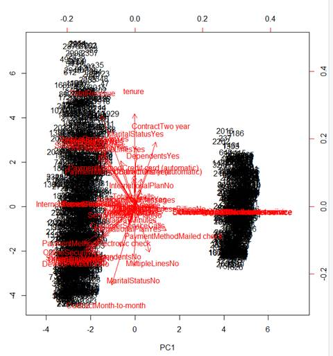

&nbsp;

&nbsp;

<table class="MsoTableGrid" style="border-collapse:collapse;border:none" cellspacing="0" cellpadding="0" border="1">
 <tbody><tr style="height:29.2pt">
  <td style="width:2.6in;border:solid windowtext 1.0pt;
  background:#9CC2E5;padding:0in 5.4pt 0in 5.4pt;height:29.2pt" width="166" valign="top">
  
<b>Model
  Type</b>

  </td>
  <td style="width:2.6in;border:solid windowtext 1.0pt;
  border-left:none;background:#9CC2E5;padding:0in 5.4pt 0in 5.4pt;height:29.2pt" width="167" valign="top">
  
<b>Random Forest</b>

  </td>
  <td style="width:187.25pt;border:solid windowtext 1.0pt;
  border-left:none;background:#9CC2E5;padding:0in 5.4pt 0in 5.4pt;height:29.2pt" width="181" valign="top">
  
<b>‘rpart’ decision
  tree</b>

  </td>
  <td style="width:209.05pt;border:solid windowtext 1.0pt;
  border-left:none;background:#9CC2E5;padding:0in 5.4pt 0in 5.4pt;height:29.2pt" width="193" valign="top">
  
<b>Tree_model decision
  tree</b>

  </td>
 </tr>
 <tr style="height:27.65pt">
  <td style="width:2.6in;border:solid windowtext 1.0pt;
  border-top:none;background:#D0CECE;padding:0in 5.4pt 0in 5.4pt;height:27.65pt" width="166" valign="top">
  
<b>Prediction
  Accuracy</b>

  </td>
  <td style="width:2.6in;border-top:none;border-left:none;
  border-bottom:solid windowtext 1.0pt;border-right:solid windowtext 1.0pt;
  padding:0in 5.4pt 0in 5.4pt;height:27.65pt" width="167" valign="top">
  
<b>97.1%</b>

  </td>
  <td style="width:187.25pt;border-top:none;border-left:
  none;border-bottom:solid windowtext 1.0pt;border-right:solid windowtext 1.0pt;
  padding:0in 5.4pt 0in 5.4pt;height:27.65pt" width="181" valign="top">
  
<b>95.4%</b>

  </td>
  <td style="width:209.05pt;border-top:none;border-left:
  none;border-bottom:solid windowtext 1.0pt;border-right:solid windowtext 1.0pt;
  padding:0in 5.4pt 0in 5.4pt;height:27.65pt" width="193" valign="top">
  
<b>92.6%</b>

  </td>
 </tr>
 <tr style="height:27.65pt">
  <td style="width:2.6in;border:solid windowtext 1.0pt;
  border-top:none;background:#D0CECE;padding:0in 5.4pt 0in 5.4pt;height:27.65pt" width="166" valign="top">
  
<b>Tuning
  Technique</b>

  </td>
  <td style="width:2.6in;border-top:none;border-left:none;
  border-bottom:solid windowtext 1.0pt;border-right:solid windowtext 1.0pt;
  padding:0in 5.4pt 0in 5.4pt;height:27.65pt" width="167" valign="top">
  
Tried changing number of trees
  generated to lower and higher. Going from 500 to 600 increased error rates.
  Going from 500 to 400 also increased error. Sweet spot is around 500

  </td>
  <td style="width:187.25pt;border-top:none;border-left:
  none;border-bottom:solid windowtext 1.0pt;border-right:solid windowtext 1.0pt;
  padding:0in 5.4pt 0in 5.4pt;height:27.65pt" width="181" valign="top">
  
Major improvements end after 7
  splits.

  </td>
  <td style="width:209.05pt;border-top:none;border-left:
  none;border-bottom:solid windowtext 1.0pt;border-right:solid windowtext 1.0pt;
  padding:0in 5.4pt 0in 5.4pt;height:27.65pt" width="193" valign="top">
  
Pruned
  based on tree split analysis. Pruned to best option of 9 splits.

  
&nbsp;

  
pruning
  improved accuracy error from .07318536 to .0718572

  
&nbsp;

  
Final
  result would model improvement to <b>92.8%</b> accuracy

  
&nbsp;

  
&nbsp;

  
&nbsp;

  </td>
 </tr>
</tbody></table>

&nbsp;

&nbsp;

&nbsp;

&nbsp;

&nbsp;

</body></html>