<html xmlns:v="urn:schemas-microsoft-com:vml"
xmlns:o="urn:schemas-microsoft-com:office:office"
xmlns:w="urn:schemas-microsoft-com:office:word"
xmlns:x="urn:schemas-microsoft-com:office:excel"
xmlns:m="http://schemas.microsoft.com/office/2004/12/omml"
xmlns="http://www.w3.org/TR/REC-html40">

<head>
<meta http-equiv=Content-Type content="text/html; charset=windows-1252">
<meta name=ProgId content=Word.Document>
<meta name=Generator content="Microsoft Word 15">
<meta name=Originator content="Microsoft Word 15">
<link rel=File-List href="README_files/filelist.xml">
<link rel=Edit-Time-Data href="README_files/editdata.mso">
<!--[if !mso]>

<![endif]--><!--[if gte mso 9]><xml>
 <o:DocumentProperties>
  <o:Author>Degrado, Mike</o:Author>
  <o:LastAuthor>Degrado, Mike</o:LastAuthor>
  <o:Revision>26</o:Revision>
  <o:TotalTime>6410</o:TotalTime>
  <o:LastPrinted>2018-11-18T01:17:00Z</o:LastPrinted>
  <o:Created>2018-11-18T01:22:00Z</o:Created>
  <o:LastSaved>2018-12-08T21:28:00Z</o:LastSaved>
  <o:Pages>1</o:Pages>
  <o:Words>2052</o:Words>
  <o:Characters>11697</o:Characters>
  <o:Company>Comcast Cable Corporation</o:Company>
  <o:Lines>97</o:Lines>
  <o:Paragraphs>27</o:Paragraphs>
  <o:CharactersWithSpaces>13722</o:CharactersWithSpaces>
  <o:Version>16.00</o:Version>
 </o:DocumentProperties>
 <o:OfficeDocumentSettings>
  <o:AllowPNG/>
 </o:OfficeDocumentSettings>
</xml><![endif]-->
<link rel=themeData href="README_files/themedata.thmx">
<link rel=colorSchemeMapping href="README_files/colorschememapping.xml">
<!--[if gte mso 9]><xml>
 <w:WordDocument>
  <w:SpellingState>Clean</w:SpellingState>
  <w:GrammarState>Clean</w:GrammarState>
  <w:TrackMoves>false</w:TrackMoves>
  <w:TrackFormatting/>
  <w:PunctuationKerning/>
  <w:ValidateAgainstSchemas/>
  <w:SaveIfXMLInvalid>false</w:SaveIfXMLInvalid>
  <w:IgnoreMixedContent>false</w:IgnoreMixedContent>
  <w:AlwaysShowPlaceholderText>false</w:AlwaysShowPlaceholderText>
  <w:DoNotPromoteQF/>
  <w:LidThemeOther>EN-US</w:LidThemeOther>
  <w:LidThemeAsian>X-NONE</w:LidThemeAsian>
  <w:LidThemeComplexScript>X-NONE</w:LidThemeComplexScript>
  <w:Compatibility>
   <w:BreakWrappedTables/>
   <w:SnapToGridInCell/>
   <w:WrapTextWithPunct/>
   <w:UseAsianBreakRules/>
   <w:UseWord2010TableStyleRules/>
   <w:DontGrowAutofit/>
   <w:SplitPgBreakAndParaMark/>
  </w:Compatibility>
  <w:BrowserLevel>MicrosoftInternetExplorer4</w:BrowserLevel>
  <m:mathPr>
   <m:mathFont m:val="Cambria Math"/>
   <m:brkBin m:val="before"/>
   <m:brkBinSub m:val="&#45;-"/>
   <m:smallFrac m:val="off"/>
   <m:dispDef/>
   <m:lMargin m:val="0"/>
   <m:rMargin m:val="0"/>
   <m:defJc m:val="centerGroup"/>
   <m:wrapIndent m:val="1440"/>
   <m:intLim m:val="subSup"/>
   <m:naryLim m:val="undOvr"/>
  </m:mathPr></w:WordDocument>
</xml><![endif]--><!--[if gte mso 9]><xml>
 <w:LatentStyles DefLockedState="false" DefUnhideWhenUsed="false"
  DefSemiHidden="false" DefQFormat="false" DefPriority="99"
  LatentStyleCount="371">
  <w:LsdException Locked="false" Priority="0" QFormat="true" Name="Normal"/>
  <w:LsdException Locked="false" Priority="9" QFormat="true" Name="heading 1"/>
  <w:LsdException Locked="false" Priority="9" SemiHidden="true"
   UnhideWhenUsed="true" QFormat="true" Name="heading 2"/>
  <w:LsdException Locked="false" Priority="9" SemiHidden="true"
   UnhideWhenUsed="true" QFormat="true" Name="heading 3"/>
  <w:LsdException Locked="false" Priority="9" SemiHidden="true"
   UnhideWhenUsed="true" QFormat="true" Name="heading 4"/>
  <w:LsdException Locked="false" Priority="9" SemiHidden="true"
   UnhideWhenUsed="true" QFormat="true" Name="heading 5"/>
  <w:LsdException Locked="false" Priority="9" SemiHidden="true"
   UnhideWhenUsed="true" QFormat="true" Name="heading 6"/>
  <w:LsdException Locked="false" Priority="9" SemiHidden="true"
   UnhideWhenUsed="true" QFormat="true" Name="heading 7"/>
  <w:LsdException Locked="false" Priority="9" SemiHidden="true"
   UnhideWhenUsed="true" QFormat="true" Name="heading 8"/>
  <w:LsdException Locked="false" Priority="9" SemiHidden="true"
   UnhideWhenUsed="true" QFormat="true" Name="heading 9"/>
  <w:LsdException Locked="false" SemiHidden="true" UnhideWhenUsed="true"
   Name="index 1"/>
  <w:LsdException Locked="false" SemiHidden="true" UnhideWhenUsed="true"
   Name="index 2"/>
  <w:LsdException Locked="false" SemiHidden="true" UnhideWhenUsed="true"
   Name="index 3"/>
  <w:LsdException Locked="false" SemiHidden="true" UnhideWhenUsed="true"
   Name="index 4"/>
  <w:LsdException Locked="false" SemiHidden="true" UnhideWhenUsed="true"
   Name="index 5"/>
  <w:LsdException Locked="false" SemiHidden="true" UnhideWhenUsed="true"
   Name="index 6"/>
  <w:LsdException Locked="false" SemiHidden="true" UnhideWhenUsed="true"
   Name="index 7"/>
  <w:LsdException Locked="false" SemiHidden="true" UnhideWhenUsed="true"
   Name="index 8"/>
  <w:LsdException Locked="false" SemiHidden="true" UnhideWhenUsed="true"
   Name="index 9"/>
  <w:LsdException Locked="false" Priority="39" SemiHidden="true"
   UnhideWhenUsed="true" Name="toc 1"/>
  <w:LsdException Locked="false" Priority="39" SemiHidden="true"
   UnhideWhenUsed="true" Name="toc 2"/>
  <w:LsdException Locked="false" Priority="39" SemiHidden="true"
   UnhideWhenUsed="true" Name="toc 3"/>
  <w:LsdException Locked="false" Priority="39" SemiHidden="true"
   UnhideWhenUsed="true" Name="toc 4"/>
  <w:LsdException Locked="false" Priority="39" SemiHidden="true"
   UnhideWhenUsed="true" Name="toc 5"/>
  <w:LsdException Locked="false" Priority="39" SemiHidden="true"
   UnhideWhenUsed="true" Name="toc 6"/>
  <w:LsdException Locked="false" Priority="39" SemiHidden="true"
   UnhideWhenUsed="true" Name="toc 7"/>
  <w:LsdException Locked="false" Priority="39" SemiHidden="true"
   UnhideWhenUsed="true" Name="toc 8"/>
  <w:LsdException Locked="false" Priority="39" SemiHidden="true"
   UnhideWhenUsed="true" Name="toc 9"/>
  <w:LsdException Locked="false" SemiHidden="true" UnhideWhenUsed="true"
   Name="Normal Indent"/>
  <w:LsdException Locked="false" SemiHidden="true" UnhideWhenUsed="true"
   Name="footnote text"/>
  <w:LsdException Locked="false" SemiHidden="true" UnhideWhenUsed="true"
   Name="annotation text"/>
  <w:LsdException Locked="false" SemiHidden="true" UnhideWhenUsed="true"
   Name="header"/>
  <w:LsdException Locked="false" SemiHidden="true" UnhideWhenUsed="true"
   Name="footer"/>
  <w:LsdException Locked="false" SemiHidden="true" UnhideWhenUsed="true"
   Name="index heading"/>
  <w:LsdException Locked="false" Priority="35" SemiHidden="true"
   UnhideWhenUsed="true" QFormat="true" Name="caption"/>
  <w:LsdException Locked="false" SemiHidden="true" UnhideWhenUsed="true"
   Name="table of figures"/>
  <w:LsdException Locked="false" SemiHidden="true" UnhideWhenUsed="true"
   Name="envelope address"/>
  <w:LsdException Locked="false" SemiHidden="true" UnhideWhenUsed="true"
   Name="envelope return"/>
  <w:LsdException Locked="false" SemiHidden="true" UnhideWhenUsed="true"
   Name="footnote reference"/>
  <w:LsdException Locked="false" SemiHidden="true" UnhideWhenUsed="true"
   Name="annotation reference"/>
  <w:LsdException Locked="false" SemiHidden="true" UnhideWhenUsed="true"
   Name="line number"/>
  <w:LsdException Locked="false" SemiHidden="true" UnhideWhenUsed="true"
   Name="page number"/>
  <w:LsdException Locked="false" SemiHidden="true" UnhideWhenUsed="true"
   Name="endnote reference"/>
  <w:LsdException Locked="false" SemiHidden="true" UnhideWhenUsed="true"
   Name="endnote text"/>
  <w:LsdException Locked="false" SemiHidden="true" UnhideWhenUsed="true"
   Name="table of authorities"/>
  <w:LsdException Locked="false" SemiHidden="true" UnhideWhenUsed="true"
   Name="macro"/>
  <w:LsdException Locked="false" SemiHidden="true" UnhideWhenUsed="true"
   Name="toa heading"/>
  <w:LsdException Locked="false" SemiHidden="true" UnhideWhenUsed="true"
   Name="List"/>
  <w:LsdException Locked="false" SemiHidden="true" UnhideWhenUsed="true"
   Name="List Bullet"/>
  <w:LsdException Locked="false" SemiHidden="true" UnhideWhenUsed="true"
   Name="List Number"/>
  <w:LsdException Locked="false" SemiHidden="true" UnhideWhenUsed="true"
   Name="List 2"/>
  <w:LsdException Locked="false" SemiHidden="true" UnhideWhenUsed="true"
   Name="List 3"/>
  <w:LsdException Locked="false" SemiHidden="true" UnhideWhenUsed="true"
   Name="List 4"/>
  <w:LsdException Locked="false" SemiHidden="true" UnhideWhenUsed="true"
   Name="List 5"/>
  <w:LsdException Locked="false" SemiHidden="true" UnhideWhenUsed="true"
   Name="List Bullet 2"/>
  <w:LsdException Locked="false" SemiHidden="true" UnhideWhenUsed="true"
   Name="List Bullet 3"/>
  <w:LsdException Locked="false" SemiHidden="true" UnhideWhenUsed="true"
   Name="List Bullet 4"/>
  <w:LsdException Locked="false" SemiHidden="true" UnhideWhenUsed="true"
   Name="List Bullet 5"/>
  <w:LsdException Locked="false" SemiHidden="true" UnhideWhenUsed="true"
   Name="List Number 2"/>
  <w:LsdException Locked="false" SemiHidden="true" UnhideWhenUsed="true"
   Name="List Number 3"/>
  <w:LsdException Locked="false" SemiHidden="true" UnhideWhenUsed="true"
   Name="List Number 4"/>
  <w:LsdException Locked="false" SemiHidden="true" UnhideWhenUsed="true"
   Name="List Number 5"/>
  <w:LsdException Locked="false" Priority="10" QFormat="true" Name="Title"/>
  <w:LsdException Locked="false" SemiHidden="true" UnhideWhenUsed="true"
   Name="Closing"/>
  <w:LsdException Locked="false" SemiHidden="true" UnhideWhenUsed="true"
   Name="Signature"/>
  <w:LsdException Locked="false" Priority="1" SemiHidden="true"
   UnhideWhenUsed="true" Name="Default Paragraph Font"/>
  <w:LsdException Locked="false" SemiHidden="true" UnhideWhenUsed="true"
   Name="Body Text"/>
  <w:LsdException Locked="false" SemiHidden="true" UnhideWhenUsed="true"
   Name="Body Text Indent"/>
  <w:LsdException Locked="false" SemiHidden="true" UnhideWhenUsed="true"
   Name="List Continue"/>
  <w:LsdException Locked="false" SemiHidden="true" UnhideWhenUsed="true"
   Name="List Continue 2"/>
  <w:LsdException Locked="false" SemiHidden="true" UnhideWhenUsed="true"
   Name="List Continue 3"/>
  <w:LsdException Locked="false" SemiHidden="true" UnhideWhenUsed="true"
   Name="List Continue 4"/>
  <w:LsdException Locked="false" SemiHidden="true" UnhideWhenUsed="true"
   Name="List Continue 5"/>
  <w:LsdException Locked="false" SemiHidden="true" UnhideWhenUsed="true"
   Name="Message Header"/>
  <w:LsdException Locked="false" Priority="11" QFormat="true" Name="Subtitle"/>
  <w:LsdException Locked="false" SemiHidden="true" UnhideWhenUsed="true"
   Name="Salutation"/>
  <w:LsdException Locked="false" SemiHidden="true" UnhideWhenUsed="true"
   Name="Date"/>
  <w:LsdException Locked="false" SemiHidden="true" UnhideWhenUsed="true"
   Name="Body Text First Indent"/>
  <w:LsdException Locked="false" SemiHidden="true" UnhideWhenUsed="true"
   Name="Body Text First Indent 2"/>
  <w:LsdException Locked="false" SemiHidden="true" UnhideWhenUsed="true"
   Name="Note Heading"/>
  <w:LsdException Locked="false" SemiHidden="true" UnhideWhenUsed="true"
   Name="Body Text 2"/>
  <w:LsdException Locked="false" SemiHidden="true" UnhideWhenUsed="true"
   Name="Body Text 3"/>
  <w:LsdException Locked="false" SemiHidden="true" UnhideWhenUsed="true"
   Name="Body Text Indent 2"/>
  <w:LsdException Locked="false" SemiHidden="true" UnhideWhenUsed="true"
   Name="Body Text Indent 3"/>
  <w:LsdException Locked="false" SemiHidden="true" UnhideWhenUsed="true"
   Name="Block Text"/>
  <w:LsdException Locked="false" SemiHidden="true" UnhideWhenUsed="true"
   Name="Hyperlink"/>
  <w:LsdException Locked="false" SemiHidden="true" UnhideWhenUsed="true"
   Name="FollowedHyperlink"/>
  <w:LsdException Locked="false" Priority="22" QFormat="true" Name="Strong"/>
  <w:LsdException Locked="false" Priority="20" QFormat="true" Name="Emphasis"/>
  <w:LsdException Locked="false" SemiHidden="true" UnhideWhenUsed="true"
   Name="Document Map"/>
  <w:LsdException Locked="false" SemiHidden="true" UnhideWhenUsed="true"
   Name="Plain Text"/>
  <w:LsdException Locked="false" SemiHidden="true" UnhideWhenUsed="true"
   Name="E-mail Signature"/>
  <w:LsdException Locked="false" SemiHidden="true" UnhideWhenUsed="true"
   Name="HTML Top of Form"/>
  <w:LsdException Locked="false" SemiHidden="true" UnhideWhenUsed="true"
   Name="HTML Bottom of Form"/>
  <w:LsdException Locked="false" SemiHidden="true" UnhideWhenUsed="true"
   Name="Normal (Web)"/>
  <w:LsdException Locked="false" SemiHidden="true" UnhideWhenUsed="true"
   Name="HTML Acronym"/>
  <w:LsdException Locked="false" SemiHidden="true" UnhideWhenUsed="true"
   Name="HTML Address"/>
  <w:LsdException Locked="false" SemiHidden="true" UnhideWhenUsed="true"
   Name="HTML Cite"/>
  <w:LsdException Locked="false" SemiHidden="true" UnhideWhenUsed="true"
   Name="HTML Code"/>
  <w:LsdException Locked="false" SemiHidden="true" UnhideWhenUsed="true"
   Name="HTML Definition"/>
  <w:LsdException Locked="false" SemiHidden="true" UnhideWhenUsed="true"
   Name="HTML Keyboard"/>
  <w:LsdException Locked="false" SemiHidden="true" UnhideWhenUsed="true"
   Name="HTML Preformatted"/>
  <w:LsdException Locked="false" SemiHidden="true" UnhideWhenUsed="true"
   Name="HTML Sample"/>
  <w:LsdException Locked="false" SemiHidden="true" UnhideWhenUsed="true"
   Name="HTML Typewriter"/>
  <w:LsdException Locked="false" SemiHidden="true" UnhideWhenUsed="true"
   Name="HTML Variable"/>
  <w:LsdException Locked="false" SemiHidden="true" UnhideWhenUsed="true"
   Name="Normal Table"/>
  <w:LsdException Locked="false" SemiHidden="true" UnhideWhenUsed="true"
   Name="annotation subject"/>
  <w:LsdException Locked="false" SemiHidden="true" UnhideWhenUsed="true"
   Name="No List"/>
  <w:LsdException Locked="false" SemiHidden="true" UnhideWhenUsed="true"
   Name="Outline List 1"/>
  <w:LsdException Locked="false" SemiHidden="true" UnhideWhenUsed="true"
   Name="Outline List 2"/>
  <w:LsdException Locked="false" SemiHidden="true" UnhideWhenUsed="true"
   Name="Outline List 3"/>
  <w:LsdException Locked="false" SemiHidden="true" UnhideWhenUsed="true"
   Name="Table Simple 1"/>
  <w:LsdException Locked="false" SemiHidden="true" UnhideWhenUsed="true"
   Name="Table Simple 2"/>
  <w:LsdException Locked="false" SemiHidden="true" UnhideWhenUsed="true"
   Name="Table Simple 3"/>
  <w:LsdException Locked="false" SemiHidden="true" UnhideWhenUsed="true"
   Name="Table Classic 1"/>
  <w:LsdException Locked="false" SemiHidden="true" UnhideWhenUsed="true"
   Name="Table Classic 2"/>
  <w:LsdException Locked="false" SemiHidden="true" UnhideWhenUsed="true"
   Name="Table Classic 3"/>
  <w:LsdException Locked="false" SemiHidden="true" UnhideWhenUsed="true"
   Name="Table Classic 4"/>
  <w:LsdException Locked="false" SemiHidden="true" UnhideWhenUsed="true"
   Name="Table Colorful 1"/>
  <w:LsdException Locked="false" SemiHidden="true" UnhideWhenUsed="true"
   Name="Table Colorful 2"/>
  <w:LsdException Locked="false" SemiHidden="true" UnhideWhenUsed="true"
   Name="Table Colorful 3"/>
  <w:LsdException Locked="false" SemiHidden="true" UnhideWhenUsed="true"
   Name="Table Columns 1"/>
  <w:LsdException Locked="false" SemiHidden="true" UnhideWhenUsed="true"
   Name="Table Columns 2"/>
  <w:LsdException Locked="false" SemiHidden="true" UnhideWhenUsed="true"
   Name="Table Columns 3"/>
  <w:LsdException Locked="false" SemiHidden="true" UnhideWhenUsed="true"
   Name="Table Columns 4"/>
  <w:LsdException Locked="false" SemiHidden="true" UnhideWhenUsed="true"
   Name="Table Columns 5"/>
  <w:LsdException Locked="false" SemiHidden="true" UnhideWhenUsed="true"
   Name="Table Grid 1"/>
  <w:LsdException Locked="false" SemiHidden="true" UnhideWhenUsed="true"
   Name="Table Grid 2"/>
  <w:LsdException Locked="false" SemiHidden="true" UnhideWhenUsed="true"
   Name="Table Grid 3"/>
  <w:LsdException Locked="false" SemiHidden="true" UnhideWhenUsed="true"
   Name="Table Grid 4"/>
  <w:LsdException Locked="false" SemiHidden="true" UnhideWhenUsed="true"
   Name="Table Grid 5"/>
  <w:LsdException Locked="false" SemiHidden="true" UnhideWhenUsed="true"
   Name="Table Grid 6"/>
  <w:LsdException Locked="false" SemiHidden="true" UnhideWhenUsed="true"
   Name="Table Grid 7"/>
  <w:LsdException Locked="false" SemiHidden="true" UnhideWhenUsed="true"
   Name="Table Grid 8"/>
  <w:LsdException Locked="false" SemiHidden="true" UnhideWhenUsed="true"
   Name="Table List 1"/>
  <w:LsdException Locked="false" SemiHidden="true" UnhideWhenUsed="true"
   Name="Table List 2"/>
  <w:LsdException Locked="false" SemiHidden="true" UnhideWhenUsed="true"
   Name="Table List 3"/>
  <w:LsdException Locked="false" SemiHidden="true" UnhideWhenUsed="true"
   Name="Table List 4"/>
  <w:LsdException Locked="false" SemiHidden="true" UnhideWhenUsed="true"
   Name="Table List 5"/>
  <w:LsdException Locked="false" SemiHidden="true" UnhideWhenUsed="true"
   Name="Table List 6"/>
  <w:LsdException Locked="false" SemiHidden="true" UnhideWhenUsed="true"
   Name="Table List 7"/>
  <w:LsdException Locked="false" SemiHidden="true" UnhideWhenUsed="true"
   Name="Table List 8"/>
  <w:LsdException Locked="false" SemiHidden="true" UnhideWhenUsed="true"
   Name="Table 3D effects 1"/>
  <w:LsdException Locked="false" SemiHidden="true" UnhideWhenUsed="true"
   Name="Table 3D effects 2"/>
  <w:LsdException Locked="false" SemiHidden="true" UnhideWhenUsed="true"
   Name="Table 3D effects 3"/>
  <w:LsdException Locked="false" SemiHidden="true" UnhideWhenUsed="true"
   Name="Table Contemporary"/>
  <w:LsdException Locked="false" SemiHidden="true" UnhideWhenUsed="true"
   Name="Table Elegant"/>
  <w:LsdException Locked="false" SemiHidden="true" UnhideWhenUsed="true"
   Name="Table Professional"/>
  <w:LsdException Locked="false" SemiHidden="true" UnhideWhenUsed="true"
   Name="Table Subtle 1"/>
  <w:LsdException Locked="false" SemiHidden="true" UnhideWhenUsed="true"
   Name="Table Subtle 2"/>
  <w:LsdException Locked="false" SemiHidden="true" UnhideWhenUsed="true"
   Name="Table Web 1"/>
  <w:LsdException Locked="false" SemiHidden="true" UnhideWhenUsed="true"
   Name="Table Web 2"/>
  <w:LsdException Locked="false" SemiHidden="true" UnhideWhenUsed="true"
   Name="Table Web 3"/>
  <w:LsdException Locked="false" SemiHidden="true" UnhideWhenUsed="true"
   Name="Balloon Text"/>
  <w:LsdException Locked="false" Priority="39" Name="Table Grid"/>
  <w:LsdException Locked="false" SemiHidden="true" UnhideWhenUsed="true"
   Name="Table Theme"/>
  <w:LsdException Locked="false" SemiHidden="true" Name="Placeholder Text"/>
  <w:LsdException Locked="false" Priority="1" QFormat="true" Name="No Spacing"/>
  <w:LsdException Locked="false" Priority="60" Name="Light Shading"/>
  <w:LsdException Locked="false" Priority="61" Name="Light List"/>
  <w:LsdException Locked="false" Priority="62" Name="Light Grid"/>
  <w:LsdException Locked="false" Priority="63" Name="Medium Shading 1"/>
  <w:LsdException Locked="false" Priority="64" Name="Medium Shading 2"/>
  <w:LsdException Locked="false" Priority="65" Name="Medium List 1"/>
  <w:LsdException Locked="false" Priority="66" Name="Medium List 2"/>
  <w:LsdException Locked="false" Priority="67" Name="Medium Grid 1"/>
  <w:LsdException Locked="false" Priority="68" Name="Medium Grid 2"/>
  <w:LsdException Locked="false" Priority="69" Name="Medium Grid 3"/>
  <w:LsdException Locked="false" Priority="70" Name="Dark List"/>
  <w:LsdException Locked="false" Priority="71" Name="Colorful Shading"/>
  <w:LsdException Locked="false" Priority="72" Name="Colorful List"/>
  <w:LsdException Locked="false" Priority="73" Name="Colorful Grid"/>
  <w:LsdException Locked="false" Priority="60" Name="Light Shading Accent 1"/>
  <w:LsdException Locked="false" Priority="61" Name="Light List Accent 1"/>
  <w:LsdException Locked="false" Priority="62" Name="Light Grid Accent 1"/>
  <w:LsdException Locked="false" Priority="63" Name="Medium Shading 1 Accent 1"/>
  <w:LsdException Locked="false" Priority="64" Name="Medium Shading 2 Accent 1"/>
  <w:LsdException Locked="false" Priority="65" Name="Medium List 1 Accent 1"/>
  <w:LsdException Locked="false" SemiHidden="true" Name="Revision"/>
  <w:LsdException Locked="false" Priority="34" QFormat="true"
   Name="List Paragraph"/>
  <w:LsdException Locked="false" Priority="29" QFormat="true" Name="Quote"/>
  <w:LsdException Locked="false" Priority="30" QFormat="true"
   Name="Intense Quote"/>
  <w:LsdException Locked="false" Priority="66" Name="Medium List 2 Accent 1"/>
  <w:LsdException Locked="false" Priority="67" Name="Medium Grid 1 Accent 1"/>
  <w:LsdException Locked="false" Priority="68" Name="Medium Grid 2 Accent 1"/>
  <w:LsdException Locked="false" Priority="69" Name="Medium Grid 3 Accent 1"/>
  <w:LsdException Locked="false" Priority="70" Name="Dark List Accent 1"/>
  <w:LsdException Locked="false" Priority="71" Name="Colorful Shading Accent 1"/>
  <w:LsdException Locked="false" Priority="72" Name="Colorful List Accent 1"/>
  <w:LsdException Locked="false" Priority="73" Name="Colorful Grid Accent 1"/>
  <w:LsdException Locked="false" Priority="60" Name="Light Shading Accent 2"/>
  <w:LsdException Locked="false" Priority="61" Name="Light List Accent 2"/>
  <w:LsdException Locked="false" Priority="62" Name="Light Grid Accent 2"/>
  <w:LsdException Locked="false" Priority="63" Name="Medium Shading 1 Accent 2"/>
  <w:LsdException Locked="false" Priority="64" Name="Medium Shading 2 Accent 2"/>
  <w:LsdException Locked="false" Priority="65" Name="Medium List 1 Accent 2"/>
  <w:LsdException Locked="false" Priority="66" Name="Medium List 2 Accent 2"/>
  <w:LsdException Locked="false" Priority="67" Name="Medium Grid 1 Accent 2"/>
  <w:LsdException Locked="false" Priority="68" Name="Medium Grid 2 Accent 2"/>
  <w:LsdException Locked="false" Priority="69" Name="Medium Grid 3 Accent 2"/>
  <w:LsdException Locked="false" Priority="70" Name="Dark List Accent 2"/>
  <w:LsdException Locked="false" Priority="71" Name="Colorful Shading Accent 2"/>
  <w:LsdException Locked="false" Priority="72" Name="Colorful List Accent 2"/>
  <w:LsdException Locked="false" Priority="73" Name="Colorful Grid Accent 2"/>
  <w:LsdException Locked="false" Priority="60" Name="Light Shading Accent 3"/>
  <w:LsdException Locked="false" Priority="61" Name="Light List Accent 3"/>
  <w:LsdException Locked="false" Priority="62" Name="Light Grid Accent 3"/>
  <w:LsdException Locked="false" Priority="63" Name="Medium Shading 1 Accent 3"/>
  <w:LsdException Locked="false" Priority="64" Name="Medium Shading 2 Accent 3"/>
  <w:LsdException Locked="false" Priority="65" Name="Medium List 1 Accent 3"/>
  <w:LsdException Locked="false" Priority="66" Name="Medium List 2 Accent 3"/>
  <w:LsdException Locked="false" Priority="67" Name="Medium Grid 1 Accent 3"/>
  <w:LsdException Locked="false" Priority="68" Name="Medium Grid 2 Accent 3"/>
  <w:LsdException Locked="false" Priority="69" Name="Medium Grid 3 Accent 3"/>
  <w:LsdException Locked="false" Priority="70" Name="Dark List Accent 3"/>
  <w:LsdException Locked="false" Priority="71" Name="Colorful Shading Accent 3"/>
  <w:LsdException Locked="false" Priority="72" Name="Colorful List Accent 3"/>
  <w:LsdException Locked="false" Priority="73" Name="Colorful Grid Accent 3"/>
  <w:LsdException Locked="false" Priority="60" Name="Light Shading Accent 4"/>
  <w:LsdException Locked="false" Priority="61" Name="Light List Accent 4"/>
  <w:LsdException Locked="false" Priority="62" Name="Light Grid Accent 4"/>
  <w:LsdException Locked="false" Priority="63" Name="Medium Shading 1 Accent 4"/>
  <w:LsdException Locked="false" Priority="64" Name="Medium Shading 2 Accent 4"/>
  <w:LsdException Locked="false" Priority="65" Name="Medium List 1 Accent 4"/>
  <w:LsdException Locked="false" Priority="66" Name="Medium List 2 Accent 4"/>
  <w:LsdException Locked="false" Priority="67" Name="Medium Grid 1 Accent 4"/>
  <w:LsdException Locked="false" Priority="68" Name="Medium Grid 2 Accent 4"/>
  <w:LsdException Locked="false" Priority="69" Name="Medium Grid 3 Accent 4"/>
  <w:LsdException Locked="false" Priority="70" Name="Dark List Accent 4"/>
  <w:LsdException Locked="false" Priority="71" Name="Colorful Shading Accent 4"/>
  <w:LsdException Locked="false" Priority="72" Name="Colorful List Accent 4"/>
  <w:LsdException Locked="false" Priority="73" Name="Colorful Grid Accent 4"/>
  <w:LsdException Locked="false" Priority="60" Name="Light Shading Accent 5"/>
  <w:LsdException Locked="false" Priority="61" Name="Light List Accent 5"/>
  <w:LsdException Locked="false" Priority="62" Name="Light Grid Accent 5"/>
  <w:LsdException Locked="false" Priority="63" Name="Medium Shading 1 Accent 5"/>
  <w:LsdException Locked="false" Priority="64" Name="Medium Shading 2 Accent 5"/>
  <w:LsdException Locked="false" Priority="65" Name="Medium List 1 Accent 5"/>
  <w:LsdException Locked="false" Priority="66" Name="Medium List 2 Accent 5"/>
  <w:LsdException Locked="false" Priority="67" Name="Medium Grid 1 Accent 5"/>
  <w:LsdException Locked="false" Priority="68" Name="Medium Grid 2 Accent 5"/>
  <w:LsdException Locked="false" Priority="69" Name="Medium Grid 3 Accent 5"/>
  <w:LsdException Locked="false" Priority="70" Name="Dark List Accent 5"/>
  <w:LsdException Locked="false" Priority="71" Name="Colorful Shading Accent 5"/>
  <w:LsdException Locked="false" Priority="72" Name="Colorful List Accent 5"/>
  <w:LsdException Locked="false" Priority="73" Name="Colorful Grid Accent 5"/>
  <w:LsdException Locked="false" Priority="60" Name="Light Shading Accent 6"/>
  <w:LsdException Locked="false" Priority="61" Name="Light List Accent 6"/>
  <w:LsdException Locked="false" Priority="62" Name="Light Grid Accent 6"/>
  <w:LsdException Locked="false" Priority="63" Name="Medium Shading 1 Accent 6"/>
  <w:LsdException Locked="false" Priority="64" Name="Medium Shading 2 Accent 6"/>
  <w:LsdException Locked="false" Priority="65" Name="Medium List 1 Accent 6"/>
  <w:LsdException Locked="false" Priority="66" Name="Medium List 2 Accent 6"/>
  <w:LsdException Locked="false" Priority="67" Name="Medium Grid 1 Accent 6"/>
  <w:LsdException Locked="false" Priority="68" Name="Medium Grid 2 Accent 6"/>
  <w:LsdException Locked="false" Priority="69" Name="Medium Grid 3 Accent 6"/>
  <w:LsdException Locked="false" Priority="70" Name="Dark List Accent 6"/>
  <w:LsdException Locked="false" Priority="71" Name="Colorful Shading Accent 6"/>
  <w:LsdException Locked="false" Priority="72" Name="Colorful List Accent 6"/>
  <w:LsdException Locked="false" Priority="73" Name="Colorful Grid Accent 6"/>
  <w:LsdException Locked="false" Priority="19" QFormat="true"
   Name="Subtle Emphasis"/>
  <w:LsdException Locked="false" Priority="21" QFormat="true"
   Name="Intense Emphasis"/>
  <w:LsdException Locked="false" Priority="31" QFormat="true"
   Name="Subtle Reference"/>
  <w:LsdException Locked="false" Priority="32" QFormat="true"
   Name="Intense Reference"/>
  <w:LsdException Locked="false" Priority="33" QFormat="true" Name="Book Title"/>
  <w:LsdException Locked="false" Priority="37" SemiHidden="true"
   UnhideWhenUsed="true" Name="Bibliography"/>
  <w:LsdException Locked="false" Priority="39" SemiHidden="true"
   UnhideWhenUsed="true" QFormat="true" Name="TOC Heading"/>
  <w:LsdException Locked="false" Priority="41" Name="Plain Table 1"/>
  <w:LsdException Locked="false" Priority="42" Name="Plain Table 2"/>
  <w:LsdException Locked="false" Priority="43" Name="Plain Table 3"/>
  <w:LsdException Locked="false" Priority="44" Name="Plain Table 4"/>
  <w:LsdException Locked="false" Priority="45" Name="Plain Table 5"/>
  <w:LsdException Locked="false" Priority="40" Name="Grid Table Light"/>
  <w:LsdException Locked="false" Priority="46" Name="Grid Table 1 Light"/>
  <w:LsdException Locked="false" Priority="47" Name="Grid Table 2"/>
  <w:LsdException Locked="false" Priority="48" Name="Grid Table 3"/>
  <w:LsdException Locked="false" Priority="49" Name="Grid Table 4"/>
  <w:LsdException Locked="false" Priority="50" Name="Grid Table 5 Dark"/>
  <w:LsdException Locked="false" Priority="51" Name="Grid Table 6 Colorful"/>
  <w:LsdException Locked="false" Priority="52" Name="Grid Table 7 Colorful"/>
  <w:LsdException Locked="false" Priority="46"
   Name="Grid Table 1 Light Accent 1"/>
  <w:LsdException Locked="false" Priority="47" Name="Grid Table 2 Accent 1"/>
  <w:LsdException Locked="false" Priority="48" Name="Grid Table 3 Accent 1"/>
  <w:LsdException Locked="false" Priority="49" Name="Grid Table 4 Accent 1"/>
  <w:LsdException Locked="false" Priority="50" Name="Grid Table 5 Dark Accent 1"/>
  <w:LsdException Locked="false" Priority="51"
   Name="Grid Table 6 Colorful Accent 1"/>
  <w:LsdException Locked="false" Priority="52"
   Name="Grid Table 7 Colorful Accent 1"/>
  <w:LsdException Locked="false" Priority="46"
   Name="Grid Table 1 Light Accent 2"/>
  <w:LsdException Locked="false" Priority="47" Name="Grid Table 2 Accent 2"/>
  <w:LsdException Locked="false" Priority="48" Name="Grid Table 3 Accent 2"/>
  <w:LsdException Locked="false" Priority="49" Name="Grid Table 4 Accent 2"/>
  <w:LsdException Locked="false" Priority="50" Name="Grid Table 5 Dark Accent 2"/>
  <w:LsdException Locked="false" Priority="51"
   Name="Grid Table 6 Colorful Accent 2"/>
  <w:LsdException Locked="false" Priority="52"
   Name="Grid Table 7 Colorful Accent 2"/>
  <w:LsdException Locked="false" Priority="46"
   Name="Grid Table 1 Light Accent 3"/>
  <w:LsdException Locked="false" Priority="47" Name="Grid Table 2 Accent 3"/>
  <w:LsdException Locked="false" Priority="48" Name="Grid Table 3 Accent 3"/>
  <w:LsdException Locked="false" Priority="49" Name="Grid Table 4 Accent 3"/>
  <w:LsdException Locked="false" Priority="50" Name="Grid Table 5 Dark Accent 3"/>
  <w:LsdException Locked="false" Priority="51"
   Name="Grid Table 6 Colorful Accent 3"/>
  <w:LsdException Locked="false" Priority="52"
   Name="Grid Table 7 Colorful Accent 3"/>
  <w:LsdException Locked="false" Priority="46"
   Name="Grid Table 1 Light Accent 4"/>
  <w:LsdException Locked="false" Priority="47" Name="Grid Table 2 Accent 4"/>
  <w:LsdException Locked="false" Priority="48" Name="Grid Table 3 Accent 4"/>
  <w:LsdException Locked="false" Priority="49" Name="Grid Table 4 Accent 4"/>
  <w:LsdException Locked="false" Priority="50" Name="Grid Table 5 Dark Accent 4"/>
  <w:LsdException Locked="false" Priority="51"
   Name="Grid Table 6 Colorful Accent 4"/>
  <w:LsdException Locked="false" Priority="52"
   Name="Grid Table 7 Colorful Accent 4"/>
  <w:LsdException Locked="false" Priority="46"
   Name="Grid Table 1 Light Accent 5"/>
  <w:LsdException Locked="false" Priority="47" Name="Grid Table 2 Accent 5"/>
  <w:LsdException Locked="false" Priority="48" Name="Grid Table 3 Accent 5"/>
  <w:LsdException Locked="false" Priority="49" Name="Grid Table 4 Accent 5"/>
  <w:LsdException Locked="false" Priority="50" Name="Grid Table 5 Dark Accent 5"/>
  <w:LsdException Locked="false" Priority="51"
   Name="Grid Table 6 Colorful Accent 5"/>
  <w:LsdException Locked="false" Priority="52"
   Name="Grid Table 7 Colorful Accent 5"/>
  <w:LsdException Locked="false" Priority="46"
   Name="Grid Table 1 Light Accent 6"/>
  <w:LsdException Locked="false" Priority="47" Name="Grid Table 2 Accent 6"/>
  <w:LsdException Locked="false" Priority="48" Name="Grid Table 3 Accent 6"/>
  <w:LsdException Locked="false" Priority="49" Name="Grid Table 4 Accent 6"/>
  <w:LsdException Locked="false" Priority="50" Name="Grid Table 5 Dark Accent 6"/>
  <w:LsdException Locked="false" Priority="51"
   Name="Grid Table 6 Colorful Accent 6"/>
  <w:LsdException Locked="false" Priority="52"
   Name="Grid Table 7 Colorful Accent 6"/>
  <w:LsdException Locked="false" Priority="46" Name="List Table 1 Light"/>
  <w:LsdException Locked="false" Priority="47" Name="List Table 2"/>
  <w:LsdException Locked="false" Priority="48" Name="List Table 3"/>
  <w:LsdException Locked="false" Priority="49" Name="List Table 4"/>
  <w:LsdException Locked="false" Priority="50" Name="List Table 5 Dark"/>
  <w:LsdException Locked="false" Priority="51" Name="List Table 6 Colorful"/>
  <w:LsdException Locked="false" Priority="52" Name="List Table 7 Colorful"/>
  <w:LsdException Locked="false" Priority="46"
   Name="List Table 1 Light Accent 1"/>
  <w:LsdException Locked="false" Priority="47" Name="List Table 2 Accent 1"/>
  <w:LsdException Locked="false" Priority="48" Name="List Table 3 Accent 1"/>
  <w:LsdException Locked="false" Priority="49" Name="List Table 4 Accent 1"/>
  <w:LsdException Locked="false" Priority="50" Name="List Table 5 Dark Accent 1"/>
  <w:LsdException Locked="false" Priority="51"
   Name="List Table 6 Colorful Accent 1"/>
  <w:LsdException Locked="false" Priority="52"
   Name="List Table 7 Colorful Accent 1"/>
  <w:LsdException Locked="false" Priority="46"
   Name="List Table 1 Light Accent 2"/>
  <w:LsdException Locked="false" Priority="47" Name="List Table 2 Accent 2"/>
  <w:LsdException Locked="false" Priority="48" Name="List Table 3 Accent 2"/>
  <w:LsdException Locked="false" Priority="49" Name="List Table 4 Accent 2"/>
  <w:LsdException Locked="false" Priority="50" Name="List Table 5 Dark Accent 2"/>
  <w:LsdException Locked="false" Priority="51"
   Name="List Table 6 Colorful Accent 2"/>
  <w:LsdException Locked="false" Priority="52"
   Name="List Table 7 Colorful Accent 2"/>
  <w:LsdException Locked="false" Priority="46"
   Name="List Table 1 Light Accent 3"/>
  <w:LsdException Locked="false" Priority="47" Name="List Table 2 Accent 3"/>
  <w:LsdException Locked="false" Priority="48" Name="List Table 3 Accent 3"/>
  <w:LsdException Locked="false" Priority="49" Name="List Table 4 Accent 3"/>
  <w:LsdException Locked="false" Priority="50" Name="List Table 5 Dark Accent 3"/>
  <w:LsdException Locked="false" Priority="51"
   Name="List Table 6 Colorful Accent 3"/>
  <w:LsdException Locked="false" Priority="52"
   Name="List Table 7 Colorful Accent 3"/>
  <w:LsdException Locked="false" Priority="46"
   Name="List Table 1 Light Accent 4"/>
  <w:LsdException Locked="false" Priority="47" Name="List Table 2 Accent 4"/>
  <w:LsdException Locked="false" Priority="48" Name="List Table 3 Accent 4"/>
  <w:LsdException Locked="false" Priority="49" Name="List Table 4 Accent 4"/>
  <w:LsdException Locked="false" Priority="50" Name="List Table 5 Dark Accent 4"/>
  <w:LsdException Locked="false" Priority="51"
   Name="List Table 6 Colorful Accent 4"/>
  <w:LsdException Locked="false" Priority="52"
   Name="List Table 7 Colorful Accent 4"/>
  <w:LsdException Locked="false" Priority="46"
   Name="List Table 1 Light Accent 5"/>
  <w:LsdException Locked="false" Priority="47" Name="List Table 2 Accent 5"/>
  <w:LsdException Locked="false" Priority="48" Name="List Table 3 Accent 5"/>
  <w:LsdException Locked="false" Priority="49" Name="List Table 4 Accent 5"/>
  <w:LsdException Locked="false" Priority="50" Name="List Table 5 Dark Accent 5"/>
  <w:LsdException Locked="false" Priority="51"
   Name="List Table 6 Colorful Accent 5"/>
  <w:LsdException Locked="false" Priority="52"
   Name="List Table 7 Colorful Accent 5"/>
  <w:LsdException Locked="false" Priority="46"
   Name="List Table 1 Light Accent 6"/>
  <w:LsdException Locked="false" Priority="47" Name="List Table 2 Accent 6"/>
  <w:LsdException Locked="false" Priority="48" Name="List Table 3 Accent 6"/>
  <w:LsdException Locked="false" Priority="49" Name="List Table 4 Accent 6"/>
  <w:LsdException Locked="false" Priority="50" Name="List Table 5 Dark Accent 6"/>
  <w:LsdException Locked="false" Priority="51"
   Name="List Table 6 Colorful Accent 6"/>
  <w:LsdException Locked="false" Priority="52"
   Name="List Table 7 Colorful Accent 6"/>
 </w:LatentStyles>
</xml><![endif]-->

<!--[if gte mso 10]>

<![endif]--><!--
 /* Font Definitions */
 @font-face
	{font-family:"Cambria Math";
	panose-1:2 4 5 3 5 4 6 3 2 4;
	mso-font-charset:0;
	mso-generic-font-family:roman;
	mso-font-pitch:variable;
	mso-font-signature:-536870145 1107305727 0 0 415 0;}
@font-face
	{font-family:Calibri;
	panose-1:2 15 5 2 2 2 4 3 2 4;
	mso-font-charset:0;
	mso-generic-font-family:swiss;
	mso-font-pitch:variable;
	mso-font-signature:-536859905 1073786111 1 0 511 0;}
@font-face
	{font-family:"Segoe UI";
	panose-1:2 11 5 2 4 2 4 2 2 3;
	mso-font-charset:0;
	mso-generic-font-family:swiss;
	mso-font-pitch:variable;
	mso-font-signature:-469750017 -1073683329 9 0 511 0;}
 /* Style Definitions */
 p.MsoNormal, li.MsoNormal, div.MsoNormal
	{mso-style-unhide:no;
	mso-style-qformat:yes;
	mso-style-parent:"";
	margin-top:0in;
	margin-right:0in;
	margin-bottom:8.0pt;
	margin-left:0in;
	line-height:107%;
	mso-pagination:widow-orphan;
	font-size:11.0pt;
	font-family:"Calibri",sans-serif;
	mso-ascii-font-family:Calibri;
	mso-ascii-theme-font:minor-latin;
	mso-fareast-font-family:Calibri;
	mso-fareast-theme-font:minor-latin;
	mso-hansi-font-family:Calibri;
	mso-hansi-theme-font:minor-latin;
	mso-bidi-font-family:"Times New Roman";
	mso-bidi-theme-font:minor-bidi;}
h1
	{mso-style-priority:9;
	mso-style-unhide:no;
	mso-style-qformat:yes;
	mso-style-link:"Heading 1 Char";
	mso-margin-top-alt:auto;
	margin-right:0in;
	mso-margin-bottom-alt:auto;
	margin-left:0in;
	mso-pagination:widow-orphan;
	mso-outline-level:1;
	font-size:24.0pt;
	font-family:"Times New Roman",serif;
	mso-fareast-font-family:"Times New Roman";
	font-weight:bold;}
a:link, span.MsoHyperlink
	{mso-style-noshow:yes;
	mso-style-priority:99;
	color:blue;
	text-decoration:underline;
	text-underline:single;}
a:visited, span.MsoHyperlinkFollowed
	{mso-style-noshow:yes;
	mso-style-priority:99;
	color:#954F72;
	mso-themecolor:followedhyperlink;
	text-decoration:underline;
	text-underline:single;}
p
	{mso-style-noshow:yes;
	mso-style-priority:99;
	mso-margin-top-alt:auto;
	margin-right:0in;
	mso-margin-bottom-alt:auto;
	margin-left:0in;
	mso-pagination:widow-orphan;
	font-size:12.0pt;
	font-family:"Times New Roman",serif;
	mso-fareast-font-family:"Times New Roman";}
pre
	{mso-style-noshow:yes;
	mso-style-priority:99;
	mso-style-link:"HTML Preformatted Char";
	margin:0in;
	margin-bottom:.0001pt;
	mso-pagination:widow-orphan;
	tab-stops:45.8pt 91.6pt 137.4pt 183.2pt 229.0pt 274.8pt 320.6pt 366.4pt 412.2pt 458.0pt 503.8pt 549.6pt 595.4pt 641.2pt 687.0pt 732.8pt;
	font-size:10.0pt;
	font-family:"Courier New";
	mso-fareast-font-family:"Times New Roman";}
span.HTMLPreformattedChar
	{mso-style-name:"HTML Preformatted Char";
	mso-style-noshow:yes;
	mso-style-priority:99;
	mso-style-unhide:no;
	mso-style-locked:yes;
	mso-style-link:"HTML Preformatted";
	mso-ansi-font-size:10.0pt;
	mso-bidi-font-size:10.0pt;
	font-family:"Courier New";
	mso-ascii-font-family:"Courier New";
	mso-fareast-font-family:"Times New Roman";
	mso-hansi-font-family:"Courier New";
	mso-bidi-font-family:"Courier New";}
span.gnkrckgcgsb
	{mso-style-name:gnkrckgcgsb;
	mso-style-unhide:no;}
span.Heading1Char
	{mso-style-name:"Heading 1 Char";
	mso-style-priority:9;
	mso-style-unhide:no;
	mso-style-locked:yes;
	mso-style-link:"Heading 1";
	mso-ansi-font-size:24.0pt;
	mso-bidi-font-size:24.0pt;
	font-family:"Times New Roman",serif;
	mso-ascii-font-family:"Times New Roman";
	mso-fareast-font-family:"Times New Roman";
	mso-hansi-font-family:"Times New Roman";
	mso-bidi-font-family:"Times New Roman";
	mso-font-kerning:18.0pt;
	font-weight:bold;}
span.SpellE
	{mso-style-name:"";
	mso-spl-e:yes;}
.MsoChpDefault
	{mso-style-type:export-only;
	mso-default-props:yes;
	font-family:"Calibri",sans-serif;
	mso-ascii-font-family:Calibri;
	mso-ascii-theme-font:minor-latin;
	mso-fareast-font-family:Calibri;
	mso-fareast-theme-font:minor-latin;
	mso-hansi-font-family:Calibri;
	mso-hansi-theme-font:minor-latin;
	mso-bidi-font-family:"Times New Roman";
	mso-bidi-theme-font:minor-bidi;}
.MsoPapDefault
	{mso-style-type:export-only;
	margin-bottom:8.0pt;
	line-height:107%;}
@page WordSection1
	{size:8.5in 11.0in;
	margin:1.0in 1.0in 1.0in 1.0in;
	mso-header-margin:.5in;
	mso-footer-margin:.5in;
	mso-paper-source:0;}
div.WordSection1
	{page:WordSection1;}
--><!--[if gte mso 9]><xml>
 <o:shapedefaults v:ext="edit" spidmax="1026"/>
</xml><![endif]--><!--[if gte mso 9]><xml>
 <o:shapelayout v:ext="edit">
  <o:idmap v:ext="edit" data="1"/>
 </o:shapelayout></xml><![endif]-->
</head>

<body lang=EN-US link=blue vlink="#954F72" style='tab-interval:.5in'>

<b>Telco Churn<o:p></o:p></b>

<b
style='mso-bidi-font-weight:normal'>Story: 14% customers
left (483 of 3,333), </b>Can we use machine
learning (ML) to help inform on why they may have churned/left and reduce
future churn?<b style='mso-bidi-font-weight:normal'> <o:p></o:p></b>

<b
style='mso-bidi-font-weight:normal'>Approach:</b>  Use exploratory data
analysis (EDA), visualizations ML to understanding data relating to Telco
churn. Demonstrate understanding of key churn data variables and provide
prediction model for churn.<o:p></o:p>

<b
style='mso-bidi-font-weight:normal'>Data</b> set from: <a
href="https://www.kaggle.com/pangkw/telco-churn/version/3">https://www.kaggle.com/pangkw/telco-churn/version/3</a><o:p></o:p>

Understand using ML which data features in the Telco churn are
significant to predicting churn. The data we have is 33 features with 3,333
rows/observations, of Telco data with churn results. The data provided has <b
style='mso-bidi-font-weight:normal'>14% (483)</b> of the total records that
churned so this will be somewhat of a constraint in our ML research. First to
understand the data we will use tools such as R and excel to explore. <o:p></o:p>

The dependent variable in our exercise is the Churn value of
‘Yes’ or ‘No’, the independent variables are the remaining data elements that
may have an impact on the dependent variable. One independent variable we can
rule out is the Phone service data element which is set to ‘Yes’ in every
record, indicating it would have no impact on the Churn since it is the same
value each time. What will be of key importance to us is will one or more
independent variables show more important than the rest.<o:p></o:p>

<b style='mso-bidi-font-weight:normal'>Model results<o:p></o:p></b>

<table class=MsoTableGrid border=1 cellspacing=0 cellpadding=0
 style='border-collapse:collapse;border:none;mso-border-alt:solid windowtext .5pt;
 mso-yfti-tbllook:1184;mso-padding-alt:0in 5.4pt 0in 5.4pt'>
 <tr style='mso-yfti-irow:0;mso-yfti-firstrow:yes;height:29.2pt'>
  <td width=77 valign=top style='width:2.6in;border:solid windowtext 1.0pt;
  mso-border-alt:solid windowtext .5pt;background:#9CC2E5;mso-background-themecolor:
  accent1;mso-background-themetint:153;padding:0in 5.4pt 0in 5.4pt;height:29.2pt'>
  
<b style='mso-bidi-font-weight:normal'>Model Type<o:p></o:p></b>

  </td>
  <td width=508 valign=top style='width:2.6in;border:solid windowtext 1.0pt;
  border-left:none;mso-border-left-alt:solid windowtext .5pt;mso-border-alt:
  solid windowtext .5pt;background:#9CC2E5;mso-background-themecolor:accent1;
  mso-background-themetint:153;padding:0in 5.4pt 0in 5.4pt;height:29.2pt'>
  
<b
  style='mso-bidi-font-weight:normal'>Random
  Forest<o:p></o:p></b>

  </td>
  <td width=518 valign=top style='width:187.25pt;border:solid windowtext 1.0pt;
  border-left:none;mso-border-left-alt:solid windowtext .5pt;mso-border-alt:
  solid windowtext .5pt;background:#9CC2E5;mso-background-themecolor:accent1;
  mso-background-themetint:153;padding:0in 5.4pt 0in 5.4pt;height:29.2pt'>
  
<b
  style='mso-bidi-font-weight:normal'>‘rpart’
  decision tree<o:p></o:p></b>

  </td>
  <td width=483 valign=top style='width:209.05pt;border:solid windowtext 1.0pt;
  border-left:none;mso-border-left-alt:solid windowtext .5pt;mso-border-alt:
  solid windowtext .5pt;background:#9CC2E5;mso-background-themecolor:accent1;
  mso-background-themetint:153;padding:0in 5.4pt 0in 5.4pt;height:29.2pt'>
  
<b
  style='mso-bidi-font-weight:normal'>Tree_model
  decision tree<o:p></o:p></b>

  </td>
 </tr>
 <tr style='mso-yfti-irow:1;height:27.65pt'>
  <td width=77 valign=top style='width:2.6in;border:solid windowtext 1.0pt;
  border-top:none;mso-border-top-alt:solid windowtext .5pt;mso-border-alt:solid windowtext .5pt;
  background:#D0CECE;mso-background-themecolor:background2;mso-background-themeshade:
  230;padding:0in 5.4pt 0in 5.4pt;height:27.65pt'>
  
<b style='mso-bidi-font-weight:normal'>Prediction Accuracy<o:p></o:p></b>

  </td>
  <td width=508 valign=top style='width:2.6in;border-top:none;border-left:none;
  border-bottom:solid windowtext 1.0pt;border-right:solid windowtext 1.0pt;
  mso-border-top-alt:solid windowtext .5pt;mso-border-left-alt:solid windowtext .5pt;
  mso-border-alt:solid windowtext .5pt;padding:0in 5.4pt 0in 5.4pt;height:27.65pt'>
  
<b
  style='mso-bidi-font-weight:normal'>97.1%<o:p></o:p></b>

  </td>
  <td width=518 valign=top style='width:187.25pt;border-top:none;border-left:
  none;border-bottom:solid windowtext 1.0pt;border-right:solid windowtext 1.0pt;
  mso-border-top-alt:solid windowtext .5pt;mso-border-left-alt:solid windowtext .5pt;
  mso-border-alt:solid windowtext .5pt;padding:0in 5.4pt 0in 5.4pt;height:27.65pt'>
  
<b
  style='mso-bidi-font-weight:normal'>95.4%<o:p></o:p></b>

  </td>
  <td width=483 valign=top style='width:209.05pt;border-top:none;border-left:
  none;border-bottom:solid windowtext 1.0pt;border-right:solid windowtext 1.0pt;
  mso-border-top-alt:solid windowtext .5pt;mso-border-left-alt:solid windowtext .5pt;
  mso-border-alt:solid windowtext .5pt;padding:0in 5.4pt 0in 5.4pt;height:27.65pt'>
  
<b
  style='mso-bidi-font-weight:normal'>92.6%<o:p></o:p></b>

  </td>
 </tr>
 <tr style='mso-yfti-irow:2;height:86.15pt'>
  <td width=77 valign=top style='width:2.6in;border:solid windowtext 1.0pt;
  border-top:none;mso-border-top-alt:solid windowtext .5pt;mso-border-alt:solid windowtext .5pt;
  background:#D0CECE;mso-background-themecolor:background2;mso-background-themeshade:
  230;padding:0in 5.4pt 0in 5.4pt;height:86.15pt'>
  
<b style='mso-bidi-font-weight:normal'>Most relevant Variables<o:p></o:p></b>

  
<b style='mso-bidi-font-weight:normal'><o:p>&nbsp;</o:p></b>

  </td>
  <td width=508 valign=top style='width:2.6in;border-top:none;border-left:none;
  border-bottom:solid windowtext 1.0pt;border-right:solid windowtext 1.0pt;
  mso-border-top-alt:solid windowtext .5pt;mso-border-left-alt:solid windowtext .5pt;
  mso-border-alt:solid windowtext .5pt;padding:0in 5.4pt 0in 5.4pt;height:86.15pt'>
  
<![if !supportLists]><b
  style='mso-bidi-font-weight:normal'>1.&nbsp;&nbsp;&nbsp;&nbsp;&nbsp;&nbsp; </b><![endif]><b
  style='mso-bidi-font-weight:normal'>Total
  Day minutes<o:p></o:p></b>

  
<![if !supportLists]><b
  style='mso-bidi-font-weight:normal'>2.&nbsp;&nbsp;&nbsp;&nbsp;&nbsp;&nbsp; </b><![endif]><b
  style='mso-bidi-font-weight:normal'>Customer
  service calls<o:p></o:p></b>

  
<![if !supportLists]>3.&nbsp;&nbsp;&nbsp;&nbsp;&nbsp;&nbsp;
  <![endif]>International
  plan<o:p></o:p>

  
<![if !supportLists]>4.&nbsp;&nbsp;&nbsp;&nbsp;&nbsp;&nbsp;
  <![endif]>Tenure<o:p></o:p>

  
<![if !supportLists]>5.&nbsp;&nbsp;&nbsp;&nbsp;&nbsp;&nbsp;
  <![endif]>Total
  revenue<o:p></o:p>

  </td>
  <td width=518 valign=top style='width:187.25pt;border-top:none;border-left:
  none;border-bottom:solid windowtext 1.0pt;border-right:solid windowtext 1.0pt;
  mso-border-top-alt:solid windowtext .5pt;mso-border-left-alt:solid windowtext .5pt;
  mso-border-alt:solid windowtext .5pt;padding:0in 5.4pt 0in 5.4pt;height:86.15pt'>
  
<![if !supportLists]><b
  style='mso-bidi-font-weight:normal'>1.&nbsp;&nbsp;&nbsp;&nbsp;&nbsp;&nbsp; </b><![endif]><b
  style='mso-bidi-font-weight:normal'>Total
  Day minutes<o:p></o:p></b>

  
<![if !supportLists]><b
  style='mso-bidi-font-weight:normal'>2.&nbsp;&nbsp;&nbsp;&nbsp;&nbsp;&nbsp; </b><![endif]><b
  style='mso-bidi-font-weight:normal'>Total
  Eve minutes<o:p></o:p></b>

  
<![if !supportLists]>3.&nbsp;&nbsp;&nbsp;&nbsp;&nbsp;&nbsp;
  <![endif]>International
  plan<o:p></o:p>

  
<![if !supportLists]>4.&nbsp;&nbsp;&nbsp;&nbsp;&nbsp;&nbsp;
  <![endif]>Total
  International minutes/calls<o:p></o:p>

  
<![if !supportLists]><b
  style='mso-bidi-font-weight:normal'>5.&nbsp;&nbsp;&nbsp;&nbsp;&nbsp;&nbsp; </b><![endif]><b
  style='mso-bidi-font-weight:normal'>Customer
  service calls<o:p></o:p></b>

  
<o:p>&nbsp;</o:p>

  </td>
  <td width=483 valign=top style='width:209.05pt;border-top:none;border-left:
  none;border-bottom:solid windowtext 1.0pt;border-right:solid windowtext 1.0pt;
  mso-border-top-alt:solid windowtext .5pt;mso-border-left-alt:solid windowtext .5pt;
  mso-border-alt:solid windowtext .5pt;padding:0in 5.4pt 0in 5.4pt;height:86.15pt'>
  
<![if !supportLists]>1.&nbsp;&nbsp;&nbsp;&nbsp;&nbsp;&nbsp;
  <![endif]>Contract<o:p></o:p>

  
<![if !supportLists]><b
  style='mso-bidi-font-weight:normal'>2.&nbsp;&nbsp;&nbsp;&nbsp;&nbsp;&nbsp; </b><![endif]><b
  style='mso-bidi-font-weight:normal'>Total
  day minutes<o:p></o:p></b>

  
<![if !supportLists]><b
  style='mso-bidi-font-weight:normal'>3.&nbsp;&nbsp;&nbsp;&nbsp;&nbsp;&nbsp; </b><![endif]><b
  style='mso-bidi-font-weight:normal'>Customer
  service calls<o:p></o:p></b>

  
<![if !supportLists]><b
  style='mso-bidi-font-weight:normal'>4.&nbsp;&nbsp;&nbsp;&nbsp;&nbsp;&nbsp; </b><![endif]><b
  style='mso-bidi-font-weight:normal'>Total
  Eve minutes<o:p></o:p></b>

  
<![if !supportLists]>5.&nbsp;&nbsp;&nbsp;&nbsp;&nbsp;&nbsp;
  <![endif]>Voice
  mail plan<o:p></o:p>

  </td>
 </tr>
 <tr style='mso-yfti-irow:3;mso-yfti-lastrow:yes;height:86.15pt'>
  <td width=77 valign=top style='width:2.6in;border:solid windowtext 1.0pt;
  border-top:none;mso-border-top-alt:solid windowtext .5pt;mso-border-alt:solid windowtext .5pt;
  background:#D0CECE;mso-background-themecolor:background2;mso-background-themeshade:
  230;padding:0in 5.4pt 0in 5.4pt;height:86.15pt'>
  
<b style='mso-bidi-font-weight:normal'>Confusion matrix:<o:p></o:p></b>

  </td>
  <td width=508 valign=top style='width:2.6in;border-top:none;border-left:none;
  border-bottom:solid windowtext 1.0pt;border-right:solid windowtext 1.0pt;
  mso-border-top-alt:solid windowtext .5pt;mso-border-left-alt:solid windowtext .5pt;
  mso-border-alt:solid windowtext .5pt;padding:0in 5.4pt 0in 5.4pt;height:86.15pt'>
  <table class=MsoNormalTable border=0 cellspacing=0 cellpadding=0 width=0
   style='width:290.0pt;border-collapse:collapse;mso-yfti-tbllook:1056;
   mso-padding-alt:0in 0in 0in 0in'>
   <tr style='mso-yfti-irow:0;mso-yfti-firstrow:yes;height:29.2pt'>
    <td width=252 colspan=2 valign=top style='width:151.0pt;border:solid white 1.0pt;
    border-bottom:solid white 3.0pt;padding:.05in .1in .05in .1in;height:29.2pt'>
    
<b style='mso-bidi-font-weight:normal'><u>Random Forest: Churn</u></b><b
    style='mso-bidi-font-weight:normal'><o:p></o:p></b>

    </td>
    <td width=241 colspan=2 valign=top style='width:139.0pt;border-top:solid white 1.0pt;
    border-left:none;border-bottom:solid white 3.0pt;border-right:solid white 1.0pt;
    mso-border-left-alt:solid white 1.0pt;padding:.05in .1in .05in .1in;
    height:29.2pt'>
    
<b>Predicted</b><b style='mso-bidi-font-weight:
    normal'><o:p></o:p></b>

    </td>
   </tr>
   <tr style='mso-yfti-irow:1;height:29.2pt'>
    <td width=142 valign=top style='width:91.0pt;border:solid white 1.0pt;
    border-top:none;mso-border-top-alt:solid white 3.0pt;padding:.05in .1in .05in .1in;
    height:29.2pt'></td>
    <td width=110 valign=top style='width:60.0pt;border-top:none;border-left:
    none;border-bottom:solid white 1.0pt;border-right:solid white 1.0pt;
    mso-border-top-alt:solid white 3.0pt;mso-border-left-alt:solid white 1.0pt;
    padding:.05in .1in .05in .1in;height:29.2pt'></td>
    <td width=126 valign=top style='width:69.0pt;border-top:none;border-left:
    none;border-bottom:solid white 1.0pt;border-right:solid white 1.0pt;
    mso-border-top-alt:solid white 3.0pt;mso-border-left-alt:solid white 1.0pt;
    background:#9DC3E6;padding:.05in .1in .05in .1in;height:29.2pt'>
    
<b>No</b><b style='mso-bidi-font-weight:
    normal'><o:p></o:p></b>

    </td>
    <td width=115 valign=top style='width:71.0pt;border-top:none;border-left:
    none;border-bottom:solid white 1.0pt;border-right:solid white 1.0pt;
    mso-border-top-alt:solid white 3.0pt;mso-border-left-alt:solid white 1.0pt;
    background:#9DC3E6;padding:.05in .1in .05in .1in;height:29.2pt'>
    
<b>Yes</b><b style='mso-bidi-font-weight:
    normal'><o:p></o:p></b>

    </td>
   </tr>
   <tr style='mso-yfti-irow:2;height:29.2pt'>
    <td width=142 rowspan=2 valign=top style='width:91.0pt;border:solid white 1.0pt;
    border-top:none;mso-border-top-alt:solid white 1.0pt;background:#9DC3E6;
    padding:.05in .1in .05in .1in;height:29.2pt'>
    
<b>Actual</b><b style='mso-bidi-font-weight:
    normal'><o:p></o:p></b>

    </td>
    <td width=110 valign=top style='width:60.0pt;border-top:none;border-left:
    none;border-bottom:solid white 1.0pt;border-right:solid white 1.0pt;
    mso-border-top-alt:solid white 1.0pt;mso-border-left-alt:solid white 1.0pt;
    background:#9DC3E6;padding:.05in .1in .05in .1in;height:29.2pt'>
    
<b>No</b><b style='mso-bidi-font-weight:
    normal'><o:p></o:p></b>

    </td>
    <td width=126 valign=top style='width:69.0pt;border-top:none;border-left:
    none;border-bottom:solid white 1.0pt;border-right:solid white 1.0pt;
    mso-border-top-alt:solid white 1.0pt;mso-border-left-alt:solid white 1.0pt;
    background:#22698C;padding:.05in .1in .05in .1in;height:29.2pt'>
    
<b>1,970</b><b style='mso-bidi-font-weight:
    normal'><o:p></o:p></b>

    </td>
    <td width=115 valign=top style='width:71.0pt;border-top:none;border-left:
    none;border-bottom:solid white 1.0pt;border-right:solid white 1.0pt;
    mso-border-top-alt:solid white 1.0pt;mso-border-left-alt:solid white 1.0pt;
    background:black;padding:.05in .1in .05in .1in;height:29.2pt'>
    
<b>31</b><b style='mso-bidi-font-weight:
    normal'><o:p></o:p></b>

    </td>
   </tr>
   <tr style='mso-yfti-irow:3;height:27.55pt'>
    <td width=110 valign=top style='width:60.0pt;border-top:none;border-left:
    none;border-bottom:solid white 1.0pt;border-right:solid white 1.0pt;
    mso-border-top-alt:solid white 1.0pt;mso-border-left-alt:solid white 1.0pt;
    background:#9DC3E6;padding:.05in .1in .05in .1in;height:27.55pt'>
    
<b>Yes</b><b style='mso-bidi-font-weight:
    normal'><o:p></o:p></b>

    </td>
    <td width=126 valign=top style='width:69.0pt;border-top:none;border-left:
    none;border-bottom:solid white 1.0pt;border-right:solid white 1.0pt;
    mso-border-top-alt:solid white 1.0pt;mso-border-left-alt:solid white 1.0pt;
    background:black;padding:.05in .1in .05in .1in;height:27.55pt'>
    
<b>132</b><b style='mso-bidi-font-weight:
    normal'><o:p></o:p></b>

    </td>
    <td width=115 valign=top style='width:71.0pt;border-top:none;border-left:
    none;border-bottom:solid white 1.0pt;border-right:solid white 1.0pt;
    mso-border-top-alt:solid white 1.0pt;mso-border-left-alt:solid white 1.0pt;
    background:#22698C;padding:.05in .1in .05in .1in;height:27.55pt'>
    
<b>200</b><b style='mso-bidi-font-weight:
    normal'><o:p></o:p></b>

    </td>
   </tr>
   <tr style='mso-yfti-irow:4;height:27.55pt'>
    <td width=492 colspan=4 valign=top style='width:290.0pt;border:solid white 1.0pt;
    border-top:none;mso-border-top-alt:solid white 1.0pt;padding:.05in .1in .05in .1in;
    height:27.55pt'>
    
<b>Total  2,233</b><b
    style='mso-bidi-font-weight:normal'><o:p></o:p></b>

    </td>
   </tr>
   <tr style='mso-yfti-irow:5;mso-yfti-lastrow:yes;height:27.55pt'>
    <td width=492 colspan=4 valign=top style='width:290.0pt;border:solid white 1.0pt;
    border-top:none;mso-border-top-alt:solid white 1.0pt;padding:.05in .1in .05in .1in;
    height:27.55pt'>
    
<b><o:p>&nbsp;</o:p></b>

    
<!--[if gte vml 1]><v:shapetype id="_x0000_t75"
     coordsize="21600,21600" o:spt="75" o:preferrelative="t" path="m@4@5l@4@11@9@11@9@5xe"
     filled="f" stroked="f">
     <v:stroke joinstyle="miter"/>
     <v:formulas>
      <v:f eqn="if lineDrawn pixelLineWidth 0"/>
      <v:f eqn="sum @0 1 0"/>
      <v:f eqn="sum 0 0 @1"/>
      <v:f eqn="prod @2 1 2"/>
      <v:f eqn="prod @3 21600 pixelWidth"/>
      <v:f eqn="prod @3 21600 pixelHeight"/>
      <v:f eqn="sum @0 0 1"/>
      <v:f eqn="prod @6 1 2"/>
      <v:f eqn="prod @7 21600 pixelWidth"/>
      <v:f eqn="sum @8 21600 0"/>
      <v:f eqn="prod @7 21600 pixelHeight"/>
      <v:f eqn="sum @10 21600 0"/>
     </v:formulas>
     <v:path o:extrusionok="f" gradientshapeok="t" o:connecttype="rect"/>
     <o:lock v:ext="edit" aspectratio="t"/>
    </v:shapetype><v:shape id="Picture_x0020_20" o:spid="_x0000_i1043" type="#_x0000_t75"
     style='width:354.75pt;height:135.75pt;visibility:visible;mso-wrap-style:square'>
     <v:imagedata src="README_files/image012.png" o:title=""/>
    </v:shape><![endif]--><![if !vml]>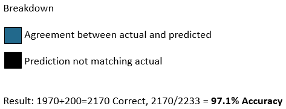<![endif]><b><o:p></o:p></b>

    </td>
   </tr>
  </table>
  
<b style='mso-bidi-font-weight:normal'><o:p></o:p></b>

  </td>
  <td width=518 valign=top style='width:187.25pt;border-top:none;border-left:
  none;border-bottom:solid windowtext 1.0pt;border-right:solid windowtext 1.0pt;
  mso-border-top-alt:solid windowtext .5pt;mso-border-left-alt:solid windowtext .5pt;
  mso-border-alt:solid windowtext .5pt;padding:0in 5.4pt 0in 5.4pt;height:86.15pt'>
  <table class=MsoNormalTable border=0 cellspacing=0 cellpadding=0 width=0
   style='width:290.0pt;border-collapse:collapse;mso-yfti-tbllook:1056;
   mso-padding-alt:0in 0in 0in 0in'>
   <tr style='mso-yfti-irow:0;mso-yfti-firstrow:yes;height:29.2pt'>
    <td width=257 colspan=2 valign=top style='width:151.0pt;border:solid white 1.0pt;
    border-bottom:solid white 3.0pt;padding:.05in .1in .05in .1in;height:29.2pt'>
    
<b style='mso-bidi-font-weight:normal'><u>Rpart: Churn</u></b><b
    style='mso-bidi-font-weight:normal'><o:p></o:p></b>

    </td>
    <td width=246 colspan=2 valign=top style='width:139.0pt;border-top:solid white 1.0pt;
    border-left:none;border-bottom:solid white 3.0pt;border-right:solid white 1.0pt;
    mso-border-left-alt:solid white 1.0pt;padding:.05in .1in .05in .1in;
    height:29.2pt'>
    
<b>Predicted</b><b style='mso-bidi-font-weight:
    normal'><o:p></o:p></b>

    </td>
   </tr>
   <tr style='mso-yfti-irow:1;height:29.2pt'>
    <td width=145 valign=top style='width:91.0pt;border:solid white 1.0pt;
    border-top:none;mso-border-top-alt:solid white 3.0pt;padding:.05in .1in .05in .1in;
    height:29.2pt'></td>
    <td width=112 valign=top style='width:60.0pt;border-top:none;border-left:
    none;border-bottom:solid white 1.0pt;border-right:solid white 1.0pt;
    mso-border-top-alt:solid white 3.0pt;mso-border-left-alt:solid white 1.0pt;
    padding:.05in .1in .05in .1in;height:29.2pt'></td>
    <td width=128 valign=top style='width:69.0pt;border-top:none;border-left:
    none;border-bottom:solid white 1.0pt;border-right:solid white 1.0pt;
    mso-border-top-alt:solid white 3.0pt;mso-border-left-alt:solid white 1.0pt;
    background:#9DC3E6;padding:.05in .1in .05in .1in;height:29.2pt'>
    
<b>No</b><b style='mso-bidi-font-weight:
    normal'><o:p></o:p></b>

    </td>
    <td width=117 valign=top style='width:71.0pt;border-top:none;border-left:
    none;border-bottom:solid white 1.0pt;border-right:solid white 1.0pt;
    mso-border-top-alt:solid white 3.0pt;mso-border-left-alt:solid white 1.0pt;
    background:#9DC3E6;padding:.05in .1in .05in .1in;height:29.2pt'>
    
<b>Yes</b><b style='mso-bidi-font-weight:
    normal'><o:p></o:p></b>

    </td>
   </tr>
   <tr style='mso-yfti-irow:2;height:29.2pt'>
    <td width=145 rowspan=2 valign=top style='width:91.0pt;border:solid white 1.0pt;
    border-top:none;mso-border-top-alt:solid white 1.0pt;background:#9DC3E6;
    padding:.05in .1in .05in .1in;height:29.2pt'>
    
<b>Actual</b><b style='mso-bidi-font-weight:
    normal'><o:p></o:p></b>

    </td>
    <td width=112 valign=top style='width:60.0pt;border-top:none;border-left:
    none;border-bottom:solid white 1.0pt;border-right:solid white 1.0pt;
    mso-border-top-alt:solid white 1.0pt;mso-border-left-alt:solid white 1.0pt;
    background:#9DC3E6;padding:.05in .1in .05in .1in;height:29.2pt'>
    
<b>No</b><b style='mso-bidi-font-weight:
    normal'><o:p></o:p></b>

    </td>
    <td width=128 valign=top style='width:69.0pt;border-top:none;border-left:
    none;border-bottom:solid white 1.0pt;border-right:solid white 1.0pt;
    mso-border-top-alt:solid white 1.0pt;mso-border-left-alt:solid white 1.0pt;
    background:#22698C;padding:.05in .1in .05in .1in;height:29.2pt'>
    
<b>1,409</b><b style='mso-bidi-font-weight:
    normal'><o:p></o:p></b>

    </td>
    <td width=117 valign=top style='width:71.0pt;border-top:none;border-left:
    none;border-bottom:solid white 1.0pt;border-right:solid white 1.0pt;
    mso-border-top-alt:solid white 1.0pt;mso-border-left-alt:solid white 1.0pt;
    background:black;padding:.05in .1in .05in .1in;height:29.2pt'>
    
<b>16</b><b style='mso-bidi-font-weight:
    normal'><o:p></o:p></b>

    </td>
   </tr>
   <tr style='mso-yfti-irow:3;height:27.55pt'>
    <td width=112 valign=top style='width:60.0pt;border-top:none;border-left:
    none;border-bottom:solid white 1.0pt;border-right:solid white 1.0pt;
    mso-border-top-alt:solid white 1.0pt;mso-border-left-alt:solid white 1.0pt;
    background:#9DC3E6;padding:.05in .1in .05in .1in;height:27.55pt'>
    
<b>Yes</b><b style='mso-bidi-font-weight:
    normal'><o:p></o:p></b>

    </td>
    <td width=128 valign=top style='width:69.0pt;border-top:none;border-left:
    none;border-bottom:solid white 1.0pt;border-right:solid white 1.0pt;
    mso-border-top-alt:solid white 1.0pt;mso-border-left-alt:solid white 1.0pt;
    background:black;padding:.05in .1in .05in .1in;height:27.55pt'>
    
<b>60</b><b style='mso-bidi-font-weight:
    normal'><o:p></o:p></b>

    </td>
    <td width=117 valign=top style='width:71.0pt;border-top:none;border-left:
    none;border-bottom:solid white 1.0pt;border-right:solid white 1.0pt;
    mso-border-top-alt:solid white 1.0pt;mso-border-left-alt:solid white 1.0pt;
    background:#22698C;padding:.05in .1in .05in .1in;height:27.55pt'>
    
<b>182</b><b style='mso-bidi-font-weight:
    normal'><o:p></o:p></b>

    </td>
   </tr>
   <tr style='mso-yfti-irow:4;height:27.55pt'>
    <td width=502 colspan=4 valign=top style='width:290.0pt;border:solid white 1.0pt;
    border-top:none;mso-border-top-alt:solid white 1.0pt;padding:.05in .1in .05in .1in;
    height:27.55pt'>
    
<b>Total  1,667</b><b
    style='mso-bidi-font-weight:normal'><o:p></o:p></b>

    </td>
   </tr>
   <tr style='mso-yfti-irow:5;mso-yfti-lastrow:yes;height:27.55pt'>
    <td width=502 colspan=4 valign=top style='width:290.0pt;border:solid white 1.0pt;
    border-top:none;mso-border-top-alt:solid white 1.0pt;padding:.05in .1in .05in .1in;
    height:27.55pt'>
    
<b><o:p>&nbsp;</o:p></b>

    
<!--[if gte vml 1]><v:shape
     id="Picture_x0020_17" o:spid="_x0000_i1042" type="#_x0000_t75" style='width:362.25pt;
     height:150.75pt;visibility:visible;mso-wrap-style:square'>
     <v:imagedata src="README_files/image003.png" o:title=""/>
    </v:shape><![endif]--><![if !vml]>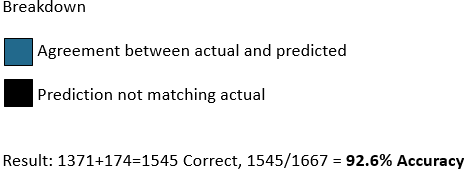<![endif]><b><o:p></o:p></b>

    </td>
   </tr>
  </table>
  
<b style='mso-bidi-font-weight:normal'><o:p></o:p></b>

  </td>
  <td width=483 valign=top style='width:209.05pt;border-top:none;border-left:
  none;border-bottom:solid windowtext 1.0pt;border-right:solid windowtext 1.0pt;
  mso-border-top-alt:solid windowtext .5pt;mso-border-left-alt:solid windowtext .5pt;
  mso-border-alt:solid windowtext .5pt;padding:0in 5.4pt 0in 5.4pt;height:86.15pt'>
  <table class=MsoNormalTable border=0 cellspacing=0 cellpadding=0 width=0
   style='width:290.0pt;border-collapse:collapse;mso-yfti-tbllook:1056;
   mso-padding-alt:0in 0in 0in 0in'>
   <tr style='mso-yfti-irow:0;mso-yfti-firstrow:yes;height:29.2pt'>
    <td width=196 colspan=2 valign=top style='width:151.0pt;border:solid white 1.0pt;
    border-bottom:solid white 3.0pt;padding:.05in .1in .05in .1in;height:29.2pt'>
    
<u>Tree Model: Churn</u><o:p></o:p>

    </td>
    <td width=191 colspan=2 valign=top style='width:139.0pt;border-top:solid white 1.0pt;
    border-left:none;border-bottom:solid white 3.0pt;border-right:solid white 1.0pt;
    mso-border-left-alt:solid white 1.0pt;padding:.05in .1in .05in .1in;
    height:29.2pt'>
    
<b>Predicted</b><o:p></o:p>

    </td>
   </tr>
   <tr style='mso-yfti-irow:1;height:29.2pt'>
    <td width=108 valign=top style='width:91.0pt;border:solid white 1.0pt;
    border-top:none;mso-border-top-alt:solid white 3.0pt;padding:.05in .1in .05in .1in;
    height:29.2pt'></td>
    <td width=88 valign=top style='width:60.0pt;border-top:none;border-left:
    none;border-bottom:solid white 1.0pt;border-right:solid white 1.0pt;
    mso-border-top-alt:solid white 3.0pt;mso-border-left-alt:solid white 1.0pt;
    padding:.05in .1in .05in .1in;height:29.2pt'></td>
    <td width=101 valign=top style='width:69.0pt;border-top:none;border-left:
    none;border-bottom:solid white 1.0pt;border-right:solid white 1.0pt;
    mso-border-top-alt:solid white 3.0pt;mso-border-left-alt:solid white 1.0pt;
    background:#9DC3E6;padding:.05in .1in .05in .1in;height:29.2pt'>
    
<b>No</b><o:p></o:p>

    </td>
    <td width=90 valign=top style='width:71.0pt;border-top:none;border-left:
    none;border-bottom:solid white 1.0pt;border-right:solid white 1.0pt;
    mso-border-top-alt:solid white 3.0pt;mso-border-left-alt:solid white 1.0pt;
    background:#9DC3E6;padding:.05in .1in .05in .1in;height:29.2pt'>
    
<b>Yes</b><o:p></o:p>

    </td>
   </tr>
   <tr style='mso-yfti-irow:2;height:29.2pt'>
    <td width=108 rowspan=2 valign=top style='width:91.0pt;border:solid white 1.0pt;
    border-top:none;mso-border-top-alt:solid white 1.0pt;background:#9DC3E6;
    padding:.05in .1in .05in .1in;height:29.2pt'>
    
<b>Actual</b><o:p></o:p>

    </td>
    <td width=88 valign=top style='width:60.0pt;border-top:none;border-left:
    none;border-bottom:solid white 1.0pt;border-right:solid white 1.0pt;
    mso-border-top-alt:solid white 1.0pt;mso-border-left-alt:solid white 1.0pt;
    background:#9DC3E6;padding:.05in .1in .05in .1in;height:29.2pt'>
    
<b>No</b><o:p></o:p>

    </td>
    <td width=101 valign=top style='width:69.0pt;border-top:none;border-left:
    none;border-bottom:solid white 1.0pt;border-right:solid white 1.0pt;
    mso-border-top-alt:solid white 1.0pt;mso-border-left-alt:solid white 1.0pt;
    background:#22698C;padding:.05in .1in .05in .1in;height:29.2pt'>
    
<b>1,371</b><o:p></o:p>

    </td>
    <td width=90 valign=top style='width:71.0pt;border-top:none;border-left:
    none;border-bottom:solid white 1.0pt;border-right:solid white 1.0pt;
    mso-border-top-alt:solid white 1.0pt;mso-border-left-alt:solid white 1.0pt;
    background:black;padding:.05in .1in .05in .1in;height:29.2pt'>
    
<b>54</b><o:p></o:p>

    </td>
   </tr>
   <tr style='mso-yfti-irow:3;height:27.55pt'>
    <td width=88 valign=top style='width:60.0pt;border-top:none;border-left:
    none;border-bottom:solid white 1.0pt;border-right:solid white 1.0pt;
    mso-border-top-alt:solid white 1.0pt;mso-border-left-alt:solid white 1.0pt;
    background:#9DC3E6;padding:.05in .1in .05in .1in;height:27.55pt'>
    
<b>Yes</b><o:p></o:p>

    </td>
    <td width=101 valign=top style='width:69.0pt;border-top:none;border-left:
    none;border-bottom:solid white 1.0pt;border-right:solid white 1.0pt;
    mso-border-top-alt:solid white 1.0pt;mso-border-left-alt:solid white 1.0pt;
    background:black;padding:.05in .1in .05in .1in;height:27.55pt'>
    
<b>68</b><o:p></o:p>

    </td>
    <td width=90 valign=top style='width:71.0pt;border-top:none;border-left:
    none;border-bottom:solid white 1.0pt;border-right:solid white 1.0pt;
    mso-border-top-alt:solid white 1.0pt;mso-border-left-alt:solid white 1.0pt;
    background:#22698C;padding:.05in .1in .05in .1in;height:27.55pt'>
    
<b>174</b><o:p></o:p>

    </td>
   </tr>
   <tr style='mso-yfti-irow:4;mso-yfti-lastrow:yes;height:27.55pt'>
    <td width=387 colspan=4 valign=top style='width:290.0pt;border:solid white 1.0pt;
    border-top:none;mso-border-top-alt:solid white 1.0pt;padding:.05in .1in .05in .1in;
    height:27.55pt'>
    
<b>Total 
    1,667<o:p></o:p></b>

    
<b><o:p>&nbsp;</o:p></b>

    
<b><o:p>&nbsp;</o:p></b>

    </td>
   </tr>
  </table>
  
<!--[if gte vml 1]><v:shape
   id="Picture_x0020_21" o:spid="_x0000_i1041" type="#_x0000_t75" style='width:351.75pt;
   height:134.25pt;visibility:visible;mso-wrap-style:square'>
   <v:imagedata src="README_files/image013.png" o:title=""/>
  </v:shape><![endif]--><![if !vml]>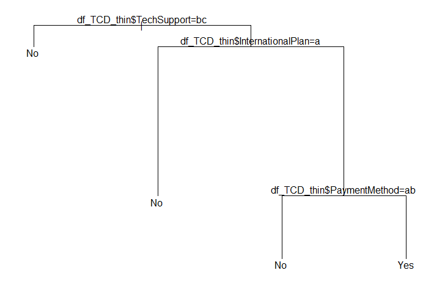<![endif]><o:p></o:p>

  </td>
 </tr>
</table>

<o:p>&nbsp;</o:p>

<b
style='mso-bidi-font-weight:normal'>Recommendations and usage scenarios:<o:p></o:p></b>

<![if !supportLists]><b
style='mso-bidi-font-weight:normal'>1.&nbsp;&nbsp;&nbsp;&nbsp;&nbsp;
</b><![endif]>The models could be used on new customers to
understand if they may be more likely to churn<b style='mso-bidi-font-weight:
normal'><o:p></o:p></b>

<![if !supportLists]><b
style='mso-bidi-font-weight:normal'>2.&nbsp;&nbsp;&nbsp;&nbsp;&nbsp;
</b><![endif]>The models agree on many of the same data
elements having significance to churn<b style='mso-bidi-font-weight:normal'><o:p></o:p></b>

<![if !supportLists]><b
style='mso-bidi-font-weight:normal'>a.&nbsp;&nbsp;&nbsp;&nbsp;&nbsp;
</b><![endif]>Understand and promote those features that
are significant factors to churn behavior.<b style='mso-bidi-font-weight:normal'><o:p></o:p></b>

<b
style='mso-bidi-font-weight:normal'>Follow up and additional recommended work:<o:p></o:p></b>

<![if !supportLists]>1.&nbsp;&nbsp;&nbsp;&nbsp;&nbsp; <![endif]>Principle
Component Analysis (PCA) code is included and working

<![if !supportLists]>2.&nbsp;&nbsp;&nbsp;&nbsp;&nbsp; <![endif]>Next
step of combining the PCA and sending PCA data in the Tree based models is a
next step

<![if !supportLists]>3.&nbsp;&nbsp;&nbsp;&nbsp;&nbsp; <![endif]>Logistics
regression code is included. Model was run but accuracy was so low that it isn’t
included in the results

<![if !supportLists]>a.&nbsp;&nbsp;&nbsp;&nbsp;&nbsp;&nbsp; <![endif]>Accuracy
could be low because of the number of independent variables in the data. 

<![if !supportLists]>b.&nbsp;&nbsp;&nbsp;&nbsp;&nbsp; <![endif]>Research
indicated that with so many independent variables the Tree based models would
be the best approach for machine learning.

<b
style='mso-bidi-font-weight:normal'>References:<o:p></o:p></b>

<![if !supportLists]>1.&nbsp;&nbsp;&nbsp;&nbsp;&nbsp; <![endif]>Cirillo, A. (2017). <i style='mso-bidi-font-style:normal'>R
Data Mining.</i> Birmingham, UK. Packt Publishing<o:p></o:p>

<![if !supportLists]>2.&nbsp;&nbsp;&nbsp;&nbsp;&nbsp; <![endif]>Lantz,
B. (2015). <i style='mso-bidi-font-style:normal'>Machine Learning with R -
Second Edition.</i> Birmingham, UK. Packt Publishing<o:p></o:p>

<![if !supportLists]>3.&nbsp;&nbsp;&nbsp;&nbsp;&nbsp; <![endif]>Schmuller, J. (2018). <i style='mso-bidi-font-style:normal'>R Projects
For Dummies</i>. Hoboken, NJ. John Wiley &amp; Sons
Inc.<o:p></o:p>

<![if !supportLists]>4.&nbsp;&nbsp;&nbsp;&nbsp;&nbsp; <![endif]>PCA
example<b style='mso-bidi-font-weight:normal'> </b><a
href="https://www.analyticsvidhya.com/blog/2016/03/practical-guide-principal-component-analysis-python/">https://www.analyticsvidhya.com/blog/2016/03/practical-guide-principal-component-analysis-python/</a><o:p></o:p>

<![if !supportLists]><b
style='mso-bidi-font-weight:normal'>5.&nbsp;&nbsp;&nbsp;&nbsp;&nbsp;
</b><![endif]>Logistic regression sample <b
style='mso-bidi-font-weight:normal'> </b><a
href="https://www.r-bloggers.com/how-to-perform-a-logistic-regression-in-r/">https://www.r-bloggers.com/how-to-perform-a-logistic-regression-in-r/</a><b
style='mso-bidi-font-weight:normal'><o:p></o:p></b>

<![if !supportLists]>6.&nbsp;&nbsp;&nbsp;&nbsp;&nbsp; <![endif]>Tree based modeling tutorial <a
href="https://www.analyticsvidhya.com/blog/2016/04/complete-tutorial-tree-based-modeling-scratch-in-python/">https://www.analyticsvidhya.com/blog/2016/04/complete-tutorial-tree-based-modeling-scratch-in-python/</a>   ---
Tree base modeling tutorial<o:p></o:p>

<![if !supportLists]>7.&nbsp;&nbsp;&nbsp;&nbsp;&nbsp; <![endif]>Titanic
Tutorial for R uses cool examples and graphics for decision trees: <a
href="https://trevorstephens.com/kaggle-titanic-tutorial/getting-started-with-r/">https://trevorstephens.com/kaggle-titanic-tutorial/getting-started-with-r/</a><o:p></o:p>

<![if !supportLists]>8.&nbsp;&nbsp;&nbsp;&nbsp;&nbsp; <![endif]>Example
project from past practicum that I am using as a layout reference. Please
advise if this example has issues you would recommend improvements on. <o:p></o:p>

<a
href="https://github.com/KeanuNotReeves/practicum-trad-projections">https://github.com/KeanuNotReeves/practicum-trad-projections</a><o:p></o:p>

<![if !supportLists]>9.&nbsp;&nbsp;&nbsp;&nbsp;&nbsp; <![endif]>Basic
R example for decision tree:  <a href="https://rpubs.com/SANPANDE/221595">https://rpubs.com/SANPANDE/221595</a><o:p></o:p>

<![if !supportLists]>10.&nbsp; <![endif]>My Github for Practicum 2: <a
href="https://github.com/mdegrado/TelcoChurn">https://github.com/mdegrado/TelcoChurn</a>  - In Progress<o:p></o:p>

<![if !supportLists]>11.&nbsp; <![endif]>My Gibhub for Practicum 1: <a
href="https://github.com/mdegrado/Wine-reviews-analysis-and-visualization">https://github.com/mdegrado/Wine-reviews-analysis-and-visualization</a>
<o:p></o:p>

<b
style='mso-bidi-font-weight:normal'>Appendix<o:p></o:p></b>

<b
style='mso-bidi-font-weight:normal'><o:p>&nbsp;</o:p></b>

<b
style='mso-bidi-font-weight:normal'>The Data: Results from EDA:<o:p></o:p></b>

<table class=MsoTableGrid border=1 cellspacing=0 cellpadding=0
 style='border-collapse:collapse;border:none;mso-border-alt:solid windowtext .5pt;
 mso-yfti-tbllook:1184;mso-padding-alt:0in 5.4pt 0in 5.4pt'>
 <tr style='mso-yfti-irow:0;mso-yfti-firstrow:yes;height:15.75pt'>
  <td width=175 nowrap valign=top style='width:131.0pt;border:solid windowtext 1.0pt;
  mso-border-alt:solid windowtext .5pt;padding:0in 5.4pt 0in 5.4pt;height:15.75pt'>
  
<b>Data fields<o:p></o:p></b>

  </td>
  <td width=269 nowrap valign=top style='width:202.0pt;border:solid windowtext 1.0pt;
  border-left:none;mso-border-left-alt:solid windowtext .5pt;mso-border-alt:
  solid windowtext .5pt;padding:0in 5.4pt 0in 5.4pt;height:15.75pt'>
  
<b>Definition<o:p></o:p></b>

  </td>
  <td width=188 nowrap valign=top style='width:141.0pt;border:solid windowtext 1.0pt;
  border-left:none;mso-border-left-alt:solid windowtext .5pt;mso-border-alt:
  solid windowtext .5pt;padding:0in 5.4pt 0in 5.4pt;height:15.75pt'>
  
<b>Example data<o:p></o:p></b>

  </td>
 </tr>
 <tr style='mso-yfti-irow:1;height:15.0pt'>
  <td width=175 nowrap valign=top style='width:131.0pt;border:solid windowtext 1.0pt;
  border-top:none;mso-border-top-alt:solid windowtext .5pt;mso-border-alt:solid windowtext .5pt;
  padding:0in 5.4pt 0in 5.4pt;height:15.0pt'>
  
<b>customerID</b><b><o:p></o:p></b>

  </td>
  <td width=269 nowrap valign=top style='width:202.0pt;border-top:none;
  border-left:none;border-bottom:solid windowtext 1.0pt;border-right:solid windowtext 1.0pt;
  mso-border-top-alt:solid windowtext .5pt;mso-border-left-alt:solid windowtext .5pt;
  mso-border-alt:solid windowtext .5pt;padding:0in 5.4pt 0in 5.4pt;height:15.0pt'>
  
Unique ID for customer<o:p></o:p>

  </td>
  <td width=188 valign=top style='width:141.0pt;border-top:none;border-left:
  none;border-bottom:solid windowtext 1.0pt;border-right:solid windowtext 1.0pt;
  mso-border-top-alt:solid windowtext .5pt;mso-border-left-alt:solid windowtext .5pt;
  mso-border-alt:solid windowtext .5pt;padding:0in 5.4pt 0in 5.4pt;height:15.0pt'>
  
0002-ORFBO<o:p></o:p>

  </td>
 </tr>
 <tr style='mso-yfti-irow:2;height:15.0pt'>
  <td width=175 nowrap valign=top style='width:131.0pt;border:solid windowtext 1.0pt;
  border-top:none;mso-border-top-alt:solid windowtext .5pt;mso-border-alt:solid windowtext .5pt;
  padding:0in 5.4pt 0in 5.4pt;height:15.0pt'>
  
<b>gender<o:p></o:p></b>

  </td>
  <td width=269 nowrap valign=top style='width:202.0pt;border-top:none;
  border-left:none;border-bottom:solid windowtext 1.0pt;border-right:solid windowtext 1.0pt;
  mso-border-top-alt:solid windowtext .5pt;mso-border-left-alt:solid windowtext .5pt;
  mso-border-alt:solid windowtext .5pt;padding:0in 5.4pt 0in 5.4pt;height:15.0pt'>
  
has: 
  Male or Female<o:p></o:p>

  </td>
  <td width=188 valign=top style='width:141.0pt;border-top:none;border-left:
  none;border-bottom:solid windowtext 1.0pt;border-right:solid windowtext 1.0pt;
  mso-border-top-alt:solid windowtext .5pt;mso-border-left-alt:solid windowtext .5pt;
  mso-border-alt:solid windowtext .5pt;padding:0in 5.4pt 0in 5.4pt;height:15.0pt'>
  
Female<o:p></o:p>

  </td>
 </tr>
 <tr style='mso-yfti-irow:3;height:15.0pt'>
  <td width=175 nowrap valign=top style='width:131.0pt;border:solid windowtext 1.0pt;
  border-top:none;mso-border-top-alt:solid windowtext .5pt;mso-border-alt:solid windowtext .5pt;
  padding:0in 5.4pt 0in 5.4pt;height:15.0pt'>
  
<b>SeniorCitizen</b><b><o:p></o:p></b>

  </td>
  <td width=269 nowrap valign=top style='width:202.0pt;border-top:none;
  border-left:none;border-bottom:solid windowtext 1.0pt;border-right:solid windowtext 1.0pt;
  mso-border-top-alt:solid windowtext .5pt;mso-border-left-alt:solid windowtext .5pt;
  mso-border-alt:solid windowtext .5pt;padding:0in 5.4pt 0in 5.4pt;height:15.0pt'>
  
has: 0 or 1<o:p></o:p>

  </td>
  <td width=188 valign=top style='width:141.0pt;border-top:none;border-left:
  none;border-bottom:solid windowtext 1.0pt;border-right:solid windowtext 1.0pt;
  mso-border-top-alt:solid windowtext .5pt;mso-border-left-alt:solid windowtext .5pt;
  mso-border-alt:solid windowtext .5pt;padding:0in 5.4pt 0in 5.4pt;height:15.0pt'>
  
0<o:p></o:p>

  </td>
 </tr>
 <tr style='mso-yfti-irow:4;height:15.0pt'>
  <td width=175 nowrap valign=top style='width:131.0pt;border:solid windowtext 1.0pt;
  border-top:none;mso-border-top-alt:solid windowtext .5pt;mso-border-alt:solid windowtext .5pt;
  padding:0in 5.4pt 0in 5.4pt;height:15.0pt'>
  
<b>MaritalStatus</b><b><o:p></o:p></b>

  </td>
  <td width=269 nowrap valign=top style='width:202.0pt;border-top:none;
  border-left:none;border-bottom:solid windowtext 1.0pt;border-right:solid windowtext 1.0pt;
  mso-border-top-alt:solid windowtext .5pt;mso-border-left-alt:solid windowtext .5pt;
  mso-border-alt:solid windowtext .5pt;padding:0in 5.4pt 0in 5.4pt;height:15.0pt'>
  
has Yes or No<o:p></o:p>

  </td>
  <td width=188 valign=top style='width:141.0pt;border-top:none;border-left:
  none;border-bottom:solid windowtext 1.0pt;border-right:solid windowtext 1.0pt;
  mso-border-top-alt:solid windowtext .5pt;mso-border-left-alt:solid windowtext .5pt;
  mso-border-alt:solid windowtext .5pt;padding:0in 5.4pt 0in 5.4pt;height:15.0pt'>
  
Yes<o:p></o:p>

  </td>
 </tr>
 <tr style='mso-yfti-irow:5;height:15.0pt'>
  <td width=175 nowrap valign=top style='width:131.0pt;border:solid windowtext 1.0pt;
  border-top:none;mso-border-top-alt:solid windowtext .5pt;mso-border-alt:solid windowtext .5pt;
  padding:0in 5.4pt 0in 5.4pt;height:15.0pt'>
  
<b>Dependents<o:p></o:p></b>

  </td>
  <td width=269 nowrap valign=top style='width:202.0pt;border-top:none;
  border-left:none;border-bottom:solid windowtext 1.0pt;border-right:solid windowtext 1.0pt;
  mso-border-top-alt:solid windowtext .5pt;mso-border-left-alt:solid windowtext .5pt;
  mso-border-alt:solid windowtext .5pt;padding:0in 5.4pt 0in 5.4pt;height:15.0pt'>
  
has Yes or No<o:p></o:p>

  </td>
  <td width=188 valign=top style='width:141.0pt;border-top:none;border-left:
  none;border-bottom:solid windowtext 1.0pt;border-right:solid windowtext 1.0pt;
  mso-border-top-alt:solid windowtext .5pt;mso-border-left-alt:solid windowtext .5pt;
  mso-border-alt:solid windowtext .5pt;padding:0in 5.4pt 0in 5.4pt;height:15.0pt'>
  
Yes<o:p></o:p>

  </td>
 </tr>
 <tr style='mso-yfti-irow:6;height:15.0pt'>
  <td width=175 nowrap valign=top style='width:131.0pt;border:solid windowtext 1.0pt;
  border-top:none;mso-border-top-alt:solid windowtext .5pt;mso-border-alt:solid windowtext .5pt;
  padding:0in 5.4pt 0in 5.4pt;height:15.0pt'>
  
<b>tenure<o:p></o:p></b>

  </td>
  <td width=269 nowrap valign=top style='width:202.0pt;border-top:none;
  border-left:none;border-bottom:solid windowtext 1.0pt;border-right:solid windowtext 1.0pt;
  mso-border-top-alt:solid windowtext .5pt;mso-border-left-alt:solid windowtext .5pt;
  mso-border-alt:solid windowtext .5pt;padding:0in 5.4pt 0in 5.4pt;height:15.0pt'>
  
ranges from 0 to 72<o:p></o:p>

  </td>
  <td width=188 valign=top style='width:141.0pt;border-top:none;border-left:
  none;border-bottom:solid windowtext 1.0pt;border-right:solid windowtext 1.0pt;
  mso-border-top-alt:solid windowtext .5pt;mso-border-left-alt:solid windowtext .5pt;
  mso-border-alt:solid windowtext .5pt;padding:0in 5.4pt 0in 5.4pt;height:15.0pt'>
  
9<o:p></o:p>

  </td>
 </tr>
 <tr style='mso-yfti-irow:7;height:15.0pt'>
  <td width=175 nowrap valign=top style='width:131.0pt;border:solid windowtext 1.0pt;
  border-top:none;mso-border-top-alt:solid windowtext .5pt;mso-border-alt:solid windowtext .5pt;
  padding:0in 5.4pt 0in 5.4pt;height:15.0pt'>
  
<b>PhoneService</b><b><o:p></o:p></b>

  </td>
  <td width=269 nowrap valign=top style='width:202.0pt;border-top:none;
  border-left:none;border-bottom:solid windowtext 1.0pt;border-right:solid windowtext 1.0pt;
  mso-border-top-alt:solid windowtext .5pt;mso-border-left-alt:solid windowtext .5pt;
  mso-border-alt:solid windowtext .5pt;padding:0in 5.4pt 0in 5.4pt;height:15.0pt'>
  
all records set to yes<o:p></o:p>

  </td>
  <td width=188 valign=top style='width:141.0pt;border-top:none;border-left:
  none;border-bottom:solid windowtext 1.0pt;border-right:solid windowtext 1.0pt;
  mso-border-top-alt:solid windowtext .5pt;mso-border-left-alt:solid windowtext .5pt;
  mso-border-alt:solid windowtext .5pt;padding:0in 5.4pt 0in 5.4pt;height:15.0pt'>
  
Yes<o:p></o:p>

  </td>
 </tr>
 <tr style='mso-yfti-irow:8;height:15.0pt'>
  <td width=175 nowrap valign=top style='width:131.0pt;border:solid windowtext 1.0pt;
  border-top:none;mso-border-top-alt:solid windowtext .5pt;mso-border-alt:solid windowtext .5pt;
  padding:0in 5.4pt 0in 5.4pt;height:15.0pt'>
  
<b>MultipleLines</b><b><o:p></o:p></b>

  </td>
  <td width=269 nowrap valign=top style='width:202.0pt;border-top:none;
  border-left:none;border-bottom:solid windowtext 1.0pt;border-right:solid windowtext 1.0pt;
  mso-border-top-alt:solid windowtext .5pt;mso-border-left-alt:solid windowtext .5pt;
  mso-border-alt:solid windowtext .5pt;padding:0in 5.4pt 0in 5.4pt;height:15.0pt'>
  
has Yes or No<o:p></o:p>

  </td>
  <td width=188 valign=top style='width:141.0pt;border-top:none;border-left:
  none;border-bottom:solid windowtext 1.0pt;border-right:solid windowtext 1.0pt;
  mso-border-top-alt:solid windowtext .5pt;mso-border-left-alt:solid windowtext .5pt;
  mso-border-alt:solid windowtext .5pt;padding:0in 5.4pt 0in 5.4pt;height:15.0pt'>
  
No<o:p></o:p>

  </td>
 </tr>
 <tr style='mso-yfti-irow:9;height:15.0pt'>
  <td width=175 nowrap valign=top style='width:131.0pt;border:solid windowtext 1.0pt;
  border-top:none;mso-border-top-alt:solid windowtext .5pt;mso-border-alt:solid windowtext .5pt;
  padding:0in 5.4pt 0in 5.4pt;height:15.0pt'>
  
<b>InternetService</b><b><o:p></o:p></b>

  </td>
  <td width=269 nowrap valign=top style='width:202.0pt;border-top:none;
  border-left:none;border-bottom:solid windowtext 1.0pt;border-right:solid windowtext 1.0pt;
  mso-border-top-alt:solid windowtext .5pt;mso-border-left-alt:solid windowtext .5pt;
  mso-border-alt:solid windowtext .5pt;padding:0in 5.4pt 0in 5.4pt;height:15.0pt'>
  
has DSL, Fiber optic, No<o:p></o:p>

  </td>
  <td width=188 valign=top style='width:141.0pt;border-top:none;border-left:
  none;border-bottom:solid windowtext 1.0pt;border-right:solid windowtext 1.0pt;
  mso-border-top-alt:solid windowtext .5pt;mso-border-left-alt:solid windowtext .5pt;
  mso-border-alt:solid windowtext .5pt;padding:0in 5.4pt 0in 5.4pt;height:15.0pt'>
  
DSL<o:p></o:p>

  </td>
 </tr>
 <tr style='mso-yfti-irow:10;height:15.0pt'>
  <td width=175 nowrap valign=top style='width:131.0pt;border:solid windowtext 1.0pt;
  border-top:none;mso-border-top-alt:solid windowtext .5pt;mso-border-alt:solid windowtext .5pt;
  padding:0in 5.4pt 0in 5.4pt;height:15.0pt'>
  
<b>OnlineSecurity</b><b><o:p></o:p></b>

  </td>
  <td width=269 nowrap valign=top style='width:202.0pt;border-top:none;
  border-left:none;border-bottom:solid windowtext 1.0pt;border-right:solid windowtext 1.0pt;
  mso-border-top-alt:solid windowtext .5pt;mso-border-left-alt:solid windowtext .5pt;
  mso-border-alt:solid windowtext .5pt;padding:0in 5.4pt 0in 5.4pt;height:15.0pt'>
  
has No, No Internet service, Yes<o:p></o:p>

  </td>
  <td width=188 valign=top style='width:141.0pt;border-top:none;border-left:
  none;border-bottom:solid windowtext 1.0pt;border-right:solid windowtext 1.0pt;
  mso-border-top-alt:solid windowtext .5pt;mso-border-left-alt:solid windowtext .5pt;
  mso-border-alt:solid windowtext .5pt;padding:0in 5.4pt 0in 5.4pt;height:15.0pt'>
  
No<o:p></o:p>

  </td>
 </tr>
 <tr style='mso-yfti-irow:11;height:15.0pt'>
  <td width=175 nowrap valign=top style='width:131.0pt;border:solid windowtext 1.0pt;
  border-top:none;mso-border-top-alt:solid windowtext .5pt;mso-border-alt:solid windowtext .5pt;
  padding:0in 5.4pt 0in 5.4pt;height:15.0pt'>
  
<b>OnlineBackup</b><b><o:p></o:p></b>

  </td>
  <td width=269 nowrap valign=top style='width:202.0pt;border-top:none;
  border-left:none;border-bottom:solid windowtext 1.0pt;border-right:solid windowtext 1.0pt;
  mso-border-top-alt:solid windowtext .5pt;mso-border-left-alt:solid windowtext .5pt;
  mso-border-alt:solid windowtext .5pt;padding:0in 5.4pt 0in 5.4pt;height:15.0pt'>
  
has No, No Internet service, Yes<o:p></o:p>

  </td>
  <td width=188 valign=top style='width:141.0pt;border-top:none;border-left:
  none;border-bottom:solid windowtext 1.0pt;border-right:solid windowtext 1.0pt;
  mso-border-top-alt:solid windowtext .5pt;mso-border-left-alt:solid windowtext .5pt;
  mso-border-alt:solid windowtext .5pt;padding:0in 5.4pt 0in 5.4pt;height:15.0pt'>
  
Yes<o:p></o:p>

  </td>
 </tr>
 <tr style='mso-yfti-irow:12;height:15.0pt'>
  <td width=175 nowrap valign=top style='width:131.0pt;border:solid windowtext 1.0pt;
  border-top:none;mso-border-top-alt:solid windowtext .5pt;mso-border-alt:solid windowtext .5pt;
  padding:0in 5.4pt 0in 5.4pt;height:15.0pt'>
  
<b>DeviceProtection</b><b><o:p></o:p></b>

  </td>
  <td width=269 nowrap valign=top style='width:202.0pt;border-top:none;
  border-left:none;border-bottom:solid windowtext 1.0pt;border-right:solid windowtext 1.0pt;
  mso-border-top-alt:solid windowtext .5pt;mso-border-left-alt:solid windowtext .5pt;
  mso-border-alt:solid windowtext .5pt;padding:0in 5.4pt 0in 5.4pt;height:15.0pt'>
  
has No, No Internet service, Yes<o:p></o:p>

  </td>
  <td width=188 valign=top style='width:141.0pt;border-top:none;border-left:
  none;border-bottom:solid windowtext 1.0pt;border-right:solid windowtext 1.0pt;
  mso-border-top-alt:solid windowtext .5pt;mso-border-left-alt:solid windowtext .5pt;
  mso-border-alt:solid windowtext .5pt;padding:0in 5.4pt 0in 5.4pt;height:15.0pt'>
  
No<o:p></o:p>

  </td>
 </tr>
 <tr style='mso-yfti-irow:13;height:15.0pt'>
  <td width=175 nowrap valign=top style='width:131.0pt;border:solid windowtext 1.0pt;
  border-top:none;mso-border-top-alt:solid windowtext .5pt;mso-border-alt:solid windowtext .5pt;
  padding:0in 5.4pt 0in 5.4pt;height:15.0pt'>
  
<b>TechSupport</b><b><o:p></o:p></b>

  </td>
  <td width=269 nowrap valign=top style='width:202.0pt;border-top:none;
  border-left:none;border-bottom:solid windowtext 1.0pt;border-right:solid windowtext 1.0pt;
  mso-border-top-alt:solid windowtext .5pt;mso-border-left-alt:solid windowtext .5pt;
  mso-border-alt:solid windowtext .5pt;padding:0in 5.4pt 0in 5.4pt;height:15.0pt'>
  
has No, No Internet service, Yes<o:p></o:p>

  </td>
  <td width=188 valign=top style='width:141.0pt;border-top:none;border-left:
  none;border-bottom:solid windowtext 1.0pt;border-right:solid windowtext 1.0pt;
  mso-border-top-alt:solid windowtext .5pt;mso-border-left-alt:solid windowtext .5pt;
  mso-border-alt:solid windowtext .5pt;padding:0in 5.4pt 0in 5.4pt;height:15.0pt'>
  
Yes<o:p></o:p>

  </td>
 </tr>
 <tr style='mso-yfti-irow:14;height:15.0pt'>
  <td width=175 nowrap valign=top style='width:131.0pt;border:solid windowtext 1.0pt;
  border-top:none;mso-border-top-alt:solid windowtext .5pt;mso-border-alt:solid windowtext .5pt;
  padding:0in 5.4pt 0in 5.4pt;height:15.0pt'>
  
<b>StreamingTV</b><b><o:p></o:p></b>

  </td>
  <td width=269 nowrap valign=top style='width:202.0pt;border-top:none;
  border-left:none;border-bottom:solid windowtext 1.0pt;border-right:solid windowtext 1.0pt;
  mso-border-top-alt:solid windowtext .5pt;mso-border-left-alt:solid windowtext .5pt;
  mso-border-alt:solid windowtext .5pt;padding:0in 5.4pt 0in 5.4pt;height:15.0pt'>
  
has No, No Internet service, Yes<o:p></o:p>

  </td>
  <td width=188 valign=top style='width:141.0pt;border-top:none;border-left:
  none;border-bottom:solid windowtext 1.0pt;border-right:solid windowtext 1.0pt;
  mso-border-top-alt:solid windowtext .5pt;mso-border-left-alt:solid windowtext .5pt;
  mso-border-alt:solid windowtext .5pt;padding:0in 5.4pt 0in 5.4pt;height:15.0pt'>
  
Yes<o:p></o:p>

  </td>
 </tr>
 <tr style='mso-yfti-irow:15;height:15.0pt'>
  <td width=175 nowrap valign=top style='width:131.0pt;border:solid windowtext 1.0pt;
  border-top:none;mso-border-top-alt:solid windowtext .5pt;mso-border-alt:solid windowtext .5pt;
  padding:0in 5.4pt 0in 5.4pt;height:15.0pt'>
  
<b>StreamingMovies</b><b><o:p></o:p></b>

  </td>
  <td width=269 nowrap valign=top style='width:202.0pt;border-top:none;
  border-left:none;border-bottom:solid windowtext 1.0pt;border-right:solid windowtext 1.0pt;
  mso-border-top-alt:solid windowtext .5pt;mso-border-left-alt:solid windowtext .5pt;
  mso-border-alt:solid windowtext .5pt;padding:0in 5.4pt 0in 5.4pt;height:15.0pt'>
  
has No, No Internet service, Yes<o:p></o:p>

  </td>
  <td width=188 valign=top style='width:141.0pt;border-top:none;border-left:
  none;border-bottom:solid windowtext 1.0pt;border-right:solid windowtext 1.0pt;
  mso-border-top-alt:solid windowtext .5pt;mso-border-left-alt:solid windowtext .5pt;
  mso-border-alt:solid windowtext .5pt;padding:0in 5.4pt 0in 5.4pt;height:15.0pt'>
  
No<o:p></o:p>

  </td>
 </tr>
 <tr style='mso-yfti-irow:16;height:15.0pt'>
  <td width=175 nowrap valign=top style='width:131.0pt;border:solid windowtext 1.0pt;
  border-top:none;mso-border-top-alt:solid windowtext .5pt;mso-border-alt:solid windowtext .5pt;
  padding:0in 5.4pt 0in 5.4pt;height:15.0pt'>
  
<b>Contract<o:p></o:p></b>

  </td>
  <td width=269 nowrap valign=top style='width:202.0pt;border-top:none;
  border-left:none;border-bottom:solid windowtext 1.0pt;border-right:solid windowtext 1.0pt;
  mso-border-top-alt:solid windowtext .5pt;mso-border-left-alt:solid windowtext .5pt;
  mso-border-alt:solid windowtext .5pt;padding:0in 5.4pt 0in 5.4pt;height:15.0pt'>
  
has Month-to-month, One year, Two year<o:p></o:p>

  </td>
  <td width=188 valign=top style='width:141.0pt;border-top:none;border-left:
  none;border-bottom:solid windowtext 1.0pt;border-right:solid windowtext 1.0pt;
  mso-border-top-alt:solid windowtext .5pt;mso-border-left-alt:solid windowtext .5pt;
  mso-border-alt:solid windowtext .5pt;padding:0in 5.4pt 0in 5.4pt;height:15.0pt'>
  
One year<o:p></o:p>

  </td>
 </tr>
 <tr style='mso-yfti-irow:17;height:15.0pt'>
  <td width=175 nowrap valign=top style='width:131.0pt;border:solid windowtext 1.0pt;
  border-top:none;mso-border-top-alt:solid windowtext .5pt;mso-border-alt:solid windowtext .5pt;
  padding:0in 5.4pt 0in 5.4pt;height:15.0pt'>
  
<b>PaperlessBilling</b><b><o:p></o:p></b>

  </td>
  <td width=269 nowrap valign=top style='width:202.0pt;border-top:none;
  border-left:none;border-bottom:solid windowtext 1.0pt;border-right:solid windowtext 1.0pt;
  mso-border-top-alt:solid windowtext .5pt;mso-border-left-alt:solid windowtext .5pt;
  mso-border-alt:solid windowtext .5pt;padding:0in 5.4pt 0in 5.4pt;height:15.0pt'>
  
has Yes or No<o:p></o:p>

  </td>
  <td width=188 valign=top style='width:141.0pt;border-top:none;border-left:
  none;border-bottom:solid windowtext 1.0pt;border-right:solid windowtext 1.0pt;
  mso-border-top-alt:solid windowtext .5pt;mso-border-left-alt:solid windowtext .5pt;
  mso-border-alt:solid windowtext .5pt;padding:0in 5.4pt 0in 5.4pt;height:15.0pt'>
  
Yes<o:p></o:p>

  </td>
 </tr>
 <tr style='mso-yfti-irow:18;height:45.0pt'>
  <td width=175 nowrap valign=top style='width:131.0pt;border:solid windowtext 1.0pt;
  border-top:none;mso-border-top-alt:solid windowtext .5pt;mso-border-alt:solid windowtext .5pt;
  padding:0in 5.4pt 0in 5.4pt;height:45.0pt'>
  
<b>PaymentMethod</b><b><o:p></o:p></b>

  </td>
  <td width=269 valign=top style='width:202.0pt;border-top:none;border-left:
  none;border-bottom:solid windowtext 1.0pt;border-right:solid windowtext 1.0pt;
  mso-border-top-alt:solid windowtext .5pt;mso-border-left-alt:solid windowtext .5pt;
  mso-border-alt:solid windowtext .5pt;padding:0in 5.4pt 0in 5.4pt;height:45.0pt'>
  
has Bank transfer (automatic), Credit card
  (automatic), Electronic check, Mailed check<o:p></o:p>

  </td>
  <td width=188 valign=top style='width:141.0pt;border-top:none;border-left:
  none;border-bottom:solid windowtext 1.0pt;border-right:solid windowtext 1.0pt;
  mso-border-top-alt:solid windowtext .5pt;mso-border-left-alt:solid windowtext .5pt;
  mso-border-alt:solid windowtext .5pt;padding:0in 5.4pt 0in 5.4pt;height:45.0pt'>
  
Mailed check<o:p></o:p>

  </td>
 </tr>
 <tr style='mso-yfti-irow:19;height:15.0pt'>
  <td width=175 nowrap valign=top style='width:131.0pt;border:solid windowtext 1.0pt;
  border-top:none;mso-border-top-alt:solid windowtext .5pt;mso-border-alt:solid windowtext .5pt;
  padding:0in 5.4pt 0in 5.4pt;height:15.0pt'>
  
<b>InternationalPlan</b><b><o:p></o:p></b>

  </td>
  <td width=269 nowrap valign=top style='width:202.0pt;border-top:none;
  border-left:none;border-bottom:solid windowtext 1.0pt;border-right:solid windowtext 1.0pt;
  mso-border-top-alt:solid windowtext .5pt;mso-border-left-alt:solid windowtext .5pt;
  mso-border-alt:solid windowtext .5pt;padding:0in 5.4pt 0in 5.4pt;height:15.0pt'>
  
has Yes or No<o:p></o:p>

  </td>
  <td width=188 valign=top style='width:141.0pt;border-top:none;border-left:
  none;border-bottom:solid windowtext 1.0pt;border-right:solid windowtext 1.0pt;
  mso-border-top-alt:solid windowtext .5pt;mso-border-left-alt:solid windowtext .5pt;
  mso-border-alt:solid windowtext .5pt;padding:0in 5.4pt 0in 5.4pt;height:15.0pt'>
  
No<o:p></o:p>

  </td>
 </tr>
 <tr style='mso-yfti-irow:20;height:15.0pt'>
  <td width=175 nowrap valign=top style='width:131.0pt;border:solid windowtext 1.0pt;
  border-top:none;mso-border-top-alt:solid windowtext .5pt;mso-border-alt:solid windowtext .5pt;
  padding:0in 5.4pt 0in 5.4pt;height:15.0pt'>
  
<b>VoiceMailPlan</b><b><o:p></o:p></b>

  </td>
  <td width=269 nowrap valign=top style='width:202.0pt;border-top:none;
  border-left:none;border-bottom:solid windowtext 1.0pt;border-right:solid windowtext 1.0pt;
  mso-border-top-alt:solid windowtext .5pt;mso-border-left-alt:solid windowtext .5pt;
  mso-border-alt:solid windowtext .5pt;padding:0in 5.4pt 0in 5.4pt;height:15.0pt'>
  
has Yes or No<o:p></o:p>

  </td>
  <td width=188 valign=top style='width:141.0pt;border-top:none;border-left:
  none;border-bottom:solid windowtext 1.0pt;border-right:solid windowtext 1.0pt;
  mso-border-top-alt:solid windowtext .5pt;mso-border-left-alt:solid windowtext .5pt;
  mso-border-alt:solid windowtext .5pt;padding:0in 5.4pt 0in 5.4pt;height:15.0pt'>
  
No<o:p></o:p>

  </td>
 </tr>
 <tr style='mso-yfti-irow:21;height:15.0pt'>
  <td width=175 nowrap valign=top style='width:131.0pt;border:solid windowtext 1.0pt;
  border-top:none;mso-border-top-alt:solid windowtext .5pt;mso-border-alt:solid windowtext .5pt;
  padding:0in 5.4pt 0in 5.4pt;height:15.0pt'>
  
<b>NumbervMailMessages</b><b><o:p></o:p></b>

  </td>
  <td width=269 nowrap valign=top style='width:202.0pt;border-top:none;
  border-left:none;border-bottom:solid windowtext 1.0pt;border-right:solid windowtext 1.0pt;
  mso-border-top-alt:solid windowtext .5pt;mso-border-left-alt:solid windowtext .5pt;
  mso-border-alt:solid windowtext .5pt;padding:0in 5.4pt 0in 5.4pt;height:15.0pt'>
  
ranges 0 to 51<o:p></o:p>

  </td>
  <td width=188 valign=top style='width:141.0pt;border-top:none;border-left:
  none;border-bottom:solid windowtext 1.0pt;border-right:solid windowtext 1.0pt;
  mso-border-top-alt:solid windowtext .5pt;mso-border-left-alt:solid windowtext .5pt;
  mso-border-alt:solid windowtext .5pt;padding:0in 5.4pt 0in 5.4pt;height:15.0pt'>
  
0<o:p></o:p>

  </td>
 </tr>
 <tr style='mso-yfti-irow:22;height:15.0pt'>
  <td width=175 nowrap valign=top style='width:131.0pt;border:solid windowtext 1.0pt;
  border-top:none;mso-border-top-alt:solid windowtext .5pt;mso-border-alt:solid windowtext .5pt;
  padding:0in 5.4pt 0in 5.4pt;height:15.0pt'>
  
<b>TotalDayMinutes</b><b><o:p></o:p></b>

  </td>
  <td width=269 nowrap valign=top style='width:202.0pt;border-top:none;
  border-left:none;border-bottom:solid windowtext 1.0pt;border-right:solid windowtext 1.0pt;
  mso-border-top-alt:solid windowtext .5pt;mso-border-left-alt:solid windowtext .5pt;
  mso-border-alt:solid windowtext .5pt;padding:0in 5.4pt 0in 5.4pt;height:15.0pt'>
  
ranges 0 to 350.8<o:p></o:p>

  </td>
  <td width=188 valign=top style='width:141.0pt;border-top:none;border-left:
  none;border-bottom:solid windowtext 1.0pt;border-right:solid windowtext 1.0pt;
  mso-border-top-alt:solid windowtext .5pt;mso-border-left-alt:solid windowtext .5pt;
  mso-border-alt:solid windowtext .5pt;padding:0in 5.4pt 0in 5.4pt;height:15.0pt'>
  
168.8<o:p></o:p>

  </td>
 </tr>
 <tr style='mso-yfti-irow:23;height:15.0pt'>
  <td width=175 nowrap valign=top style='width:131.0pt;border:solid windowtext 1.0pt;
  border-top:none;mso-border-top-alt:solid windowtext .5pt;mso-border-alt:solid windowtext .5pt;
  padding:0in 5.4pt 0in 5.4pt;height:15.0pt'>
  
<b>TotalDayCalls</b><b><o:p></o:p></b>

  </td>
  <td width=269 nowrap valign=top style='width:202.0pt;border-top:none;
  border-left:none;border-bottom:solid windowtext 1.0pt;border-right:solid windowtext 1.0pt;
  mso-border-top-alt:solid windowtext .5pt;mso-border-left-alt:solid windowtext .5pt;
  mso-border-alt:solid windowtext .5pt;padding:0in 5.4pt 0in 5.4pt;height:15.0pt'>
  
ranges 0 to 165<o:p></o:p>

  </td>
  <td width=188 valign=top style='width:141.0pt;border-top:none;border-left:
  none;border-bottom:solid windowtext 1.0pt;border-right:solid windowtext 1.0pt;
  mso-border-top-alt:solid windowtext .5pt;mso-border-left-alt:solid windowtext .5pt;
  mso-border-alt:solid windowtext .5pt;padding:0in 5.4pt 0in 5.4pt;height:15.0pt'>
  
137<o:p></o:p>

  </td>
 </tr>
 <tr style='mso-yfti-irow:24;height:15.0pt'>
  <td width=175 nowrap valign=top style='width:131.0pt;border:solid windowtext 1.0pt;
  border-top:none;mso-border-top-alt:solid windowtext .5pt;mso-border-alt:solid windowtext .5pt;
  padding:0in 5.4pt 0in 5.4pt;height:15.0pt'>
  
<b>TotalEveMinutes</b><b><o:p></o:p></b>

  </td>
  <td width=269 nowrap valign=top style='width:202.0pt;border-top:none;
  border-left:none;border-bottom:solid windowtext 1.0pt;border-right:solid windowtext 1.0pt;
  mso-border-top-alt:solid windowtext .5pt;mso-border-left-alt:solid windowtext .5pt;
  mso-border-alt:solid windowtext .5pt;padding:0in 5.4pt 0in 5.4pt;height:15.0pt'>
  
ranges 0 to 363.7<o:p></o:p>

  </td>
  <td width=188 valign=top style='width:141.0pt;border-top:none;border-left:
  none;border-bottom:solid windowtext 1.0pt;border-right:solid windowtext 1.0pt;
  mso-border-top-alt:solid windowtext .5pt;mso-border-left-alt:solid windowtext .5pt;
  mso-border-alt:solid windowtext .5pt;padding:0in 5.4pt 0in 5.4pt;height:15.0pt'>
  
241.4<o:p></o:p>

  </td>
 </tr>
 <tr style='mso-yfti-irow:25;height:15.0pt'>
  <td width=175 nowrap valign=top style='width:131.0pt;border:solid windowtext 1.0pt;
  border-top:none;mso-border-top-alt:solid windowtext .5pt;mso-border-alt:solid windowtext .5pt;
  padding:0in 5.4pt 0in 5.4pt;height:15.0pt'>
  
<b>TotalEveCalls</b><b><o:p></o:p></b>

  </td>
  <td width=269 nowrap valign=top style='width:202.0pt;border-top:none;
  border-left:none;border-bottom:solid windowtext 1.0pt;border-right:solid windowtext 1.0pt;
  mso-border-top-alt:solid windowtext .5pt;mso-border-left-alt:solid windowtext .5pt;
  mso-border-alt:solid windowtext .5pt;padding:0in 5.4pt 0in 5.4pt;height:15.0pt'>
  
ranges 0-170<o:p></o:p>

  </td>
  <td width=188 valign=top style='width:141.0pt;border-top:none;border-left:
  none;border-bottom:solid windowtext 1.0pt;border-right:solid windowtext 1.0pt;
  mso-border-top-alt:solid windowtext .5pt;mso-border-left-alt:solid windowtext .5pt;
  mso-border-alt:solid windowtext .5pt;padding:0in 5.4pt 0in 5.4pt;height:15.0pt'>
  
107<o:p></o:p>

  </td>
 </tr>
 <tr style='mso-yfti-irow:26;height:15.0pt'>
  <td width=175 nowrap valign=top style='width:131.0pt;border:solid windowtext 1.0pt;
  border-top:none;mso-border-top-alt:solid windowtext .5pt;mso-border-alt:solid windowtext .5pt;
  padding:0in 5.4pt 0in 5.4pt;height:15.0pt'>
  
<b>TotalNightMinutes</b><b><o:p></o:p></b>

  </td>
  <td width=269 nowrap valign=top style='width:202.0pt;border-top:none;
  border-left:none;border-bottom:solid windowtext 1.0pt;border-right:solid windowtext 1.0pt;
  mso-border-top-alt:solid windowtext .5pt;mso-border-left-alt:solid windowtext .5pt;
  mso-border-alt:solid windowtext .5pt;padding:0in 5.4pt 0in 5.4pt;height:15.0pt'>
  
ranges 23.2 to 395<o:p></o:p>

  </td>
  <td width=188 valign=top style='width:141.0pt;border-top:none;border-left:
  none;border-bottom:solid windowtext 1.0pt;border-right:solid windowtext 1.0pt;
  mso-border-top-alt:solid windowtext .5pt;mso-border-left-alt:solid windowtext .5pt;
  mso-border-alt:solid windowtext .5pt;padding:0in 5.4pt 0in 5.4pt;height:15.0pt'>
  
204.8<o:p></o:p>

  </td>
 </tr>
 <tr style='mso-yfti-irow:27;height:15.0pt'>
  <td width=175 nowrap valign=top style='width:131.0pt;border:solid windowtext 1.0pt;
  border-top:none;mso-border-top-alt:solid windowtext .5pt;mso-border-alt:solid windowtext .5pt;
  padding:0in 5.4pt 0in 5.4pt;height:15.0pt'>
  
<b>TotalNightCalls</b><b><o:p></o:p></b>

  </td>
  <td width=269 nowrap valign=top style='width:202.0pt;border-top:none;
  border-left:none;border-bottom:solid windowtext 1.0pt;border-right:solid windowtext 1.0pt;
  mso-border-top-alt:solid windowtext .5pt;mso-border-left-alt:solid windowtext .5pt;
  mso-border-alt:solid windowtext .5pt;padding:0in 5.4pt 0in 5.4pt;height:15.0pt'>
  
ranges 33 to 175<o:p></o:p>

  </td>
  <td width=188 valign=top style='width:141.0pt;border-top:none;border-left:
  none;border-bottom:solid windowtext 1.0pt;border-right:solid windowtext 1.0pt;
  mso-border-top-alt:solid windowtext .5pt;mso-border-left-alt:solid windowtext .5pt;
  mso-border-alt:solid windowtext .5pt;padding:0in 5.4pt 0in 5.4pt;height:15.0pt'>
  
106<o:p></o:p>

  </td>
 </tr>
 <tr style='mso-yfti-irow:28;height:15.0pt'>
  <td width=175 nowrap valign=top style='width:131.0pt;border:solid windowtext 1.0pt;
  border-top:none;mso-border-top-alt:solid windowtext .5pt;mso-border-alt:solid windowtext .5pt;
  padding:0in 5.4pt 0in 5.4pt;height:15.0pt'>
  
<b>TotalIntlMinutes</b><b><o:p></o:p></b>

  </td>
  <td width=269 nowrap valign=top style='width:202.0pt;border-top:none;
  border-left:none;border-bottom:solid windowtext 1.0pt;border-right:solid windowtext 1.0pt;
  mso-border-top-alt:solid windowtext .5pt;mso-border-left-alt:solid windowtext .5pt;
  mso-border-alt:solid windowtext .5pt;padding:0in 5.4pt 0in 5.4pt;height:15.0pt'>
  
ranges 0 to 20<o:p></o:p>

  </td>
  <td width=188 valign=top style='width:141.0pt;border-top:none;border-left:
  none;border-bottom:solid windowtext 1.0pt;border-right:solid windowtext 1.0pt;
  mso-border-top-alt:solid windowtext .5pt;mso-border-left-alt:solid windowtext .5pt;
  mso-border-alt:solid windowtext .5pt;padding:0in 5.4pt 0in 5.4pt;height:15.0pt'>
  
15.5<o:p></o:p>

  </td>
 </tr>
 <tr style='mso-yfti-irow:29;height:15.0pt'>
  <td width=175 nowrap valign=top style='width:131.0pt;border:solid windowtext 1.0pt;
  border-top:none;mso-border-top-alt:solid windowtext .5pt;mso-border-alt:solid windowtext .5pt;
  padding:0in 5.4pt 0in 5.4pt;height:15.0pt'>
  
<b>TotalIntlCalls</b><b><o:p></o:p></b>

  </td>
  <td width=269 nowrap valign=top style='width:202.0pt;border-top:none;
  border-left:none;border-bottom:solid windowtext 1.0pt;border-right:solid windowtext 1.0pt;
  mso-border-top-alt:solid windowtext .5pt;mso-border-left-alt:solid windowtext .5pt;
  mso-border-alt:solid windowtext .5pt;padding:0in 5.4pt 0in 5.4pt;height:15.0pt'>
  
range 0 to 20<o:p></o:p>

  </td>
  <td width=188 valign=top style='width:141.0pt;border-top:none;border-left:
  none;border-bottom:solid windowtext 1.0pt;border-right:solid windowtext 1.0pt;
  mso-border-top-alt:solid windowtext .5pt;mso-border-left-alt:solid windowtext .5pt;
  mso-border-alt:solid windowtext .5pt;padding:0in 5.4pt 0in 5.4pt;height:15.0pt'>
  
4<o:p></o:p>

  </td>
 </tr>
 <tr style='mso-yfti-irow:30;height:15.0pt'>
  <td width=175 nowrap valign=top style='width:131.0pt;border:solid windowtext 1.0pt;
  border-top:none;mso-border-top-alt:solid windowtext .5pt;mso-border-alt:solid windowtext .5pt;
  padding:0in 5.4pt 0in 5.4pt;height:15.0pt'>
  
<b>CustomerServiceCalls</b><b><o:p></o:p></b>

  </td>
  <td width=269 nowrap valign=top style='width:202.0pt;border-top:none;
  border-left:none;border-bottom:solid windowtext 1.0pt;border-right:solid windowtext 1.0pt;
  mso-border-top-alt:solid windowtext .5pt;mso-border-left-alt:solid windowtext .5pt;
  mso-border-alt:solid windowtext .5pt;padding:0in 5.4pt 0in 5.4pt;height:15.0pt'>
  
ranges 0 to 20<o:p></o:p>

  </td>
  <td width=188 valign=top style='width:141.0pt;border-top:none;border-left:
  none;border-bottom:solid windowtext 1.0pt;border-right:solid windowtext 1.0pt;
  mso-border-top-alt:solid windowtext .5pt;mso-border-left-alt:solid windowtext .5pt;
  mso-border-alt:solid windowtext .5pt;padding:0in 5.4pt 0in 5.4pt;height:15.0pt'>
  
0<o:p></o:p>

  </td>
 </tr>
 <tr style='mso-yfti-irow:31;height:15.0pt'>
  <td width=175 nowrap valign=top style='width:131.0pt;border:solid windowtext 1.0pt;
  border-top:none;mso-border-top-alt:solid windowtext .5pt;mso-border-alt:solid windowtext .5pt;
  padding:0in 5.4pt 0in 5.4pt;height:15.0pt'>
  
<b>TotalCall</b><b><o:p></o:p></b>

  </td>
  <td width=269 nowrap valign=top style='width:202.0pt;border-top:none;
  border-left:none;border-bottom:solid windowtext 1.0pt;border-right:solid windowtext 1.0pt;
  mso-border-top-alt:solid windowtext .5pt;mso-border-left-alt:solid windowtext .5pt;
  mso-border-alt:solid windowtext .5pt;padding:0in 5.4pt 0in 5.4pt;height:15.0pt'>
  
ranges 194 to 418<o:p></o:p>

  </td>
  <td width=188 valign=top style='width:141.0pt;border-top:none;border-left:
  none;border-bottom:solid windowtext 1.0pt;border-right:solid windowtext 1.0pt;
  mso-border-top-alt:solid windowtext .5pt;mso-border-left-alt:solid windowtext .5pt;
  mso-border-alt:solid windowtext .5pt;padding:0in 5.4pt 0in 5.4pt;height:15.0pt'>
  
354<o:p></o:p>

  </td>
 </tr>
 <tr style='mso-yfti-irow:32;height:15.0pt'>
  <td width=175 nowrap valign=top style='width:131.0pt;border:solid windowtext 1.0pt;
  border-top:none;mso-border-top-alt:solid windowtext .5pt;mso-border-alt:solid windowtext .5pt;
  padding:0in 5.4pt 0in 5.4pt;height:15.0pt'>
  
<b>TotalRevenue</b><b><o:p></o:p></b>

  </td>
  <td width=269 nowrap valign=top style='width:202.0pt;border-top:none;
  border-left:none;border-bottom:solid windowtext 1.0pt;border-right:solid windowtext 1.0pt;
  mso-border-top-alt:solid windowtext .5pt;mso-border-left-alt:solid windowtext .5pt;
  mso-border-alt:solid windowtext .5pt;padding:0in 5.4pt 0in 5.4pt;height:15.0pt'>
  
ranges 18.8 to 8476.5, 5 NA's<o:p></o:p>

  </td>
  <td width=188 valign=top style='width:141.0pt;border-top:none;border-left:
  none;border-bottom:solid windowtext 1.0pt;border-right:solid windowtext 1.0pt;
  mso-border-top-alt:solid windowtext .5pt;mso-border-left-alt:solid windowtext .5pt;
  mso-border-alt:solid windowtext .5pt;padding:0in 5.4pt 0in 5.4pt;height:15.0pt'>
  
593.3<o:p></o:p>

  </td>
 </tr>
 <tr style='mso-yfti-irow:33;mso-yfti-lastrow:yes;height:15.75pt'>
  <td width=175 nowrap valign=top style='width:131.0pt;border:solid windowtext 1.0pt;
  border-top:none;mso-border-top-alt:solid windowtext .5pt;mso-border-alt:solid windowtext .5pt;
  padding:0in 5.4pt 0in 5.4pt;height:15.75pt'>
  
<b>Churn<o:p></o:p></b>

  </td>
  <td width=269 nowrap valign=top style='width:202.0pt;border-top:none;
  border-left:none;border-bottom:solid windowtext 1.0pt;border-right:solid windowtext 1.0pt;
  mso-border-top-alt:solid windowtext .5pt;mso-border-left-alt:solid windowtext .5pt;
  mso-border-alt:solid windowtext .5pt;padding:0in 5.4pt 0in 5.4pt;height:15.75pt'>
  
has Yes or No<o:p></o:p>

  </td>
  <td width=188 valign=top style='width:141.0pt;border-top:none;border-left:
  none;border-bottom:solid windowtext 1.0pt;border-right:solid windowtext 1.0pt;
  mso-border-top-alt:solid windowtext .5pt;mso-border-left-alt:solid windowtext .5pt;
  mso-border-alt:solid windowtext .5pt;padding:0in 5.4pt 0in 5.4pt;height:15.75pt'>
  
No<o:p></o:p>

  </td>
 </tr>
</table>

<o:p>&nbsp;</o:p>

<b
style='mso-bidi-font-weight:normal'>R code and graphics from the EDA activities<o:p></o:p></b>

<o:p>&nbsp;</o:p>

<table class=MsoTableGrid border=1 cellspacing=0 cellpadding=0 width=0
 style='width:499.25pt;border-collapse:collapse;border:none;mso-border-alt:
 solid windowtext .5pt;mso-yfti-tbllook:1184;mso-padding-alt:0in 5.4pt 0in 5.4pt'>
 <tr style='mso-yfti-irow:0;mso-yfti-firstrow:yes'>
  <td width=666 colspan=3 valign=top style='width:499.25pt;border:solid windowtext 1.0pt;
  mso-border-alt:solid windowtext .5pt;padding:0in 5.4pt 0in 5.4pt'>
  
Exploratory Data Analysis (EDA)<o:p></o:p>

  </td>
 </tr>
 <tr style='mso-yfti-irow:1'>
  <td width=125 valign=top style='width:93.5pt;border:solid windowtext 1.0pt;
  border-top:none;mso-border-top-alt:solid windowtext .5pt;mso-border-alt:solid windowtext .5pt;
  padding:0in 5.4pt 0in 5.4pt'>
  
<o:p>&nbsp;</o:p>

  </td>
  <td width=236 valign=top style='width:177.3pt;border-top:none;border-left:
  none;border-bottom:solid windowtext 1.0pt;border-right:solid windowtext 1.0pt;
  mso-border-top-alt:solid windowtext .5pt;mso-border-left-alt:solid windowtext .5pt;
  mso-border-alt:solid windowtext .5pt;padding:0in 5.4pt 0in 5.4pt'>
  
Excel pivot<o:p></o:p>

  </td>
  <td width=305 valign=top style='width:228.45pt;border-top:none;border-left:
  none;border-bottom:solid windowtext 1.0pt;border-right:solid windowtext 1.0pt;
  mso-border-top-alt:solid windowtext .5pt;mso-border-left-alt:solid windowtext .5pt;
  mso-border-alt:solid windowtext .5pt;padding:0in 5.4pt 0in 5.4pt'>
  
<b style='mso-bidi-font-weight:
  normal'><u>#R plot<o:p></o:p></u></b>

  
TCD &lt;-
  read.csv(&quot;C:/Users/mdegra200/Documents/P2/TCD.csv&quot;)<o:p></o:p>

  
df_TCD = data.frame(TCD)<o:p></o:p>

  
attach(df_TCD)<o:p></o:p>

  
plot(gender)<o:p></o:p>

  
<o:p>&nbsp;</o:p>

  </td>
 </tr>
 <tr style='mso-yfti-irow:2'>
  <td width=125 valign=top style='width:93.5pt;border:solid windowtext 1.0pt;
  border-top:none;mso-border-top-alt:solid windowtext .5pt;mso-border-alt:solid windowtext .5pt;
  padding:0in 5.4pt 0in 5.4pt'>
  
Gender<o:p></o:p>

  
<o:p>&nbsp;</o:p>

  </td>
  <td width=236 valign=top style='width:177.3pt;border-top:none;border-left:
  none;border-bottom:solid windowtext 1.0pt;border-right:solid windowtext 1.0pt;
  mso-border-top-alt:solid windowtext .5pt;mso-border-left-alt:solid windowtext .5pt;
  mso-border-alt:solid windowtext .5pt;padding:0in 5.4pt 0in 5.4pt'>
  
<!--[if gte vml 1]><v:shape
   id="Picture_x0020_1" o:spid="_x0000_i1040" type="#_x0000_t75" style='width:166.5pt;
   height:61.5pt;visibility:visible;mso-wrap-style:square'>
   <v:imagedata src="README_files/image001.png" o:title=""/>
  </v:shape><![endif]--><![if !vml]>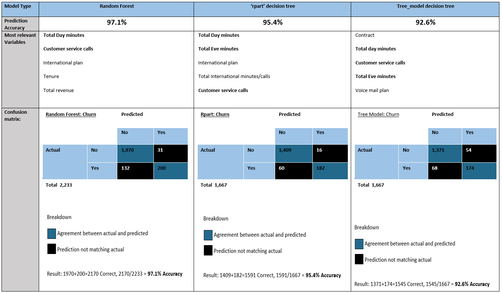<![endif]><o:p></o:p>

  </td>
  <td width=305 valign=top style='width:228.45pt;border-top:none;border-left:
  none;border-bottom:solid windowtext 1.0pt;border-right:solid windowtext 1.0pt;
  mso-border-top-alt:solid windowtext .5pt;mso-border-left-alt:solid windowtext .5pt;
  mso-border-alt:solid windowtext .5pt;padding:0in 5.4pt 0in 5.4pt'>
  
<!--[if gte vml 1]><v:shape
   id="Picture_x0020_3" o:spid="_x0000_i1039" type="#_x0000_t75" style='width:71.25pt;
   height:93pt;visibility:visible;mso-wrap-style:square'>
   <v:imagedata src="README_files/image002.png" o:title=""/>
  </v:shape><![endif]--><![if !vml]><![endif]><o:p></o:p>

  </td>
 </tr>
 <tr style='mso-yfti-irow:3'>
  <td width=125 valign=top style='width:93.5pt;border:solid windowtext 1.0pt;
  border-top:none;mso-border-top-alt:solid windowtext .5pt;mso-border-alt:solid windowtext .5pt;
  padding:0in 5.4pt 0in 5.4pt'>
  
SeniorCitizen<o:p></o:p>

  </td>
  <td width=236 valign=top style='width:177.3pt;border-top:none;border-left:
  none;border-bottom:solid windowtext 1.0pt;border-right:solid windowtext 1.0pt;
  mso-border-top-alt:solid windowtext .5pt;mso-border-left-alt:solid windowtext .5pt;
  mso-border-alt:solid windowtext .5pt;padding:0in 5.4pt 0in 5.4pt'>
  
<!--[if gte vml 1]><v:shape
   id="Picture_x0020_4" o:spid="_x0000_i1038" type="#_x0000_t75" style='width:146.25pt;
   height:60pt;visibility:visible;mso-wrap-style:square'>
   <v:imagedata src="README_files/image004.png" o:title=""/>
  </v:shape><![endif]--><![if !vml]>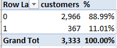<![endif]><o:p></o:p>

  </td>
  <td width=305 valign=top style='width:228.45pt;border-top:none;border-left:
  none;border-bottom:solid windowtext 1.0pt;border-right:solid windowtext 1.0pt;
  mso-border-top-alt:solid windowtext .5pt;mso-border-left-alt:solid windowtext .5pt;
  mso-border-alt:solid windowtext .5pt;padding:0in 5.4pt 0in 5.4pt'>
  
<!--[if gte vml 1]><v:shape
   id="Picture_x0020_5" o:spid="_x0000_i1037" type="#_x0000_t75" style='width:115.5pt;
   height:157.5pt;visibility:visible;mso-wrap-style:square'>
   <v:imagedata src="README_files/image005.png" o:title=""/>
  </v:shape><![endif]--><![if !vml]><![endif]><o:p></o:p>

  
Hist(SeniorCitizen)<o:p></o:p>

  </td>
 </tr>
 <tr style='mso-yfti-irow:4'>
  <td width=125 valign=top style='width:93.5pt;border:solid windowtext 1.0pt;
  border-top:none;mso-border-top-alt:solid windowtext .5pt;mso-border-alt:solid windowtext .5pt;
  padding:0in 5.4pt 0in 5.4pt'>
  
MaritalStatus<o:p></o:p>

  </td>
  <td width=236 valign=top style='width:177.3pt;border-top:none;border-left:
  none;border-bottom:solid windowtext 1.0pt;border-right:solid windowtext 1.0pt;
  mso-border-top-alt:solid windowtext .5pt;mso-border-left-alt:solid windowtext .5pt;
  mso-border-alt:solid windowtext .5pt;padding:0in 5.4pt 0in 5.4pt'>
  
<!--[if gte vml 1]><v:shape
   id="_x0000_i1036" type="#_x0000_t75" style='width:165pt;height:55.5pt;
   visibility:visible;mso-wrap-style:square'>
   <v:imagedata src="README_files/image007.png" o:title=""/>
  </v:shape><![endif]--><![if !vml]>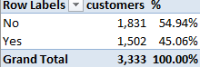<![endif]><o:p></o:p>

  </td>
  <td width=305 valign=top style='width:228.45pt;border-top:none;border-left:
  none;border-bottom:solid windowtext 1.0pt;border-right:solid windowtext 1.0pt;
  mso-border-top-alt:solid windowtext .5pt;mso-border-left-alt:solid windowtext .5pt;
  mso-border-alt:solid windowtext .5pt;padding:0in 5.4pt 0in 5.4pt'>
  
<!--[if gte vml 1]><v:shape
   id="Picture_x0020_6" o:spid="_x0000_i1035" type="#_x0000_t75" style='width:129pt;
   height:160.5pt;visibility:visible;mso-wrap-style:square'>
   <v:imagedata src="README_files/image008.png" o:title=""/>
  </v:shape><![endif]--><![if !vml]>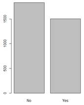<![endif]><o:p></o:p>

  </td>
 </tr>
 <tr style='mso-yfti-irow:5'>
  <td width=125 valign=top style='width:93.5pt;border:solid windowtext 1.0pt;
  border-top:none;mso-border-top-alt:solid windowtext .5pt;mso-border-alt:solid windowtext .5pt;
  padding:0in 5.4pt 0in 5.4pt'>
  
<o:p>&nbsp;</o:p>

  </td>
  <td width=236 valign=top style='width:177.3pt;border-top:none;border-left:
  none;border-bottom:solid windowtext 1.0pt;border-right:solid windowtext 1.0pt;
  mso-border-top-alt:solid windowtext .5pt;mso-border-left-alt:solid windowtext .5pt;
  mso-border-alt:solid windowtext .5pt;padding:0in 5.4pt 0in 5.4pt'>
  
<o:p>&nbsp;</o:p>

  </td>
  <td width=305 valign=top style='width:228.45pt;border-top:none;border-left:
  none;border-bottom:solid windowtext 1.0pt;border-right:solid windowtext 1.0pt;
  mso-border-top-alt:solid windowtext .5pt;mso-border-left-alt:solid windowtext .5pt;
  mso-border-alt:solid windowtext .5pt;padding:0in 5.4pt 0in 5.4pt'>
  
<o:p>&nbsp;</o:p>

  </td>
 </tr>
 <tr style='mso-yfti-irow:6;mso-yfti-lastrow:yes'>
  <td width=125 valign=top style='width:93.5pt;border:solid windowtext 1.0pt;
  border-top:none;mso-border-top-alt:solid windowtext .5pt;mso-border-alt:solid windowtext .5pt;
  padding:0in 5.4pt 0in 5.4pt'>
  
<o:p>&nbsp;</o:p>

  </td>
  <td width=236 valign=top style='width:177.3pt;border-top:none;border-left:
  none;border-bottom:solid windowtext 1.0pt;border-right:solid windowtext 1.0pt;
  mso-border-top-alt:solid windowtext .5pt;mso-border-left-alt:solid windowtext .5pt;
  mso-border-alt:solid windowtext .5pt;padding:0in 5.4pt 0in 5.4pt'>
  
<o:p>&nbsp;</o:p>

  </td>
  <td width=305 valign=top style='width:228.45pt;border-top:none;border-left:
  none;border-bottom:solid windowtext 1.0pt;border-right:solid windowtext 1.0pt;
  mso-border-top-alt:solid windowtext .5pt;mso-border-left-alt:solid windowtext .5pt;
  mso-border-alt:solid windowtext .5pt;padding:0in 5.4pt 0in 5.4pt'>
  
<o:p>&nbsp;</o:p>

  </td>
 </tr>
</table>

<o:p>&nbsp;</o:p>

<o:p>&nbsp;</o:p>

<o:p>&nbsp;</o:p>

<o:p>&nbsp;</o:p>

<table class=MsoTableGrid border=1 cellspacing=0 cellpadding=0
 style='border-collapse:collapse;border:none;mso-border-alt:solid windowtext .5pt;
 mso-yfti-tbllook:1184;mso-padding-alt:0in 5.4pt 0in 5.4pt'>
 <tr style='mso-yfti-irow:0;mso-yfti-firstrow:yes'>
  <td width=1126 valign=top style='width:467.5pt;border:solid windowtext 1.0pt;
  mso-border-alt:solid windowtext .5pt;padding:0in 5.4pt 0in 5.4pt'>
  
This could take all day. So instead I run the
  following command:<o:p></o:p>

  
summary(df_TCD)
  #Summarizes the data in the data frame<o:p></o:p>

  
<o:p>&nbsp;</o:p>

  
<!--[if gte vml 1]><v:shape
   id="Picture_x0020_7" o:spid="_x0000_i1034" type="#_x0000_t75" style='width:468pt;
   height:171pt;visibility:visible;mso-wrap-style:square'>
   <v:imagedata src="README_files/image010.png" o:title=""/>
  </v:shape><![endif]--><![if !vml]>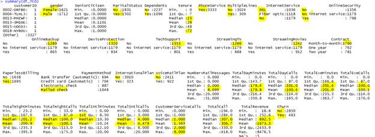<![endif]><o:p></o:p>

  
Gives me the contents and breakdown for the
  categorical fields<o:p></o:p>

  
Gives me some interesting stats like Min,Max and quartiles on the continuous fields<o:p></o:p>

  
Removed Nulls from Total revenue manually
  since there were only 5 of them. I set them to 0.<o:p></o:p>

  
<o:p>&nbsp;</o:p>

  </td>
 </tr>
 <tr style='mso-yfti-irow:1'>
  <td width=1126 valign=top style='width:467.5pt;border:solid windowtext 1.0pt;
  border-top:none;mso-border-top-alt:solid windowtext .5pt;mso-border-alt:solid windowtext .5pt;
  padding:0in 5.4pt 0in 5.4pt'>
  <table class=MsoNormalTable border=0 cellspacing=0 cellpadding=0 width=0
   style='width:633.75pt;mso-cellspacing:0in;background:white;mso-yfti-tbllook:
   1184;mso-padding-alt:0in 0in 6.0pt 4.5pt'>
   <tr style='mso-yfti-irow:0;mso-yfti-firstrow:yes'>
    <td valign=top style='padding:0in 0in 6.0pt 4.5pt'>
    
str(df_TCD)<o:p></o:p>

    
'data.frame':  3333 obs. of  33
    variables:<o:p></o:p>

    
 $ customerID          : Factor w/ 3333 levels
    &quot;0002-ORFBO&quot;,&quot;0004-TLHLJ&quot;,..: 1 2 3 4 5 6 7 8 9 10 ...<o:p></o:p>

    
 $ gender              : Factor w/ 2 levels &quot;Female&quot;,&quot;Male&quot;: 1 2 1 1 1 1 1 2 1 1 ...<o:p></o:p>

    
 $ SeniorCitizen       : int  0 0 0 1 1 0 1 1 0 0 ...<o:p></o:p>

    
 $ MaritalStatus       : Factor w/ 2 levels &quot;No&quot;,&quot;Yes&quot;: 2 1 1 2 1 2 1 1 1 2 ...<o:p></o:p>

    
 $ Dependents          : Factor w/ 2 levels &quot;No&quot;,&quot;Yes&quot;: 2 1 2 1 1 1 1 1 1 2 ...<o:p></o:p>

    
 $ tenure              : int  9 4 9 71 7 5 1 45 3 4 ...<o:p></o:p>

    
 $ PhoneService        : Factor w/ 1 level
    &quot;Yes&quot;: 1 1 1 1 1 1 1 1 1 1 ...<o:p></o:p>

    
 $ MultipleLines       : Factor w/ 2 levels &quot;No&quot;,&quot;Yes&quot;: 1 1 1 1 1 1 2 1 1 1 ...<o:p></o:p>

    
 $ InternetService     : Factor w/ 3 levels &quot;DSL&quot;,&quot;Fiber optic&quot;,..: 1 2 1 2 1 2 2 1 3
    3 ...<o:p></o:p>

    
 $ OnlineSecurity      : Factor w/ 3 levels &quot;No&quot;,&quot;No internet service&quot;,..: 1 1 1 3 3
    1 1 3 2 2 ...<o:p></o:p>

    
 $ OnlineBackup        : Factor w/ 3 levels &quot;No&quot;,&quot;No internet service&quot;,..: 3 1 1 3 1
    1 1 1 2 2 ...<o:p></o:p>

    
 $ DeviceProtection    : Factor w/ 3 levels &quot;No&quot;,&quot;No internet service&quot;,..: 1 3 1 3 1
    1 1 3 2 2 ...<o:p></o:p>

    
 $ TechSupport         : Factor w/ 3 levels &quot;No&quot;,&quot;No internet service&quot;,..: 3 1 3 3 1
    1 1 1 2 2 ...<o:p></o:p>

    
 $ StreamingTV         : Factor w/ 3 levels &quot;No&quot;,&quot;No internet service&quot;,..: 3 1 3 3 1
    1 1 1 2 2 ...<o:p></o:p>

    
 $ StreamingMovies     : Factor w/ 3 levels &quot;No&quot;,&quot;No internet service&quot;,..: 1 1 3 3 1
    1 1 3 2 2 ...<o:p></o:p>

    
 $ Contract            : Factor w/ 3 levels
    &quot;Month-to-month&quot;,..: 2 1 1 3 1 1 1 2 1 1 ...<o:p></o:p>

    
 $ PaperlessBilling    : Factor w/ 2 levels &quot;No&quot;,&quot;Yes&quot;: 2 2 2 2 2 2 2 1 1 1 ...<o:p></o:p>

    
 $ PaymentMethod       : Factor w/ 4 levels &quot;Bank
    transfer (automatic)&quot;,..: 4 3 2 1 3 3 3 2 4 4 ...<o:p></o:p>

    
 $ InternationalPlan   : Factor w/ 2 levels &quot;No&quot;,&quot;Yes&quot;: 1 2 1 1 1 1 2 1 1 1 ...<o:p></o:p>

    
 $ VoiceMailPlan       : Factor w/ 2 levels &quot;No&quot;,&quot;Yes&quot;: 1 1 2 1 1 1 1 1 1 1 ...<o:p></o:p>

    
 $ NumbervMailMessages
    : int  0 0
    36 0 0 0 0 0 0 0 ...<o:p></o:p>

    
 $ TotalDayMinutes     : num  168.8 122.2 178.7 190.2 67.7 ...<o:p></o:p>

    
 $ TotalDayCalls       : int  137 112 134 68 68 95 55 133 158 99 ...<o:p></o:p>

    
 $ TotalEveMinutes     : num  241 132 179 262 196 ...<o:p></o:p>

    
 $ TotalEveCalls       : int  107 94 102 64 86 128 124 86 120 93 ...<o:p></o:p>

    
 $ TotalNightMinutes   : num  205 170 127 130 236 ...<o:p></o:p>

    
 $ TotalNightCalls     : int  106 106 82 92 137 105 81 80 46 106 ...<o:p></o:p>

    
 $ TotalIntlMinutes    : num  15.5 10.3 8 8.8 12 12.9 10 11.5 12.4 8
    ...<o:p></o:p>

    
 $ TotalIntlCalls      : int  4 9 4 4 2 5 7 3 3 4 ...<o:p></o:p>

    
 $ CustomerServiceCalls:
    int  0 5 2
    0 1 3 3 0 1 1 ...<o:p></o:p>

    
 $ TotalCall           : int  354 326 324 228 294 336 270 302 328 303
    ...<o:p></o:p>

    
 $ TotalRevenue        : num  593 281 572 7904 340 ...<o:p></o:p>

    
 $ Churn               : Factor w/ 2 levels &quot;No&quot;,&quot;Yes&quot;: 1 2 1 1 1 1 1 2 1 2 ...<o:p></o:p>

    </td>
   </tr>
   <tr style='mso-yfti-irow:1'>
    <td valign=top style='padding:0in 0in 6.0pt 4.5pt'></td>
   </tr>
   <tr style='mso-yfti-irow:2;mso-yfti-lastrow:yes'>
    <td valign=top style='padding:0in 0in 6.0pt 4.5pt'>
    <table class=MsoNormalTable border=0 cellspacing=0 cellpadding=0 width=0
     style='width:629.25pt;mso-cellspacing:0in;mso-yfti-tbllook:1184;
     mso-padding-alt:0in 0in 0in 0in'>
     <tr style='mso-yfti-irow:0;mso-yfti-firstrow:yes;mso-yfti-lastrow:yes'>
      <td width=839 valign=top style='width:.75pt;padding:0in 0in 0in 0in'>
      
 <o:p></o:p>

      </td>
     </tr>
    </table>
    </td>
   </tr>
  </table>
  </td>
 </tr>
 <tr style='mso-yfti-irow:2;mso-yfti-lastrow:yes'>
  <td width=1126 valign=top style='width:467.5pt;border:solid windowtext 1.0pt;
  border-top:none;mso-border-top-alt:solid windowtext .5pt;mso-border-alt:solid windowtext .5pt;
  padding:0in 5.4pt 0in 5.4pt'>
  
describe(df_TCD) # advantage
  over summary()? Shows distinct,missing,descriptive<o:p></o:p>

  
<o:p>&nbsp;</o:p>

  
Sample:<o:p></o:p>

  
<o:p>&nbsp;</o:p>

  
<!--[if gte vml 1]><v:shape
   id="Picture_x0020_15" o:spid="_x0000_i1033" type="#_x0000_t75" style='width:834pt;
   height:246.75pt;visibility:visible;mso-wrap-style:square'>
   <v:imagedata src="README_files/image018.png" o:title=""/>
  </v:shape><![endif]--><![if !vml]>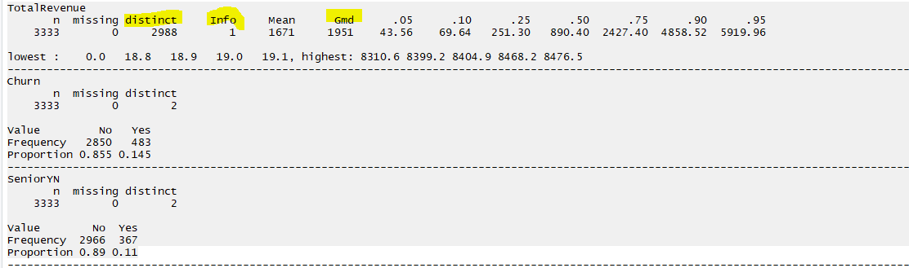<![endif]><o:p></o:p>

  
<o:p>&nbsp;</o:p>

  
<o:p>&nbsp;</o:p>

  <pre style='line-height:11.25pt;background:white;word-break:break-all'>var(df_TCD_thin) #shows variance within the data<o:p></o:p></pre>
  
<o:p>&nbsp;</o:p>

  </td>
 </tr>
</table>

<o:p>&nbsp;</o:p>

<b
style='mso-bidi-font-weight:normal'>Data cleansing needed<o:p></o:p></b>

<![if !supportLists]>1.&nbsp;&nbsp;&nbsp;&nbsp;&nbsp; <![endif]><b style='mso-bidi-font-weight:normal'>SeniorCitizen</b><b
style='mso-bidi-font-weight:normal'> </b>is stored as 1 or 0, I would like that
to change to Yes or No to fit with rest of Y/N attributes like Marital status, Children etc.

<![if !supportLists]><b
style='mso-bidi-font-weight:normal'>2.&nbsp;&nbsp;&nbsp;&nbsp;&nbsp;
</b><![endif]><b style='mso-bidi-font-weight:
normal'>PhoneService</b><b style='mso-bidi-font-weight:normal'> </b>is
always set to know which is possibly responsible for my decision tree error of
needing more factor levels. I am going to remove it and try.<b
style='mso-bidi-font-weight:normal'><o:p></o:p></b>

<![if !supportLists]><b
style='mso-bidi-font-weight:normal'>3.&nbsp;&nbsp;&nbsp;&nbsp;&nbsp;
</b><![endif]><b style='mso-bidi-font-weight:
normal'>TotalRevenue</b><b style='mso-bidi-font-weight:normal'> </b>has
some Null values which I need to replace with zeros or averages.<b
style='mso-bidi-font-weight:normal'><o:p></o:p></b>

<o:p>&nbsp;</o:p>

Simple
tree comparison, playing around

<table class=MsoTableGrid border=1 cellspacing=0 cellpadding=0
 style='border-collapse:collapse;border:none;mso-border-alt:solid windowtext .5pt;
 mso-yfti-tbllook:1184;mso-padding-alt:0in 5.4pt 0in 5.4pt'>
 <tr style='mso-yfti-irow:0;mso-yfti-firstrow:yes'>
  <td width=583 valign=top style='width:233.75pt;border:solid windowtext 1.0pt;
  mso-border-alt:solid windowtext .5pt;padding:0in 5.4pt 0in 5.4pt'>
  
Splits on Contract<o:p></o:p>

  
$SeniorYN+$gender+$MaritalStatus+$Dependents+$MultipleLines+$InternetService+$OnlineSecurity<o:p></o:p>

  
+$OnlineBackup+$DeviceProtection+$TechSupport+$StreamingTV+$StreamingMovies+$Contract<o:p></o:p>

  
+$PaperlessBilling+$PaymentMethod+$InternationalPlan+$VoiceMailPlan<o:p></o:p>

  </td>
  <td width=724 valign=top style='width:233.75pt;border:solid windowtext 1.0pt;
  border-left:none;mso-border-left-alt:solid windowtext .5pt;mso-border-alt:
  solid windowtext .5pt;padding:0in 5.4pt 0in 5.4pt'>
  
Removed Contract<o:p></o:p>

  
Splits on Tech support<o:p></o:p>

  </td>
 </tr>
 <tr style='mso-yfti-irow:1;mso-yfti-lastrow:yes'>
  <td width=583 valign=top style='width:233.75pt;border:solid windowtext 1.0pt;
  border-top:none;mso-border-top-alt:solid windowtext .5pt;mso-border-alt:solid windowtext .5pt;
  padding:0in 5.4pt 0in 5.4pt'>
  
<!--[if gte vml 1]><v:shape
   id="Picture_x0020_11" o:spid="_x0000_i1032" type="#_x0000_t75" style='width:426pt;
   height:312.75pt;visibility:visible;mso-wrap-style:square'>
   <v:imagedata src="README_files/image017.png" o:title=""/>
  </v:shape><![endif]--><![if !vml]><![endif]><o:p></o:p>

  </td>
  <td width=724 valign=top style='width:233.75pt;border-top:none;border-left:
  none;border-bottom:solid windowtext 1.0pt;border-right:solid windowtext 1.0pt;
  mso-border-top-alt:solid windowtext .5pt;mso-border-left-alt:solid windowtext .5pt;
  mso-border-alt:solid windowtext .5pt;padding:0in 5.4pt 0in 5.4pt'>
  
<!--[if gte vml 1]><v:shape
   id="Picture_x0020_12" o:spid="_x0000_i1031" type="#_x0000_t75" style='width:532.5pt;
   height:348.75pt;visibility:visible;mso-wrap-style:square'>
   <v:imagedata src="README_files/image022.png" o:title=""/>
  </v:shape><![endif]--><![if !vml]><![endif]><o:p></o:p>

  </td>
 </tr>
</table>

<o:p>&nbsp;</o:p>

<o:p>&nbsp;</o:p>

Simple
tree results

<table class=MsoTableGrid border=1 cellspacing=0 cellpadding=0
 style='border-collapse:collapse;border:none;mso-border-alt:solid windowtext .5pt;
 mso-yfti-tbllook:1184;mso-padding-alt:0in 5.4pt 0in 5.4pt'>
 <tr style='mso-yfti-irow:0;mso-yfti-firstrow:yes'>
  <td width=125 valign=top style='width:233.75pt;border:solid windowtext 1.0pt;
  mso-border-alt:solid windowtext .5pt;padding:0in 5.4pt 0in 5.4pt'>
  
From SimpleTree_TCD.R<o:p></o:p>

  </td>
  <td width=890 valign=top style='width:637.8pt;border:solid windowtext 1.0pt;
  border-left:none;mso-border-left-alt:solid windowtext .5pt;mso-border-alt:
  solid windowtext .5pt;padding:0in 5.4pt 0in 5.4pt'>
  
Tree plot output<o:p></o:p>

  
plot(fit) and text(fit)<o:p></o:p>

  </td>
 </tr>
 <tr style='mso-yfti-irow:1'>
  <td width=125 valign=top style='width:233.75pt;border:solid windowtext 1.0pt;
  border-top:none;mso-border-top-alt:solid windowtext .5pt;mso-border-alt:solid windowtext .5pt;
  padding:0in 5.4pt 0in 5.4pt'>
  
Using rpart<o:p></o:p>

  </td>
  <td width=890 valign=top style='width:637.8pt;border-top:none;border-left:
  none;border-bottom:solid windowtext 1.0pt;border-right:solid windowtext 1.0pt;
  mso-border-top-alt:solid windowtext .5pt;mso-border-left-alt:solid windowtext .5pt;
  mso-border-alt:solid windowtext .5pt;padding:0in 5.4pt 0in 5.4pt'>
  
<!--[if gte vml 1]><v:shape
   id="Picture_x0020_8" o:spid="_x0000_i1030" type="#_x0000_t75" style='width:626.25pt;
   height:310.5pt;visibility:visible;mso-wrap-style:square'>
   <v:imagedata src="README_files/image016.png" o:title=""/>
  </v:shape><![endif]--><![if !vml]><![endif]><o:p></o:p>

  </td>
 </tr>
 <tr style='mso-yfti-irow:2'>
  <td width=125 valign=top style='width:233.75pt;border:solid windowtext 1.0pt;
  border-top:none;mso-border-top-alt:solid windowtext .5pt;mso-border-alt:solid windowtext .5pt;
  padding:0in 5.4pt 0in 5.4pt'>
  
Using the fancyRpartPlot<o:p></o:p>

  </td>
  <td width=890 valign=top style='width:637.8pt;border-top:none;border-left:
  none;border-bottom:solid windowtext 1.0pt;border-right:solid windowtext 1.0pt;
  mso-border-top-alt:solid windowtext .5pt;mso-border-left-alt:solid windowtext .5pt;
  mso-border-alt:solid windowtext .5pt;padding:0in 5.4pt 0in 5.4pt'>
  
<!--[if gte vml 1]><v:shape
   id="Picture_x0020_9" o:spid="_x0000_i1029" type="#_x0000_t75" style='width:657pt;
   height:402.75pt;visibility:visible;mso-wrap-style:square'>
   <v:imagedata src="README_files/image019.png" o:title=""/>
  </v:shape><![endif]--><![if !vml]>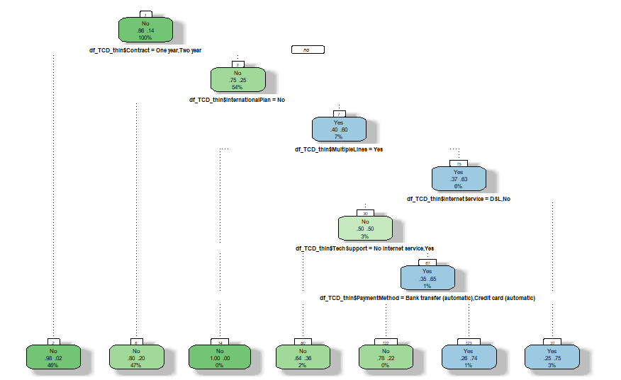<![endif]><o:p></o:p>

  </td>
 </tr>
 <tr style='mso-yfti-irow:3'>
  <td width=125 valign=top style='width:233.75pt;border:solid windowtext 1.0pt;
  border-top:none;mso-border-top-alt:solid windowtext .5pt;mso-border-alt:solid windowtext .5pt;
  padding:0in 5.4pt 0in 5.4pt'>
  
Using prp(fit) part
  of rpart<o:p></o:p>

  
<o:p>&nbsp;</o:p>

  </td>
  <td width=890 valign=top style='width:637.8pt;border-top:none;border-left:
  none;border-bottom:solid windowtext 1.0pt;border-right:solid windowtext 1.0pt;
  mso-border-top-alt:solid windowtext .5pt;mso-border-left-alt:solid windowtext .5pt;
  mso-border-alt:solid windowtext .5pt;padding:0in 5.4pt 0in 5.4pt'>
  
<!--[if gte vml 1]><v:shape
   id="Picture_x0020_10" o:spid="_x0000_i1028" type="#_x0000_t75" style='width:627pt;
   height:412.5pt;visibility:visible;mso-wrap-style:square'>
   <v:imagedata src="README_files/image020.png" o:title=""/>
  </v:shape><![endif]--><![if !vml]>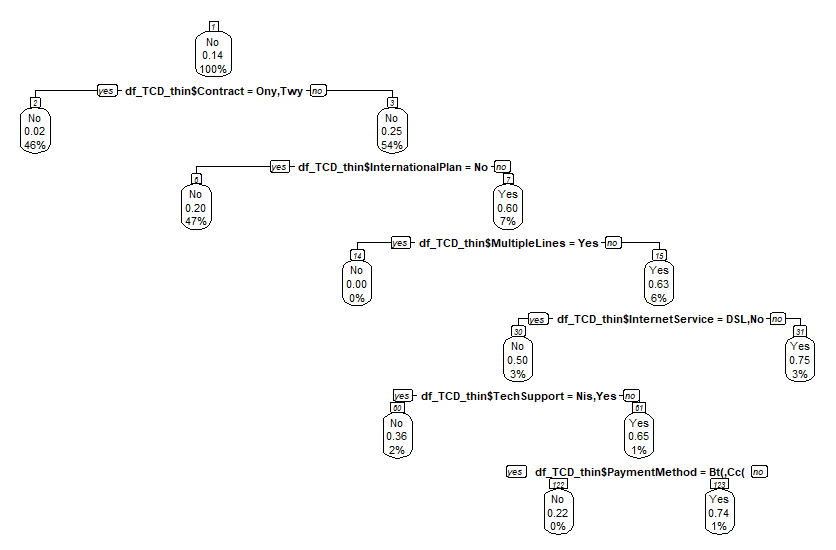<![endif]><o:p></o:p>

  </td>
 </tr>
 <tr style='mso-yfti-irow:4;mso-yfti-lastrow:yes'>
  <td width=125 valign=top style='width:233.75pt;border:solid windowtext 1.0pt;
  border-top:none;mso-border-top-alt:solid windowtext .5pt;mso-border-alt:solid windowtext .5pt;
  padding:0in 5.4pt 0in 5.4pt'>
  
Using all the data for decision tree<o:p></o:p>

  
<o:p>&nbsp;</o:p>

  </td>
  <td width=890 valign=top style='width:637.8pt;border-top:none;border-left:
  none;border-bottom:solid windowtext 1.0pt;border-right:solid windowtext 1.0pt;
  mso-border-top-alt:solid windowtext .5pt;mso-border-left-alt:solid windowtext .5pt;
  mso-border-alt:solid windowtext .5pt;padding:0in 5.4pt 0in 5.4pt'>
  
<!--[if gte vml 1]><v:shape
   id="Picture_x0020_13" o:spid="_x0000_i1027" type="#_x0000_t75" style='width:517.5pt;
   height:417.75pt;visibility:visible;mso-wrap-style:square'>
   <v:imagedata src="README_files/image025.png" o:title=""/>
  </v:shape><![endif]--><![if !vml]>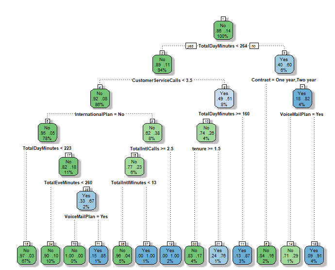<![endif]><o:p></o:p>

  </td>
 </tr>
</table>

<o:p>&nbsp;</o:p>

<table class=MsoTableGrid border=1 cellspacing=0 cellpadding=0
 style='border-collapse:collapse;border:none;mso-border-alt:solid windowtext .5pt;
 mso-yfti-tbllook:1184;mso-padding-alt:0in 5.4pt 0in 5.4pt'>
 <tr style='mso-yfti-irow:0;mso-yfti-firstrow:yes'>
  <td width=734 valign=top style='width:467.5pt;border:solid windowtext 1.0pt;
  mso-border-alt:solid windowtext .5pt;padding:0in 5.4pt 0in 5.4pt'>
  
<!--[if gte vml 1]><v:shape
   id="Picture_x0020_14" o:spid="_x0000_i1026" type="#_x0000_t75" style='width:540pt;
   height:438pt;visibility:visible;mso-wrap-style:square'>
   <v:imagedata src="README_files/image026.png" o:title=""/>
  </v:shape><![endif]--><![if !vml]>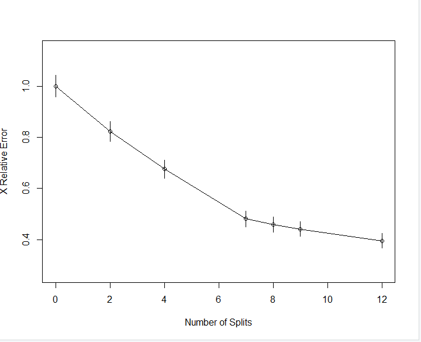<![endif]><o:p></o:p>

  </td>
 </tr>
 <tr style='mso-yfti-irow:1'>
  <td width=734 valign=top style='width:467.5pt;border:solid windowtext 1.0pt;
  border-top:none;mso-border-top-alt:solid windowtext .5pt;mso-border-alt:solid windowtext .5pt;
  padding:0in 5.4pt 0in 5.4pt'>
  
rsq.rpart(fit_all) #major
  improvements end after 7 splits<o:p></o:p>

  </td>
 </tr>
 <tr style='mso-yfti-irow:2'>
  <td width=734 valign=top style='width:467.5pt;border:solid windowtext 1.0pt;
  border-top:none;mso-border-top-alt:solid windowtext .5pt;mso-border-alt:solid windowtext .5pt;
  padding:0in 5.4pt 0in 5.4pt'>
  
<o:p>&nbsp;</o:p>

  </td>
 </tr>
 <tr style='mso-yfti-irow:3'>
  <td width=734 valign=top style='width:467.5pt;border:solid windowtext 1.0pt;
  border-top:none;mso-border-top-alt:solid windowtext .5pt;mso-border-alt:solid windowtext .5pt;
  padding:0in 5.4pt 0in 5.4pt'><pre style='line-height:11.25pt;background:white;
  word-break:break-all'>&gt; summary(fit_all)<o:p></o:p></pre><pre
  style='line-height:11.25pt;background:white;word-break:break-all'>Call:<o:p></o:p></pre><pre
  style='line-height:11.25pt;background:white;word-break:break-all'>rpart(formula = Churn ~ SeniorYN + gender + MaritalStatus + Dependents + <o:p></o:p></pre><pre
  style='line-height:11.25pt;background:white;word-break:break-all'>    tenure + PhoneService + MultipleLines + InternetService + <o:p></o:p></pre><pre
  style='line-height:11.25pt;background:white;word-break:break-all'>    OnlineSecurity + OnlineBackup + DeviceProtection + TechSupport + <o:p></o:p></pre><pre
  style='line-height:11.25pt;background:white;word-break:break-all'>    StreamingTV + StreamingMovies + Contract + PaperlessBilling + <o:p></o:p></pre><pre
  style='line-height:11.25pt;background:white;word-break:break-all'>    PaymentMethod + InternationalPlan + VoiceMailPlan + NumbervMailMessages + <o:p></o:p></pre><pre
  style='line-height:11.25pt;background:white;word-break:break-all'>    TotalDayMinutes + TotalDayCalls + TotalEveMinutes + TotalEveCalls + <o:p></o:p></pre><pre
  style='line-height:11.25pt;background:white;word-break:break-all'>    TotalNightMinutes + TotalNightCalls + TotalIntlMinutes + <o:p></o:p></pre><pre
  style='line-height:11.25pt;background:white;word-break:break-all'>    TotalIntlCalls + CustomerServiceCalls + TotalCall + TotalRevenue, <o:p></o:p></pre><pre
  style='line-height:11.25pt;background:white;word-break:break-all'>    data = df_TCD_thin, method = &quot;class&quot;)<o:p></o:p></pre><pre
  style='line-height:11.25pt;background:white;word-break:break-all'>  n= 3333 <o:p></o:p></pre><pre
  style='line-height:11.25pt;background:white;word-break:break-all'><o:p>&nbsp;</o:p></pre><pre
  style='line-height:11.25pt;background:white;word-break:break-all'>          CP nsplit rel error    xerror       xstd<o:p></o:p></pre><pre
  style='line-height:11.25pt;background:white;word-break:break-all'>1 0.09316770      0 1.0000000 1.0000000 0.04207569<o:p></o:p></pre><pre
  style='line-height:11.25pt;background:white;word-break:break-all'>2 0.07867495      2 0.8136646 0.8219462 0.03871761<o:p></o:p></pre><pre
  style='line-height:11.25pt;background:white;word-break:break-all'>3 0.05279503      4 0.6563147 0.6749482 0.03550673<o:p></o:p></pre><pre
  style='line-height:11.25pt;background:white;word-break:break-all'>4 0.02277433      7 0.4616977 0.4803313 0.03041796<o:p></o:p></pre><pre
  style='line-height:11.25pt;background:white;word-break:break-all'>5 0.01863354      8 0.4389234 0.4575569 0.02974070<o:p></o:p></pre><pre
  style='line-height:11.25pt;background:white;word-break:break-all'>6 0.01759834      9 0.4202899 0.4409938 0.02923495<o:p></o:p></pre><pre
  style='line-height:11.25pt;background:white;word-break:break-all'>7 0.01000000     12 0.3623188 0.3954451 0.02778145<o:p></o:p></pre><pre
  style='line-height:11.25pt;background:white;word-break:break-all'><o:p>&nbsp;</o:p></pre><pre
  style='line-height:11.25pt;background:white;word-break:break-all'>Variable importance<o:p></o:p></pre><pre
  style='line-height:11.25pt;background:white;word-break:break-all'>     TotalDayMinutes CustomerServiceCalls     TotalIntlMinutes    InternationalPlan       TotalIntlCalls               tenure <o:p></o:p></pre><pre
  style='line-height:11.25pt;background:white;word-break:break-all'>                  24                   13                   10                    8                    8                    7 <o:p></o:p></pre><pre
  style='line-height:11.25pt;background:white;word-break:break-all'>            Contract         TotalRevenue      TotalEveMinutes  NumbervMailMessages        VoiceMailPlan       OnlineSecurity <o:p></o:p></pre><pre
  style='line-height:11.25pt;background:white;word-break:break-all'>                   6                    5                    4                    4                    4                    2 <o:p></o:p></pre><pre
  style='line-height:11.25pt;background:white;word-break:break-all'>     InternetService         OnlineBackup      TotalNightCalls    TotalNightMinutes <o:p></o:p></pre><pre
  style='line-height:11.25pt;background:white;word-break:break-all'>                   1                    1                    1                    1 <o:p></o:p></pre><pre
  style='line-height:11.25pt;background:white;word-break:break-all'><o:p>&nbsp;</o:p></pre><pre
  style='line-height:11.25pt;background:white;word-break:break-all'>Node number 1: 3333 observations,    complexity param=0.0931677<o:p></o:p></pre><pre
  style='line-height:11.25pt;background:white;word-break:break-all'>  predicted class=No   expected loss=0.1449145  P(node) =1<o:p></o:p></pre><pre
  style='line-height:11.25pt;background:yellow;word-break:break-all'>    class counts:  2850   483<o:p></o:p></pre><pre
  style='line-height:11.25pt;background:yellow;word-break:break-all'>   probabilities: 0.855 0.145 <o:p></o:p></pre><pre
  style='line-height:11.25pt;background:yellow;word-break:break-all'>  left son=2 (3122 obs) right son=3 (211 obs)<o:p></o:p></pre><pre
  style='line-height:11.25pt;background:white;word-break:break-all'>  Primary splits:<o:p></o:p></pre><pre
  style='line-height:11.25pt;background:white;word-break:break-all'>      TotalDayMinutes      &lt; 264.45  to the left,  improve=94.08310, (0 missing)<o:p></o:p></pre><pre
  style='line-height:11.25pt;background:white;word-break:break-all'>      Contract             splits as  RLL,         improve=86.76350, (0 missing)<o:p></o:p></pre><pre
  style='line-height:11.25pt;background:white;word-break:break-all'>      CustomerServiceCalls &lt; 3.5     to the left,  improve=80.30617, (0 missing)<o:p></o:p></pre><pre
  style='line-height:11.25pt;background:white;word-break:break-all'>      tenure               &lt; 5.5     to the right, improve=80.25095, (0 missing)<o:p></o:p></pre><pre
  style='line-height:11.25pt;background:white;word-break:break-all'>      TechSupport          splits as  RLL,         improve=71.85318, (0 missing)</pre>
  
<o:p>&nbsp;</o:p>

  </td>
 </tr>
 <tr style='mso-yfti-irow:4'>
  <td width=734 valign=top style='width:467.5pt;border:solid windowtext 1.0pt;
  border-top:none;mso-border-top-alt:solid windowtext .5pt;mso-border-alt:solid windowtext .5pt;
  padding:0in 5.4pt 0in 5.4pt'><pre style='line-height:11.25pt;background:white;
  word-break:break-all'><o:p>&nbsp;</o:p></pre><pre style='line-height:
  11.25pt;background:white;word-break:break-all'><o:p>&nbsp;</o:p></pre><pre
  style='line-height:11.25pt;background:white;word-break:break-all'><o:p>&nbsp;</o:p></pre></td>
 </tr>
 <tr style='mso-yfti-irow:5'>
  <td width=734 valign=top style='width:467.5pt;border:solid windowtext 1.0pt;
  border-top:none;mso-border-top-alt:solid windowtext .5pt;mso-border-alt:solid windowtext .5pt;
  padding:0in 5.4pt 0in 5.4pt'>
  
<o:p>&nbsp;</o:p>

  </td>
 </tr>
 <tr style='mso-yfti-irow:6;mso-yfti-lastrow:yes'>
  <td width=734 valign=top style='width:467.5pt;border:solid windowtext 1.0pt;
  border-top:none;mso-border-top-alt:solid windowtext .5pt;mso-border-alt:solid windowtext .5pt;
  padding:0in 5.4pt 0in 5.4pt'>
  
<o:p>&nbsp;</o:p>

  </td>
 </tr>
</table>

<o:p>&nbsp;</o:p>

<b
style='mso-bidi-font-weight:normal'>PCA model output<o:p></o:p></b>

<!--[if gte vml 1]><v:shape id="Picture_x0020_16"
 o:spid="_x0000_i1025" type="#_x0000_t75" style='width:5in;height:385.5pt;
 visibility:visible;mso-wrap-style:square'>
 <v:imagedata src="README_files/image028.png" o:title=""/>
</v:shape><![endif]--><![if !vml]>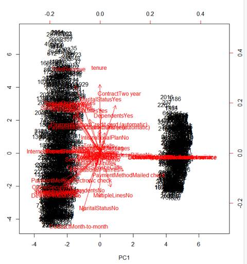<![endif]>

<o:p>&nbsp;</o:p>

<o:p>&nbsp;</o:p>

<table class=MsoTableGrid border=1 cellspacing=0 cellpadding=0
 style='border-collapse:collapse;border:none;mso-border-alt:solid windowtext .5pt;
 mso-yfti-tbllook:1184;mso-padding-alt:0in 5.4pt 0in 5.4pt'>
 <tr style='mso-yfti-irow:0;mso-yfti-firstrow:yes;height:29.2pt'>
  <td width=166 valign=top style='width:2.6in;border:solid windowtext 1.0pt;
  mso-border-alt:solid windowtext .5pt;background:#9CC2E5;mso-background-themecolor:
  accent1;mso-background-themetint:153;padding:0in 5.4pt 0in 5.4pt;height:29.2pt'>
  
<b style='mso-bidi-font-weight:normal'>Model Type<o:p></o:p></b>

  </td>
  <td width=167 valign=top style='width:2.6in;border:solid windowtext 1.0pt;
  border-left:none;mso-border-left-alt:solid windowtext .5pt;mso-border-alt:
  solid windowtext .5pt;background:#9CC2E5;mso-background-themecolor:accent1;
  mso-background-themetint:153;padding:0in 5.4pt 0in 5.4pt;height:29.2pt'>
  
<b
  style='mso-bidi-font-weight:normal'>Random
  Forest<o:p></o:p></b>

  </td>
  <td width=181 valign=top style='width:187.25pt;border:solid windowtext 1.0pt;
  border-left:none;mso-border-left-alt:solid windowtext .5pt;mso-border-alt:
  solid windowtext .5pt;background:#9CC2E5;mso-background-themecolor:accent1;
  mso-background-themetint:153;padding:0in 5.4pt 0in 5.4pt;height:29.2pt'>
  
<b
  style='mso-bidi-font-weight:normal'>‘rpart’
  decision tree<o:p></o:p></b>

  </td>
  <td width=193 valign=top style='width:209.05pt;border:solid windowtext 1.0pt;
  border-left:none;mso-border-left-alt:solid windowtext .5pt;mso-border-alt:
  solid windowtext .5pt;background:#9CC2E5;mso-background-themecolor:accent1;
  mso-background-themetint:153;padding:0in 5.4pt 0in 5.4pt;height:29.2pt'>
  
<b
  style='mso-bidi-font-weight:normal'>Tree_model
  decision tree<o:p></o:p></b>

  </td>
 </tr>
 <tr style='mso-yfti-irow:1;height:27.65pt'>
  <td width=166 valign=top style='width:2.6in;border:solid windowtext 1.0pt;
  border-top:none;mso-border-top-alt:solid windowtext .5pt;mso-border-alt:solid windowtext .5pt;
  background:#D0CECE;mso-background-themecolor:background2;mso-background-themeshade:
  230;padding:0in 5.4pt 0in 5.4pt;height:27.65pt'>
  
<b style='mso-bidi-font-weight:normal'>Prediction Accuracy<o:p></o:p></b>

  </td>
  <td width=167 valign=top style='width:2.6in;border-top:none;border-left:none;
  border-bottom:solid windowtext 1.0pt;border-right:solid windowtext 1.0pt;
  mso-border-top-alt:solid windowtext .5pt;mso-border-left-alt:solid windowtext .5pt;
  mso-border-alt:solid windowtext .5pt;padding:0in 5.4pt 0in 5.4pt;height:27.65pt'>
  
<b
  style='mso-bidi-font-weight:normal'>97.1%<o:p></o:p></b>

  </td>
  <td width=181 valign=top style='width:187.25pt;border-top:none;border-left:
  none;border-bottom:solid windowtext 1.0pt;border-right:solid windowtext 1.0pt;
  mso-border-top-alt:solid windowtext .5pt;mso-border-left-alt:solid windowtext .5pt;
  mso-border-alt:solid windowtext .5pt;padding:0in 5.4pt 0in 5.4pt;height:27.65pt'>
  
<b
  style='mso-bidi-font-weight:normal'>95.4%<o:p></o:p></b>

  </td>
  <td width=193 valign=top style='width:209.05pt;border-top:none;border-left:
  none;border-bottom:solid windowtext 1.0pt;border-right:solid windowtext 1.0pt;
  mso-border-top-alt:solid windowtext .5pt;mso-border-left-alt:solid windowtext .5pt;
  mso-border-alt:solid windowtext .5pt;padding:0in 5.4pt 0in 5.4pt;height:27.65pt'>
  
<b
  style='mso-bidi-font-weight:normal'>92.6%<o:p></o:p></b>

  </td>
 </tr>
 <tr style='mso-yfti-irow:2;mso-yfti-lastrow:yes;height:27.65pt'>
  <td width=166 valign=top style='width:2.6in;border:solid windowtext 1.0pt;
  border-top:none;mso-border-top-alt:solid windowtext .5pt;mso-border-alt:solid windowtext .5pt;
  background:#D0CECE;mso-background-themecolor:background2;mso-background-themeshade:
  230;padding:0in 5.4pt 0in 5.4pt;height:27.65pt'>
  
<b style='mso-bidi-font-weight:normal'>Tuning Technique<o:p></o:p></b>

  </td>
  <td width=167 valign=top style='width:2.6in;border-top:none;border-left:none;
  border-bottom:solid windowtext 1.0pt;border-right:solid windowtext 1.0pt;
  mso-border-top-alt:solid windowtext .5pt;mso-border-left-alt:solid windowtext .5pt;
  mso-border-alt:solid windowtext .5pt;padding:0in 5.4pt 0in 5.4pt;height:27.65pt'>
  
Tried changing number of trees generated to
  lower and higher. Going from 500 to 600 increased error rates. Going from 500
  to 400 also increased error. Sweet spot is around 500<o:p></o:p>

  </td>
  <td width=181 valign=top style='width:187.25pt;border-top:none;border-left:
  none;border-bottom:solid windowtext 1.0pt;border-right:solid windowtext 1.0pt;
  mso-border-top-alt:solid windowtext .5pt;mso-border-left-alt:solid windowtext .5pt;
  mso-border-alt:solid windowtext .5pt;padding:0in 5.4pt 0in 5.4pt;height:27.65pt'>
  
Major improvements end after 7 splits.<o:p></o:p>

  </td>
  <td width=193 valign=top style='width:209.05pt;border-top:none;border-left:
  none;border-bottom:solid windowtext 1.0pt;border-right:solid windowtext 1.0pt;
  mso-border-top-alt:solid windowtext .5pt;mso-border-left-alt:solid windowtext .5pt;
  mso-border-alt:solid windowtext .5pt;padding:0in 5.4pt 0in 5.4pt;height:27.65pt'>
  
Pruned based on tree split analysis. Pruned
  to best option of 9 splits.<o:p></o:p>

  
<o:p>&nbsp;</o:p>

  
pruning improved accuracy error from
  .07318536 to .0718572<o:p></o:p>

  
<o:p>&nbsp;</o:p>

  
Final result would model improvement to <b
  style='mso-bidi-font-weight:normal'>92.8%</b> accuracy<o:p></o:p>

  
<o:p>&nbsp;</o:p>

  
<o:p>&nbsp;</o:p>

  
<o:p>&nbsp;</o:p>

  </td>
 </tr>
</table>

<o:p>&nbsp;</o:p>

<o:p>&nbsp;</o:p>

<o:p>&nbsp;</o:p>

<o:p>&nbsp;</o:p>

<o:p>&nbsp;</o:p>

</body>

</html>
