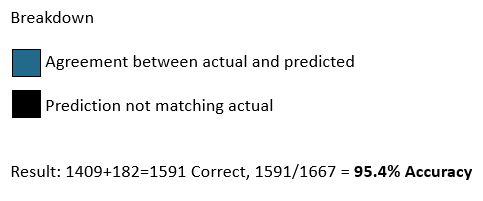
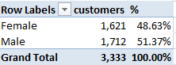

<html>

<head>
<meta http-equiv=Content-Type content="text/html; charset=windows-1252">
<meta name=Generator content="Microsoft Word 15 (filtered)">

<!--
 /* Font Definitions */
 @font-face
	{font-family:"Cambria Math";
	panose-1:2 4 5 3 5 4 6 3 2 4;
	mso-font-charset:0;
	mso-generic-font-family:roman;
	mso-font-pitch:variable;
	mso-font-signature:-536870145 1107305727 0 0 415 0;}
@font-face
	{font-family:Calibri;
	panose-1:2 15 5 2 2 2 4 3 2 4;
	mso-font-charset:0;
	mso-generic-font-family:swiss;
	mso-font-pitch:variable;
	mso-font-signature:-536859905 1073786111 1 0 511 0;}
@font-face
	{font-family:"Segoe UI";
	panose-1:2 11 5 2 4 2 4 2 2 3;
	mso-font-charset:0;
	mso-generic-font-family:swiss;
	mso-font-pitch:variable;
	mso-font-signature:-469750017 -1073683329 9 0 511 0;}
 /* Style Definitions */
 p.MsoNormal, li.MsoNormal, div.MsoNormal
	{mso-style-unhide:no;
	mso-style-qformat:yes;
	mso-style-parent:"";
	margin-top:0in;
	margin-right:0in;
	margin-bottom:8.0pt;
	margin-left:0in;
	line-height:107%;
	mso-pagination:widow-orphan;
	font-size:11.0pt;
	font-family:"Calibri",sans-serif;
	mso-ascii-font-family:Calibri;
	mso-ascii-theme-font:minor-latin;
	mso-fareast-font-family:Calibri;
	mso-fareast-theme-font:minor-latin;
	mso-hansi-font-family:Calibri;
	mso-hansi-theme-font:minor-latin;
	mso-bidi-font-family:"Times New Roman";
	mso-bidi-theme-font:minor-bidi;}
h1
	{mso-style-priority:9;
	mso-style-unhide:no;
	mso-style-qformat:yes;
	mso-style-link:"Heading 1 Char";
	mso-margin-top-alt:auto;
	margin-right:0in;
	mso-margin-bottom-alt:auto;
	margin-left:0in;
	mso-pagination:widow-orphan;
	mso-outline-level:1;
	font-size:24.0pt;
	font-family:"Times New Roman",serif;
	mso-fareast-font-family:"Times New Roman";
	font-weight:bold;}
a:link, span.MsoHyperlink
	{mso-style-noshow:yes;
	mso-style-priority:99;
	color:blue;
	text-decoration:underline;
	text-underline:single;}
a:visited, span.MsoHyperlinkFollowed
	{mso-style-noshow:yes;
	mso-style-priority:99;
	color:#954F72;
	mso-themecolor:followedhyperlink;
	text-decoration:underline;
	text-underline:single;}
p
	{mso-style-noshow:yes;
	mso-style-priority:99;
	mso-margin-top-alt:auto;
	margin-right:0in;
	mso-margin-bottom-alt:auto;
	margin-left:0in;
	mso-pagination:widow-orphan;
	font-size:12.0pt;
	font-family:"Times New Roman",serif;
	mso-fareast-font-family:"Times New Roman";}
pre
	{mso-style-noshow:yes;
	mso-style-priority:99;
	mso-style-link:"HTML Preformatted Char";
	margin:0in;
	margin-bottom:.0001pt;
	mso-pagination:widow-orphan;
	tab-stops:45.8pt 91.6pt 137.4pt 183.2pt 229.0pt 274.8pt 320.6pt 366.4pt 412.2pt 458.0pt 503.8pt 549.6pt 595.4pt 641.2pt 687.0pt 732.8pt;
	font-size:10.0pt;
	font-family:"Courier New";
	mso-fareast-font-family:"Times New Roman";}
span.HTMLPreformattedChar
	{mso-style-name:"HTML Preformatted Char";
	mso-style-noshow:yes;
	mso-style-priority:99;
	mso-style-unhide:no;
	mso-style-locked:yes;
	mso-style-link:"HTML Preformatted";
	mso-ansi-font-size:10.0pt;
	mso-bidi-font-size:10.0pt;
	font-family:"Courier New";
	mso-ascii-font-family:"Courier New";
	mso-fareast-font-family:"Times New Roman";
	mso-hansi-font-family:"Courier New";
	mso-bidi-font-family:"Courier New";}
span.gnkrckgcgsb
	{mso-style-name:gnkrckgcgsb;
	mso-style-unhide:no;}
span.Heading1Char
	{mso-style-name:"Heading 1 Char";
	mso-style-priority:9;
	mso-style-unhide:no;
	mso-style-locked:yes;
	mso-style-link:"Heading 1";
	mso-ansi-font-size:24.0pt;
	mso-bidi-font-size:24.0pt;
	font-family:"Times New Roman",serif;
	mso-ascii-font-family:"Times New Roman";
	mso-fareast-font-family:"Times New Roman";
	mso-hansi-font-family:"Times New Roman";
	mso-bidi-font-family:"Times New Roman";
	mso-font-kerning:18.0pt;
	font-weight:bold;}
span.SpellE
	{mso-style-name:"";
	mso-spl-e:yes;}
.MsoChpDefault
	{mso-style-type:export-only;
	mso-default-props:yes;
	font-family:"Calibri",sans-serif;
	mso-ascii-font-family:Calibri;
	mso-ascii-theme-font:minor-latin;
	mso-fareast-font-family:Calibri;
	mso-fareast-theme-font:minor-latin;
	mso-hansi-font-family:Calibri;
	mso-hansi-theme-font:minor-latin;
	mso-bidi-font-family:"Times New Roman";
	mso-bidi-theme-font:minor-bidi;}
.MsoPapDefault
	{mso-style-type:export-only;
	margin-bottom:8.0pt;
	line-height:107%;}
@page WordSection1
	{size:8.5in 11.0in;
	margin:1.0in 1.0in 1.0in 1.0in;
	mso-header-margin:.5in;
	mso-footer-margin:.5in;
	mso-paper-source:0;}
div.WordSection1
	{page:WordSection1;}
-->
</head>

<body lang=EN-US link=blue vlink="#954F72">

<b>Telco
Churn</b>

<b>Story: 14% customers left (483 of 3,333), </b>Can we use machine
learning (ML) to help inform on why they may have churned/left and reduce
future churn?<b> </b>

<b>Approach:</b>  Use exploratory data analysis
(EDA), visualizations ML to understanding data relating to Telco churn.
Demonstrate understanding of key churn data variables and provide prediction
model for churn.

<b>Data</b> set from: <a
href="https://www.kaggle.com/pangkw/telco-churn/version/3">https://www.kaggle.com/pangkw/telco-churn/version/3</a>

Understand
using ML which data features in the Telco churn are significant to predicting
churn. The data we have is 33 features with 3,333 rows/observations, of Telco
data with churn results. The data provided has <b>14% (483)</b> of the total
records that churned so this will be somewhat of a constraint in our ML
research. First to understand the data we will use tools such as R and excel to
explore. 

The
dependent variable in our exercise is the Churn value of ‘Yes’ or ‘No’, the
independent variables are the remaining data elements that may have an impact
on the dependent variable. One independent variable we can rule out is the
Phone service data element which is set to ‘Yes’ in every record, indicating it
would have no impact on the Churn since it is the same value each time. What
will be of key importance to us is will one or more independent variables show
more important than the rest.

<b>Model results</b>

<table class=MsoTableGrid border=1 cellspacing=0 cellpadding=0
 style='border-collapse:collapse;border:none'>
 <tr style='height:29.2pt'>
  <td width=77 valign=top style='width:2.6in;border:solid windowtext 1.0pt;
  background:#9CC2E5;padding:0in 5.4pt 0in 5.4pt;height:29.2pt'>
  
<b>Model
  Type</b>

  </td>
  <td width=508 valign=top style='width:2.6in;border:solid windowtext 1.0pt;
  border-left:none;background:#9CC2E5;padding:0in 5.4pt 0in 5.4pt;height:29.2pt'>
  
<b>Random Forest</b>

  </td>
  <td width=518 valign=top style='width:187.25pt;border:solid windowtext 1.0pt;
  border-left:none;background:#9CC2E5;padding:0in 5.4pt 0in 5.4pt;height:29.2pt'>
  
<b>‘rpart’ decision
  tree</b>

  </td>
  <td width=483 valign=top style='width:209.05pt;border:solid windowtext 1.0pt;
  border-left:none;background:#9CC2E5;padding:0in 5.4pt 0in 5.4pt;height:29.2pt'>
  
<b>Tree_model decision
  tree</b>

  </td>
 </tr>
 <tr style='height:27.65pt'>
  <td width=77 valign=top style='width:2.6in;border:solid windowtext 1.0pt;
  border-top:none;background:#D0CECE;padding:0in 5.4pt 0in 5.4pt;height:27.65pt'>
  
<b>Prediction
  Accuracy</b>

  </td>
  <td width=508 valign=top style='width:2.6in;border-top:none;border-left:none;
  border-bottom:solid windowtext 1.0pt;border-right:solid windowtext 1.0pt;
  padding:0in 5.4pt 0in 5.4pt;height:27.65pt'>
  
<b>97.1%</b>

  </td>
  <td width=518 valign=top style='width:187.25pt;border-top:none;border-left:
  none;border-bottom:solid windowtext 1.0pt;border-right:solid windowtext 1.0pt;
  padding:0in 5.4pt 0in 5.4pt;height:27.65pt'>
  
<b>95.4%</b>

  </td>
  <td width=483 valign=top style='width:209.05pt;border-top:none;border-left:
  none;border-bottom:solid windowtext 1.0pt;border-right:solid windowtext 1.0pt;
  padding:0in 5.4pt 0in 5.4pt;height:27.65pt'>
  
<b>92.6%</b>

  </td>
 </tr>
 <tr style='height:86.15pt'>
  <td width=77 valign=top style='width:2.6in;border:solid windowtext 1.0pt;
  border-top:none;background:#D0CECE;padding:0in 5.4pt 0in 5.4pt;height:86.15pt'>
  
<b>Most
  relevant Variables</b>

  
<b>&nbsp;</b>

  </td>
  <td width=508 valign=top style='width:2.6in;border-top:none;border-left:none;
  border-bottom:solid windowtext 1.0pt;border-right:solid windowtext 1.0pt;
  padding:0in 5.4pt 0in 5.4pt;height:86.15pt'>
  
<b>1.&nbsp;&nbsp;&nbsp;&nbsp;&nbsp;&nbsp; </b><b>Total Day minutes</b>

  
<b>2.&nbsp;&nbsp;&nbsp;&nbsp;&nbsp;&nbsp; </b><b>Customer service
  calls</b>

  
3.&nbsp;&nbsp;&nbsp;&nbsp;&nbsp;&nbsp; International plan

  
4.&nbsp;&nbsp;&nbsp;&nbsp;&nbsp;&nbsp; Tenure

  
5.&nbsp;&nbsp;&nbsp;&nbsp;&nbsp;&nbsp; Total revenue

  </td>
  <td width=518 valign=top style='width:187.25pt;border-top:none;border-left:
  none;border-bottom:solid windowtext 1.0pt;border-right:solid windowtext 1.0pt;
  padding:0in 5.4pt 0in 5.4pt;height:86.15pt'>
  
<b>1.&nbsp;&nbsp;&nbsp;&nbsp;&nbsp;&nbsp; </b><b>Total Day minutes</b>

  
<b>2.&nbsp;&nbsp;&nbsp;&nbsp;&nbsp;&nbsp; </b><b>Total Eve minutes</b>

  
3.&nbsp;&nbsp;&nbsp;&nbsp;&nbsp;&nbsp; International plan

  
4.&nbsp;&nbsp;&nbsp;&nbsp;&nbsp;&nbsp; Total International
  minutes/calls

  
<b>5.&nbsp;&nbsp;&nbsp;&nbsp;&nbsp;&nbsp; </b><b>Customer service
  calls</b>

  
&nbsp;

  </td>
  <td width=483 valign=top style='width:209.05pt;border-top:none;border-left:
  none;border-bottom:solid windowtext 1.0pt;border-right:solid windowtext 1.0pt;
  padding:0in 5.4pt 0in 5.4pt;height:86.15pt'>
  
1.&nbsp;&nbsp;&nbsp;&nbsp;&nbsp;&nbsp; Contract

  
<b>2.&nbsp;&nbsp;&nbsp;&nbsp;&nbsp;&nbsp; </b><b>Total day minutes</b>

  
<b>3.&nbsp;&nbsp;&nbsp;&nbsp;&nbsp;&nbsp; </b><b>Customer service
  calls</b>

  
<b>4.&nbsp;&nbsp;&nbsp;&nbsp;&nbsp;&nbsp; </b><b>Total Eve minutes</b>

  
5.&nbsp;&nbsp;&nbsp;&nbsp;&nbsp;&nbsp; Voice mail plan

  </td>
 </tr>
 <tr style='height:86.15pt'>
  <td width=77 valign=top style='width:2.6in;border:solid windowtext 1.0pt;
  border-top:none;background:#D0CECE;padding:0in 5.4pt 0in 5.4pt;height:86.15pt'>
  
<b>Confusion
  matrix:</b>

  </td>
  <td width=508 valign=top style='width:2.6in;border-top:none;border-left:none;
  border-bottom:solid windowtext 1.0pt;border-right:solid windowtext 1.0pt;
  padding:0in 5.4pt 0in 5.4pt;height:86.15pt'>
  <table class=MsoNormalTable border=0 cellspacing=0 cellpadding=0 width=0
   style='width:290.0pt;border-collapse:collapse'>
   <tr style='height:29.2pt'>
    <td width=252 colspan=2 valign=top style='width:151.0pt;border:solid white 1.0pt;
    border-bottom:solid white 3.0pt;padding:.05in .1in .05in .1in;height:29.2pt'>
    
<b><u>Random Forest: Churn</u></b>

    </td>
    <td width=241 colspan=2 valign=top style='width:139.0pt;border-top:solid white 1.0pt;
    border-left:none;border-bottom:solid white 3.0pt;border-right:solid white 1.0pt;
    padding:.05in .1in .05in .1in;height:29.2pt'>
    
<b>Predicted</b>

    </td>
   </tr>
   <tr style='height:29.2pt'>
    <td width=142 valign=top style='width:91.0pt;border:solid white 1.0pt;
    border-top:none;padding:.05in .1in .05in .1in;height:29.2pt'></td>
    <td width=110 valign=top style='width:60.0pt;border-top:none;border-left:
    none;border-bottom:solid white 1.0pt;border-right:solid white 1.0pt;
    padding:.05in .1in .05in .1in;height:29.2pt'></td>
    <td width=126 valign=top style='width:69.0pt;border-top:none;border-left:
    none;border-bottom:solid white 1.0pt;border-right:solid white 1.0pt;
    background:#9DC3E6;padding:.05in .1in .05in .1in;height:29.2pt'>
    
<b>No</b>

    </td>
    <td width=115 valign=top style='width:71.0pt;border-top:none;border-left:
    none;border-bottom:solid white 1.0pt;border-right:solid white 1.0pt;
    background:#9DC3E6;padding:.05in .1in .05in .1in;height:29.2pt'>
    
<b>Yes</b>

    </td>
   </tr>
   <tr style='height:29.2pt'>
    <td width=142 rowspan=2 valign=top style='width:91.0pt;border:solid white 1.0pt;
    border-top:none;background:#9DC3E6;padding:.05in .1in .05in .1in;
    height:29.2pt'>
    
<b>Actual</b>

    </td>
    <td width=110 valign=top style='width:60.0pt;border-top:none;border-left:
    none;border-bottom:solid white 1.0pt;border-right:solid white 1.0pt;
    background:#9DC3E6;padding:.05in .1in .05in .1in;height:29.2pt'>
    
<b>No</b>

    </td>
    <td width=126 valign=top style='width:69.0pt;border-top:none;border-left:
    none;border-bottom:solid white 1.0pt;border-right:solid white 1.0pt;
    background:#22698C;padding:.05in .1in .05in .1in;height:29.2pt'>
    
<b>1,970</b>

    </td>
    <td width=115 valign=top style='width:71.0pt;border-top:none;border-left:
    none;border-bottom:solid white 1.0pt;border-right:solid white 1.0pt;
    background:black;padding:.05in .1in .05in .1in;height:29.2pt'>
    
<b>31</b>

    </td>
   </tr>
   <tr style='height:27.55pt'>
    <td width=110 valign=top style='width:60.0pt;border-top:none;border-left:
    none;border-bottom:solid white 1.0pt;border-right:solid white 1.0pt;
    background:#9DC3E6;padding:.05in .1in .05in .1in;height:27.55pt'>
    
<b>Yes</b>

    </td>
    <td width=126 valign=top style='width:69.0pt;border-top:none;border-left:
    none;border-bottom:solid white 1.0pt;border-right:solid white 1.0pt;
    background:black;padding:.05in .1in .05in .1in;height:27.55pt'>
    
<b>132</b>

    </td>
    <td width=115 valign=top style='width:71.0pt;border-top:none;border-left:
    none;border-bottom:solid white 1.0pt;border-right:solid white 1.0pt;
    background:#22698C;padding:.05in .1in .05in .1in;height:27.55pt'>
    
<b>200</b>

    </td>
   </tr>
   <tr style='height:27.55pt'>
    <td width=492 colspan=4 valign=top style='width:290.0pt;border:solid white 1.0pt;
    border-top:none;padding:.05in .1in .05in .1in;height:27.55pt'>
    
<b>Total  2,233</b>

    </td>
   </tr>
   <tr style='height:27.55pt'>
    <td width=492 colspan=4 valign=top style='width:290.0pt;border:solid white 1.0pt;
    border-top:none;padding:.05in .1in .05in .1in;height:27.55pt'>
    
<b>&nbsp;</b>

    

    </td>
   </tr>
  </table>
  </td>
  <td width=518 valign=top style='width:187.25pt;border-top:none;border-left:
  none;border-bottom:solid windowtext 1.0pt;border-right:solid windowtext 1.0pt;
  padding:0in 5.4pt 0in 5.4pt;height:86.15pt'>
  <table class=MsoNormalTable border=0 cellspacing=0 cellpadding=0 width=0
   style='width:290.0pt;border-collapse:collapse'>
   <tr style='height:29.2pt'>
    <td width=257 colspan=2 valign=top style='width:151.0pt;border:solid white 1.0pt;
    border-bottom:solid white 3.0pt;padding:.05in .1in .05in .1in;height:29.2pt'>
    
<b><u>Rpart: Churn</u></b>

    </td>
    <td width=246 colspan=2 valign=top style='width:139.0pt;border-top:solid white 1.0pt;
    border-left:none;border-bottom:solid white 3.0pt;border-right:solid white 1.0pt;
    padding:.05in .1in .05in .1in;height:29.2pt'>
    
<b>Predicted</b>

    </td>
   </tr>
   <tr style='height:29.2pt'>
    <td width=145 valign=top style='width:91.0pt;border:solid white 1.0pt;
    border-top:none;padding:.05in .1in .05in .1in;height:29.2pt'></td>
    <td width=112 valign=top style='width:60.0pt;border-top:none;border-left:
    none;border-bottom:solid white 1.0pt;border-right:solid white 1.0pt;
    padding:.05in .1in .05in .1in;height:29.2pt'></td>
    <td width=128 valign=top style='width:69.0pt;border-top:none;border-left:
    none;border-bottom:solid white 1.0pt;border-right:solid white 1.0pt;
    background:#9DC3E6;padding:.05in .1in .05in .1in;height:29.2pt'>
    
<b>No</b>

    </td>
    <td width=117 valign=top style='width:71.0pt;border-top:none;border-left:
    none;border-bottom:solid white 1.0pt;border-right:solid white 1.0pt;
    background:#9DC3E6;padding:.05in .1in .05in .1in;height:29.2pt'>
    
<b>Yes</b>

    </td>
   </tr>
   <tr style='height:29.2pt'>
    <td width=145 rowspan=2 valign=top style='width:91.0pt;border:solid white 1.0pt;
    border-top:none;background:#9DC3E6;padding:.05in .1in .05in .1in;
    height:29.2pt'>
    
<b>Actual</b>

    </td>
    <td width=112 valign=top style='width:60.0pt;border-top:none;border-left:
    none;border-bottom:solid white 1.0pt;border-right:solid white 1.0pt;
    background:#9DC3E6;padding:.05in .1in .05in .1in;height:29.2pt'>
    
<b>No</b>

    </td>
    <td width=128 valign=top style='width:69.0pt;border-top:none;border-left:
    none;border-bottom:solid white 1.0pt;border-right:solid white 1.0pt;
    background:#22698C;padding:.05in .1in .05in .1in;height:29.2pt'>
    
<b>1,409</b>

    </td>
    <td width=117 valign=top style='width:71.0pt;border-top:none;border-left:
    none;border-bottom:solid white 1.0pt;border-right:solid white 1.0pt;
    background:black;padding:.05in .1in .05in .1in;height:29.2pt'>
    
<b>16</b>

    </td>
   </tr>
   <tr style='height:27.55pt'>
    <td width=112 valign=top style='width:60.0pt;border-top:none;border-left:
    none;border-bottom:solid white 1.0pt;border-right:solid white 1.0pt;
    background:#9DC3E6;padding:.05in .1in .05in .1in;height:27.55pt'>
    
<b>Yes</b>

    </td>
    <td width=128 valign=top style='width:69.0pt;border-top:none;border-left:
    none;border-bottom:solid white 1.0pt;border-right:solid white 1.0pt;
    background:black;padding:.05in .1in .05in .1in;height:27.55pt'>
    
<b>60</b>

    </td>
    <td width=117 valign=top style='width:71.0pt;border-top:none;border-left:
    none;border-bottom:solid white 1.0pt;border-right:solid white 1.0pt;
    background:#22698C;padding:.05in .1in .05in .1in;height:27.55pt'>
    
<b>182</b>

    </td>
   </tr>
   <tr style='height:27.55pt'>
    <td width=502 colspan=4 valign=top style='width:290.0pt;border:solid white 1.0pt;
    border-top:none;padding:.05in .1in .05in .1in;height:27.55pt'>
    
<b>Total  1,667</b>

    </td>
   </tr>
   <tr style='height:27.55pt'>
    <td width=502 colspan=4 valign=top style='width:290.0pt;border:solid white 1.0pt;
    border-top:none;padding:.05in .1in .05in .1in;height:27.55pt'>
    
<b>&nbsp;</b>

    

    </td>
   </tr>
  </table>
  </td>
  <td width=483 valign=top style='width:209.05pt;border-top:none;border-left:
  none;border-bottom:solid windowtext 1.0pt;border-right:solid windowtext 1.0pt;
  padding:0in 5.4pt 0in 5.4pt;height:86.15pt'>
  <table class=MsoNormalTable border=0 cellspacing=0 cellpadding=0 width=0
   style='width:290.0pt;border-collapse:collapse'>
   <tr style='height:29.2pt'>
    <td width=196 colspan=2 valign=top style='width:151.0pt;border:solid white 1.0pt;
    border-bottom:solid white 3.0pt;padding:.05in .1in .05in .1in;height:29.2pt'>
    
<u>Tree Model: Churn</u>

    </td>
    <td width=191 colspan=2 valign=top style='width:139.0pt;border-top:solid white 1.0pt;
    border-left:none;border-bottom:solid white 3.0pt;border-right:solid white 1.0pt;
    padding:.05in .1in .05in .1in;height:29.2pt'>
    
<b>Predicted</b>

    </td>
   </tr>
   <tr style='height:29.2pt'>
    <td width=108 valign=top style='width:91.0pt;border:solid white 1.0pt;
    border-top:none;padding:.05in .1in .05in .1in;height:29.2pt'></td>
    <td width=88 valign=top style='width:60.0pt;border-top:none;border-left:
    none;border-bottom:solid white 1.0pt;border-right:solid white 1.0pt;
    padding:.05in .1in .05in .1in;height:29.2pt'></td>
    <td width=101 valign=top style='width:69.0pt;border-top:none;border-left:
    none;border-bottom:solid white 1.0pt;border-right:solid white 1.0pt;
    background:#9DC3E6;padding:.05in .1in .05in .1in;height:29.2pt'>
    
<b>No</b>

    </td>
    <td width=90 valign=top style='width:71.0pt;border-top:none;border-left:
    none;border-bottom:solid white 1.0pt;border-right:solid white 1.0pt;
    background:#9DC3E6;padding:.05in .1in .05in .1in;height:29.2pt'>
    
<b>Yes</b>

    </td>
   </tr>
   <tr style='height:29.2pt'>
    <td width=108 rowspan=2 valign=top style='width:91.0pt;border:solid white 1.0pt;
    border-top:none;background:#9DC3E6;padding:.05in .1in .05in .1in;
    height:29.2pt'>
    
<b>Actual</b>

    </td>
    <td width=88 valign=top style='width:60.0pt;border-top:none;border-left:
    none;border-bottom:solid white 1.0pt;border-right:solid white 1.0pt;
    background:#9DC3E6;padding:.05in .1in .05in .1in;height:29.2pt'>
    
<b>No</b>

    </td>
    <td width=101 valign=top style='width:69.0pt;border-top:none;border-left:
    none;border-bottom:solid white 1.0pt;border-right:solid white 1.0pt;
    background:#22698C;padding:.05in .1in .05in .1in;height:29.2pt'>
    
<b>1,371</b>

    </td>
    <td width=90 valign=top style='width:71.0pt;border-top:none;border-left:
    none;border-bottom:solid white 1.0pt;border-right:solid white 1.0pt;
    background:black;padding:.05in .1in .05in .1in;height:29.2pt'>
    
<b>54</b>

    </td>
   </tr>
   <tr style='height:27.55pt'>
    <td width=88 valign=top style='width:60.0pt;border-top:none;border-left:
    none;border-bottom:solid white 1.0pt;border-right:solid white 1.0pt;
    background:#9DC3E6;padding:.05in .1in .05in .1in;height:27.55pt'>
    
<b>Yes</b>

    </td>
    <td width=101 valign=top style='width:69.0pt;border-top:none;border-left:
    none;border-bottom:solid white 1.0pt;border-right:solid white 1.0pt;
    background:black;padding:.05in .1in .05in .1in;height:27.55pt'>
    
<b>68</b>

    </td>
    <td width=90 valign=top style='width:71.0pt;border-top:none;border-left:
    none;border-bottom:solid white 1.0pt;border-right:solid white 1.0pt;
    background:#22698C;padding:.05in .1in .05in .1in;height:27.55pt'>
    
<b>174</b>

    </td>
   </tr>
   <tr style='height:27.55pt'>
    <td width=387 colspan=4 valign=top style='width:290.0pt;border:solid white 1.0pt;
    border-top:none;padding:.05in .1in .05in .1in;height:27.55pt'>
    
<b>Total  1,667</b>

    
<b>&nbsp;</b>

    
<b>&nbsp;</b>

    </td>
   </tr>
  </table>
  

  </td>
 </tr>
</table>

&nbsp;

<b>Recommendations and usage scenarios:</b>

<b>1.&nbsp;&nbsp;&nbsp;&nbsp;&nbsp; </b>The
models could be used on new customers to understand if they may be more likely
to churn

<b>2.&nbsp;&nbsp;&nbsp;&nbsp;&nbsp; </b>The
models agree on many of the same data elements having significance to churn

<b>a.&nbsp;&nbsp;&nbsp;&nbsp;&nbsp; </b>Understand
and promote those features that are significant factors to churn behavior.

<b>Follow up and additional recommended work:</b>

1.&nbsp;&nbsp;&nbsp;&nbsp;&nbsp; Principle
Component Analysis (PCA) code is included and working

2.&nbsp;&nbsp;&nbsp;&nbsp;&nbsp; Next
step of combining the PCA and sending PCA data in the Tree based models is a
next step

3.&nbsp;&nbsp;&nbsp;&nbsp;&nbsp; Logistics
regression code is included. Model was run but accuracy was so low that it
isn’t included in the results

a.&nbsp;&nbsp;&nbsp;&nbsp;&nbsp;&nbsp; Accuracy
could be low because of the number of independent variables in the data. 

b.&nbsp;&nbsp;&nbsp;&nbsp;&nbsp; Research
indicated that with so many independent variables the Tree based models would
be the best approach for machine learning.

<b>References:</b>

1.&nbsp;&nbsp;&nbsp;&nbsp;&nbsp;
Cirillo, A. (2017). <i>R Data Mining.</i> Birmingham, UK. Packt
Publishing

2.&nbsp;&nbsp;&nbsp;&nbsp;&nbsp;
Lantz, B. (2015). <i>Machine Learning with R - Second Edition.</i>
Birmingham, UK. Packt Publishing

3.&nbsp;&nbsp;&nbsp;&nbsp;&nbsp;
Schmuller, J. (2018). <i>R Projects For Dummies</i>.
Hoboken, NJ. John Wiley &amp; Sons Inc.

4.&nbsp;&nbsp;&nbsp;&nbsp;&nbsp;
PCA example<b> </b><a
href="https://www.analyticsvidhya.com/blog/2016/03/practical-guide-principal-component-analysis-python/">https://www.analyticsvidhya.com/blog/2016/03/practical-guide-principal-component-analysis-python/</a>

<b>5.&nbsp;&nbsp;&nbsp;&nbsp;&nbsp;
</b>Logistic regression sample <b> </b><a
href="https://www.r-bloggers.com/how-to-perform-a-logistic-regression-in-r/">https://www.r-bloggers.com/how-to-perform-a-logistic-regression-in-r/</a>

6.&nbsp;&nbsp;&nbsp;&nbsp;&nbsp;
Tree based modeling tutorial <a
href="https://www.analyticsvidhya.com/blog/2016/04/complete-tutorial-tree-based-modeling-scratch-in-python/">https://www.analyticsvidhya.com/blog/2016/04/complete-tutorial-tree-based-modeling-scratch-in-python/</a>   --- Tree base modeling tutorial

7.&nbsp;&nbsp;&nbsp;&nbsp;&nbsp;
Titanic Tutorial for R uses cool examples and graphics for decision
trees: <a
href="https://trevorstephens.com/kaggle-titanic-tutorial/getting-started-with-r/">https://trevorstephens.com/kaggle-titanic-tutorial/getting-started-with-r/</a>

8.&nbsp;&nbsp;&nbsp;&nbsp;&nbsp;
Example project from past practicum that I am using as a layout
reference. Please advise if this example has issues you would recommend
improvements on. 

<a
href="https://github.com/KeanuNotReeves/practicum-trad-projections">https://github.com/KeanuNotReeves/practicum-trad-projections</a>

9.&nbsp;&nbsp;&nbsp;&nbsp;&nbsp;
Basic R example for decision tree:  <a href="https://rpubs.com/SANPANDE/221595">https://rpubs.com/SANPANDE/221595</a>

10.&nbsp; My
Github for Practicum 2: <a
href="https://github.com/mdegrado/TelcoChurn">https://github.com/mdegrado/TelcoChurn</a> 
- In Progress

11.&nbsp; My
Gibhub for Practicum 1: <a
href="https://github.com/mdegrado/Wine-reviews-analysis-and-visualization">https://github.com/mdegrado/Wine-reviews-analysis-and-visualization</a>

<b>Appendix</b>

<b>&nbsp;</b>

<b>The Data: Results from EDA:</b>

<table class=MsoTableGrid border=1 cellspacing=0 cellpadding=0
 style='border-collapse:collapse;border:none'>
 <tr style='height:15.75pt'>
  <td width=175 nowrap valign=top style='width:131.0pt;border:solid windowtext 1.0pt;
  padding:0in 5.4pt 0in 5.4pt;height:15.75pt'>
  
<b>Data
  fields</b>

  </td>
  <td width=269 nowrap valign=top style='width:202.0pt;border:solid windowtext 1.0pt;
  border-left:none;padding:0in 5.4pt 0in 5.4pt;height:15.75pt'>
  
<b>Definition</b>

  </td>
  <td width=188 nowrap valign=top style='width:141.0pt;border:solid windowtext 1.0pt;
  border-left:none;padding:0in 5.4pt 0in 5.4pt;height:15.75pt'>
  
<b>Example
  data</b>

  </td>
 </tr>
 <tr style='height:15.0pt'>
  <td width=175 nowrap valign=top style='width:131.0pt;border:solid windowtext 1.0pt;
  border-top:none;padding:0in 5.4pt 0in 5.4pt;height:15.0pt'>
  
<b>customerID</b>

  </td>
  <td width=269 nowrap valign=top style='width:202.0pt;border-top:none;
  border-left:none;border-bottom:solid windowtext 1.0pt;border-right:solid windowtext 1.0pt;
  padding:0in 5.4pt 0in 5.4pt;height:15.0pt'>
  
Unique
  ID for customer

  </td>
  <td width=188 valign=top style='width:141.0pt;border-top:none;border-left:
  none;border-bottom:solid windowtext 1.0pt;border-right:solid windowtext 1.0pt;
  padding:0in 5.4pt 0in 5.4pt;height:15.0pt'>
  
0002-ORFBO

  </td>
 </tr>
 <tr style='height:15.0pt'>
  <td width=175 nowrap valign=top style='width:131.0pt;border:solid windowtext 1.0pt;
  border-top:none;padding:0in 5.4pt 0in 5.4pt;height:15.0pt'>
  
<b>gender</b>

  </td>
  <td width=269 nowrap valign=top style='width:202.0pt;border-top:none;
  border-left:none;border-bottom:solid windowtext 1.0pt;border-right:solid windowtext 1.0pt;
  padding:0in 5.4pt 0in 5.4pt;height:15.0pt'>
  
has: 
  Male or Female

  </td>
  <td width=188 valign=top style='width:141.0pt;border-top:none;border-left:
  none;border-bottom:solid windowtext 1.0pt;border-right:solid windowtext 1.0pt;
  padding:0in 5.4pt 0in 5.4pt;height:15.0pt'>
  
Female

  </td>
 </tr>
 <tr style='height:15.0pt'>
  <td width=175 nowrap valign=top style='width:131.0pt;border:solid windowtext 1.0pt;
  border-top:none;padding:0in 5.4pt 0in 5.4pt;height:15.0pt'>
  
<b>SeniorCitizen</b>

  </td>
  <td width=269 nowrap valign=top style='width:202.0pt;border-top:none;
  border-left:none;border-bottom:solid windowtext 1.0pt;border-right:solid windowtext 1.0pt;
  padding:0in 5.4pt 0in 5.4pt;height:15.0pt'>
  
has:
  0 or 1

  </td>
  <td width=188 valign=top style='width:141.0pt;border-top:none;border-left:
  none;border-bottom:solid windowtext 1.0pt;border-right:solid windowtext 1.0pt;
  padding:0in 5.4pt 0in 5.4pt;height:15.0pt'>
  
0

  </td>
 </tr>
 <tr style='height:15.0pt'>
  <td width=175 nowrap valign=top style='width:131.0pt;border:solid windowtext 1.0pt;
  border-top:none;padding:0in 5.4pt 0in 5.4pt;height:15.0pt'>
  
<b>MaritalStatus</b>

  </td>
  <td width=269 nowrap valign=top style='width:202.0pt;border-top:none;
  border-left:none;border-bottom:solid windowtext 1.0pt;border-right:solid windowtext 1.0pt;
  padding:0in 5.4pt 0in 5.4pt;height:15.0pt'>
  
has
  Yes or No

  </td>
  <td width=188 valign=top style='width:141.0pt;border-top:none;border-left:
  none;border-bottom:solid windowtext 1.0pt;border-right:solid windowtext 1.0pt;
  padding:0in 5.4pt 0in 5.4pt;height:15.0pt'>
  
Yes

  </td>
 </tr>
 <tr style='height:15.0pt'>
  <td width=175 nowrap valign=top style='width:131.0pt;border:solid windowtext 1.0pt;
  border-top:none;padding:0in 5.4pt 0in 5.4pt;height:15.0pt'>
  
<b>Dependents</b>

  </td>
  <td width=269 nowrap valign=top style='width:202.0pt;border-top:none;
  border-left:none;border-bottom:solid windowtext 1.0pt;border-right:solid windowtext 1.0pt;
  padding:0in 5.4pt 0in 5.4pt;height:15.0pt'>
  
has
  Yes or No

  </td>
  <td width=188 valign=top style='width:141.0pt;border-top:none;border-left:
  none;border-bottom:solid windowtext 1.0pt;border-right:solid windowtext 1.0pt;
  padding:0in 5.4pt 0in 5.4pt;height:15.0pt'>
  
Yes

  </td>
 </tr>
 <tr style='height:15.0pt'>
  <td width=175 nowrap valign=top style='width:131.0pt;border:solid windowtext 1.0pt;
  border-top:none;padding:0in 5.4pt 0in 5.4pt;height:15.0pt'>
  
<b>tenure</b>

  </td>
  <td width=269 nowrap valign=top style='width:202.0pt;border-top:none;
  border-left:none;border-bottom:solid windowtext 1.0pt;border-right:solid windowtext 1.0pt;
  padding:0in 5.4pt 0in 5.4pt;height:15.0pt'>
  
ranges
  from 0 to 72

  </td>
  <td width=188 valign=top style='width:141.0pt;border-top:none;border-left:
  none;border-bottom:solid windowtext 1.0pt;border-right:solid windowtext 1.0pt;
  padding:0in 5.4pt 0in 5.4pt;height:15.0pt'>
  
9

  </td>
 </tr>
 <tr style='height:15.0pt'>
  <td width=175 nowrap valign=top style='width:131.0pt;border:solid windowtext 1.0pt;
  border-top:none;padding:0in 5.4pt 0in 5.4pt;height:15.0pt'>
  
<b>PhoneService</b>

  </td>
  <td width=269 nowrap valign=top style='width:202.0pt;border-top:none;
  border-left:none;border-bottom:solid windowtext 1.0pt;border-right:solid windowtext 1.0pt;
  padding:0in 5.4pt 0in 5.4pt;height:15.0pt'>
  
all
  records set to yes

  </td>
  <td width=188 valign=top style='width:141.0pt;border-top:none;border-left:
  none;border-bottom:solid windowtext 1.0pt;border-right:solid windowtext 1.0pt;
  padding:0in 5.4pt 0in 5.4pt;height:15.0pt'>
  
Yes

  </td>
 </tr>
 <tr style='height:15.0pt'>
  <td width=175 nowrap valign=top style='width:131.0pt;border:solid windowtext 1.0pt;
  border-top:none;padding:0in 5.4pt 0in 5.4pt;height:15.0pt'>
  
<b>MultipleLines</b>

  </td>
  <td width=269 nowrap valign=top style='width:202.0pt;border-top:none;
  border-left:none;border-bottom:solid windowtext 1.0pt;border-right:solid windowtext 1.0pt;
  padding:0in 5.4pt 0in 5.4pt;height:15.0pt'>
  
has
  Yes or No

  </td>
  <td width=188 valign=top style='width:141.0pt;border-top:none;border-left:
  none;border-bottom:solid windowtext 1.0pt;border-right:solid windowtext 1.0pt;
  padding:0in 5.4pt 0in 5.4pt;height:15.0pt'>
  
No

  </td>
 </tr>
 <tr style='height:15.0pt'>
  <td width=175 nowrap valign=top style='width:131.0pt;border:solid windowtext 1.0pt;
  border-top:none;padding:0in 5.4pt 0in 5.4pt;height:15.0pt'>
  
<b>InternetService</b>

  </td>
  <td width=269 nowrap valign=top style='width:202.0pt;border-top:none;
  border-left:none;border-bottom:solid windowtext 1.0pt;border-right:solid windowtext 1.0pt;
  padding:0in 5.4pt 0in 5.4pt;height:15.0pt'>
  
has
  DSL, Fiber optic, No

  </td>
  <td width=188 valign=top style='width:141.0pt;border-top:none;border-left:
  none;border-bottom:solid windowtext 1.0pt;border-right:solid windowtext 1.0pt;
  padding:0in 5.4pt 0in 5.4pt;height:15.0pt'>
  
DSL

  </td>
 </tr>
 <tr style='height:15.0pt'>
  <td width=175 nowrap valign=top style='width:131.0pt;border:solid windowtext 1.0pt;
  border-top:none;padding:0in 5.4pt 0in 5.4pt;height:15.0pt'>
  
<b>OnlineSecurity</b>

  </td>
  <td width=269 nowrap valign=top style='width:202.0pt;border-top:none;
  border-left:none;border-bottom:solid windowtext 1.0pt;border-right:solid windowtext 1.0pt;
  padding:0in 5.4pt 0in 5.4pt;height:15.0pt'>
  
has
  No, No Internet service, Yes

  </td>
  <td width=188 valign=top style='width:141.0pt;border-top:none;border-left:
  none;border-bottom:solid windowtext 1.0pt;border-right:solid windowtext 1.0pt;
  padding:0in 5.4pt 0in 5.4pt;height:15.0pt'>
  
No

  </td>
 </tr>
 <tr style='height:15.0pt'>
  <td width=175 nowrap valign=top style='width:131.0pt;border:solid windowtext 1.0pt;
  border-top:none;padding:0in 5.4pt 0in 5.4pt;height:15.0pt'>
  
<b>OnlineBackup</b>

  </td>
  <td width=269 nowrap valign=top style='width:202.0pt;border-top:none;
  border-left:none;border-bottom:solid windowtext 1.0pt;border-right:solid windowtext 1.0pt;
  padding:0in 5.4pt 0in 5.4pt;height:15.0pt'>
  
has
  No, No Internet service, Yes

  </td>
  <td width=188 valign=top style='width:141.0pt;border-top:none;border-left:
  none;border-bottom:solid windowtext 1.0pt;border-right:solid windowtext 1.0pt;
  padding:0in 5.4pt 0in 5.4pt;height:15.0pt'>
  
Yes

  </td>
 </tr>
 <tr style='height:15.0pt'>
  <td width=175 nowrap valign=top style='width:131.0pt;border:solid windowtext 1.0pt;
  border-top:none;padding:0in 5.4pt 0in 5.4pt;height:15.0pt'>
  
<b>DeviceProtection</b>

  </td>
  <td width=269 nowrap valign=top style='width:202.0pt;border-top:none;
  border-left:none;border-bottom:solid windowtext 1.0pt;border-right:solid windowtext 1.0pt;
  padding:0in 5.4pt 0in 5.4pt;height:15.0pt'>
  
has
  No, No Internet service, Yes

  </td>
  <td width=188 valign=top style='width:141.0pt;border-top:none;border-left:
  none;border-bottom:solid windowtext 1.0pt;border-right:solid windowtext 1.0pt;
  padding:0in 5.4pt 0in 5.4pt;height:15.0pt'>
  
No

  </td>
 </tr>
 <tr style='height:15.0pt'>
  <td width=175 nowrap valign=top style='width:131.0pt;border:solid windowtext 1.0pt;
  border-top:none;padding:0in 5.4pt 0in 5.4pt;height:15.0pt'>
  
<b>TechSupport</b>

  </td>
  <td width=269 nowrap valign=top style='width:202.0pt;border-top:none;
  border-left:none;border-bottom:solid windowtext 1.0pt;border-right:solid windowtext 1.0pt;
  padding:0in 5.4pt 0in 5.4pt;height:15.0pt'>
  
has
  No, No Internet service, Yes

  </td>
  <td width=188 valign=top style='width:141.0pt;border-top:none;border-left:
  none;border-bottom:solid windowtext 1.0pt;border-right:solid windowtext 1.0pt;
  padding:0in 5.4pt 0in 5.4pt;height:15.0pt'>
  
Yes

  </td>
 </tr>
 <tr style='height:15.0pt'>
  <td width=175 nowrap valign=top style='width:131.0pt;border:solid windowtext 1.0pt;
  border-top:none;padding:0in 5.4pt 0in 5.4pt;height:15.0pt'>
  
<b>StreamingTV</b>

  </td>
  <td width=269 nowrap valign=top style='width:202.0pt;border-top:none;
  border-left:none;border-bottom:solid windowtext 1.0pt;border-right:solid windowtext 1.0pt;
  padding:0in 5.4pt 0in 5.4pt;height:15.0pt'>
  
has
  No, No Internet service, Yes

  </td>
  <td width=188 valign=top style='width:141.0pt;border-top:none;border-left:
  none;border-bottom:solid windowtext 1.0pt;border-right:solid windowtext 1.0pt;
  padding:0in 5.4pt 0in 5.4pt;height:15.0pt'>
  
Yes

  </td>
 </tr>
 <tr style='height:15.0pt'>
  <td width=175 nowrap valign=top style='width:131.0pt;border:solid windowtext 1.0pt;
  border-top:none;padding:0in 5.4pt 0in 5.4pt;height:15.0pt'>
  
<b>StreamingMovies</b>

  </td>
  <td width=269 nowrap valign=top style='width:202.0pt;border-top:none;
  border-left:none;border-bottom:solid windowtext 1.0pt;border-right:solid windowtext 1.0pt;
  padding:0in 5.4pt 0in 5.4pt;height:15.0pt'>
  
has
  No, No Internet service, Yes

  </td>
  <td width=188 valign=top style='width:141.0pt;border-top:none;border-left:
  none;border-bottom:solid windowtext 1.0pt;border-right:solid windowtext 1.0pt;
  padding:0in 5.4pt 0in 5.4pt;height:15.0pt'>
  
No

  </td>
 </tr>
 <tr style='height:15.0pt'>
  <td width=175 nowrap valign=top style='width:131.0pt;border:solid windowtext 1.0pt;
  border-top:none;padding:0in 5.4pt 0in 5.4pt;height:15.0pt'>
  
<b>Contract</b>

  </td>
  <td width=269 nowrap valign=top style='width:202.0pt;border-top:none;
  border-left:none;border-bottom:solid windowtext 1.0pt;border-right:solid windowtext 1.0pt;
  padding:0in 5.4pt 0in 5.4pt;height:15.0pt'>
  
has
  Month-to-month, One year, Two year

  </td>
  <td width=188 valign=top style='width:141.0pt;border-top:none;border-left:
  none;border-bottom:solid windowtext 1.0pt;border-right:solid windowtext 1.0pt;
  padding:0in 5.4pt 0in 5.4pt;height:15.0pt'>
  
One
  year

  </td>
 </tr>
 <tr style='height:15.0pt'>
  <td width=175 nowrap valign=top style='width:131.0pt;border:solid windowtext 1.0pt;
  border-top:none;padding:0in 5.4pt 0in 5.4pt;height:15.0pt'>
  
<b>PaperlessBilling</b>

  </td>
  <td width=269 nowrap valign=top style='width:202.0pt;border-top:none;
  border-left:none;border-bottom:solid windowtext 1.0pt;border-right:solid windowtext 1.0pt;
  padding:0in 5.4pt 0in 5.4pt;height:15.0pt'>
  
has
  Yes or No

  </td>
  <td width=188 valign=top style='width:141.0pt;border-top:none;border-left:
  none;border-bottom:solid windowtext 1.0pt;border-right:solid windowtext 1.0pt;
  padding:0in 5.4pt 0in 5.4pt;height:15.0pt'>
  
Yes

  </td>
 </tr>
 <tr style='height:45.0pt'>
  <td width=175 nowrap valign=top style='width:131.0pt;border:solid windowtext 1.0pt;
  border-top:none;padding:0in 5.4pt 0in 5.4pt;height:45.0pt'>
  
<b>PaymentMethod</b>

  </td>
  <td width=269 valign=top style='width:202.0pt;border-top:none;border-left:
  none;border-bottom:solid windowtext 1.0pt;border-right:solid windowtext 1.0pt;
  padding:0in 5.4pt 0in 5.4pt;height:45.0pt'>
  
has
  Bank transfer (automatic), Credit card (automatic), Electronic check, Mailed
  check

  </td>
  <td width=188 valign=top style='width:141.0pt;border-top:none;border-left:
  none;border-bottom:solid windowtext 1.0pt;border-right:solid windowtext 1.0pt;
  padding:0in 5.4pt 0in 5.4pt;height:45.0pt'>
  
Mailed
  check

  </td>
 </tr>
 <tr style='height:15.0pt'>
  <td width=175 nowrap valign=top style='width:131.0pt;border:solid windowtext 1.0pt;
  border-top:none;padding:0in 5.4pt 0in 5.4pt;height:15.0pt'>
  
<b>InternationalPlan</b>

  </td>
  <td width=269 nowrap valign=top style='width:202.0pt;border-top:none;
  border-left:none;border-bottom:solid windowtext 1.0pt;border-right:solid windowtext 1.0pt;
  padding:0in 5.4pt 0in 5.4pt;height:15.0pt'>
  
has
  Yes or No

  </td>
  <td width=188 valign=top style='width:141.0pt;border-top:none;border-left:
  none;border-bottom:solid windowtext 1.0pt;border-right:solid windowtext 1.0pt;
  padding:0in 5.4pt 0in 5.4pt;height:15.0pt'>
  
No

  </td>
 </tr>
 <tr style='height:15.0pt'>
  <td width=175 nowrap valign=top style='width:131.0pt;border:solid windowtext 1.0pt;
  border-top:none;padding:0in 5.4pt 0in 5.4pt;height:15.0pt'>
  
<b>VoiceMailPlan</b>

  </td>
  <td width=269 nowrap valign=top style='width:202.0pt;border-top:none;
  border-left:none;border-bottom:solid windowtext 1.0pt;border-right:solid windowtext 1.0pt;
  padding:0in 5.4pt 0in 5.4pt;height:15.0pt'>
  
has
  Yes or No

  </td>
  <td width=188 valign=top style='width:141.0pt;border-top:none;border-left:
  none;border-bottom:solid windowtext 1.0pt;border-right:solid windowtext 1.0pt;
  padding:0in 5.4pt 0in 5.4pt;height:15.0pt'>
  
No

  </td>
 </tr>
 <tr style='height:15.0pt'>
  <td width=175 nowrap valign=top style='width:131.0pt;border:solid windowtext 1.0pt;
  border-top:none;padding:0in 5.4pt 0in 5.4pt;height:15.0pt'>
  
<b>NumbervMailMessages</b>

  </td>
  <td width=269 nowrap valign=top style='width:202.0pt;border-top:none;
  border-left:none;border-bottom:solid windowtext 1.0pt;border-right:solid windowtext 1.0pt;
  padding:0in 5.4pt 0in 5.4pt;height:15.0pt'>
  
ranges
  0 to 51

  </td>
  <td width=188 valign=top style='width:141.0pt;border-top:none;border-left:
  none;border-bottom:solid windowtext 1.0pt;border-right:solid windowtext 1.0pt;
  padding:0in 5.4pt 0in 5.4pt;height:15.0pt'>
  
0

  </td>
 </tr>
 <tr style='height:15.0pt'>
  <td width=175 nowrap valign=top style='width:131.0pt;border:solid windowtext 1.0pt;
  border-top:none;padding:0in 5.4pt 0in 5.4pt;height:15.0pt'>
  
<b>TotalDayMinutes</b>

  </td>
  <td width=269 nowrap valign=top style='width:202.0pt;border-top:none;
  border-left:none;border-bottom:solid windowtext 1.0pt;border-right:solid windowtext 1.0pt;
  padding:0in 5.4pt 0in 5.4pt;height:15.0pt'>
  
ranges
  0 to 350.8

  </td>
  <td width=188 valign=top style='width:141.0pt;border-top:none;border-left:
  none;border-bottom:solid windowtext 1.0pt;border-right:solid windowtext 1.0pt;
  padding:0in 5.4pt 0in 5.4pt;height:15.0pt'>
  
168.8

  </td>
 </tr>
 <tr style='height:15.0pt'>
  <td width=175 nowrap valign=top style='width:131.0pt;border:solid windowtext 1.0pt;
  border-top:none;padding:0in 5.4pt 0in 5.4pt;height:15.0pt'>
  
<b>TotalDayCalls</b>

  </td>
  <td width=269 nowrap valign=top style='width:202.0pt;border-top:none;
  border-left:none;border-bottom:solid windowtext 1.0pt;border-right:solid windowtext 1.0pt;
  padding:0in 5.4pt 0in 5.4pt;height:15.0pt'>
  
ranges
  0 to 165

  </td>
  <td width=188 valign=top style='width:141.0pt;border-top:none;border-left:
  none;border-bottom:solid windowtext 1.0pt;border-right:solid windowtext 1.0pt;
  padding:0in 5.4pt 0in 5.4pt;height:15.0pt'>
  
137

  </td>
 </tr>
 <tr style='height:15.0pt'>
  <td width=175 nowrap valign=top style='width:131.0pt;border:solid windowtext 1.0pt;
  border-top:none;padding:0in 5.4pt 0in 5.4pt;height:15.0pt'>
  
<b>TotalEveMinutes</b>

  </td>
  <td width=269 nowrap valign=top style='width:202.0pt;border-top:none;
  border-left:none;border-bottom:solid windowtext 1.0pt;border-right:solid windowtext 1.0pt;
  padding:0in 5.4pt 0in 5.4pt;height:15.0pt'>
  
ranges
  0 to 363.7

  </td>
  <td width=188 valign=top style='width:141.0pt;border-top:none;border-left:
  none;border-bottom:solid windowtext 1.0pt;border-right:solid windowtext 1.0pt;
  padding:0in 5.4pt 0in 5.4pt;height:15.0pt'>
  
241.4

  </td>
 </tr>
 <tr style='height:15.0pt'>
  <td width=175 nowrap valign=top style='width:131.0pt;border:solid windowtext 1.0pt;
  border-top:none;padding:0in 5.4pt 0in 5.4pt;height:15.0pt'>
  
<b>TotalEveCalls</b>

  </td>
  <td width=269 nowrap valign=top style='width:202.0pt;border-top:none;
  border-left:none;border-bottom:solid windowtext 1.0pt;border-right:solid windowtext 1.0pt;
  padding:0in 5.4pt 0in 5.4pt;height:15.0pt'>
  
ranges
  0-170

  </td>
  <td width=188 valign=top style='width:141.0pt;border-top:none;border-left:
  none;border-bottom:solid windowtext 1.0pt;border-right:solid windowtext 1.0pt;
  padding:0in 5.4pt 0in 5.4pt;height:15.0pt'>
  
107

  </td>
 </tr>
 <tr style='height:15.0pt'>
  <td width=175 nowrap valign=top style='width:131.0pt;border:solid windowtext 1.0pt;
  border-top:none;padding:0in 5.4pt 0in 5.4pt;height:15.0pt'>
  
<b>TotalNightMinutes</b>

  </td>
  <td width=269 nowrap valign=top style='width:202.0pt;border-top:none;
  border-left:none;border-bottom:solid windowtext 1.0pt;border-right:solid windowtext 1.0pt;
  padding:0in 5.4pt 0in 5.4pt;height:15.0pt'>
  
ranges
  23.2 to 395

  </td>
  <td width=188 valign=top style='width:141.0pt;border-top:none;border-left:
  none;border-bottom:solid windowtext 1.0pt;border-right:solid windowtext 1.0pt;
  padding:0in 5.4pt 0in 5.4pt;height:15.0pt'>
  
204.8

  </td>
 </tr>
 <tr style='height:15.0pt'>
  <td width=175 nowrap valign=top style='width:131.0pt;border:solid windowtext 1.0pt;
  border-top:none;padding:0in 5.4pt 0in 5.4pt;height:15.0pt'>
  
<b>TotalNightCalls</b>

  </td>
  <td width=269 nowrap valign=top style='width:202.0pt;border-top:none;
  border-left:none;border-bottom:solid windowtext 1.0pt;border-right:solid windowtext 1.0pt;
  padding:0in 5.4pt 0in 5.4pt;height:15.0pt'>
  
ranges
  33 to 175

  </td>
  <td width=188 valign=top style='width:141.0pt;border-top:none;border-left:
  none;border-bottom:solid windowtext 1.0pt;border-right:solid windowtext 1.0pt;
  padding:0in 5.4pt 0in 5.4pt;height:15.0pt'>
  
106

  </td>
 </tr>
 <tr style='height:15.0pt'>
  <td width=175 nowrap valign=top style='width:131.0pt;border:solid windowtext 1.0pt;
  border-top:none;padding:0in 5.4pt 0in 5.4pt;height:15.0pt'>
  
<b>TotalIntlMinutes</b>

  </td>
  <td width=269 nowrap valign=top style='width:202.0pt;border-top:none;
  border-left:none;border-bottom:solid windowtext 1.0pt;border-right:solid windowtext 1.0pt;
  padding:0in 5.4pt 0in 5.4pt;height:15.0pt'>
  
ranges
  0 to 20

  </td>
  <td width=188 valign=top style='width:141.0pt;border-top:none;border-left:
  none;border-bottom:solid windowtext 1.0pt;border-right:solid windowtext 1.0pt;
  padding:0in 5.4pt 0in 5.4pt;height:15.0pt'>
  
15.5

  </td>
 </tr>
 <tr style='height:15.0pt'>
  <td width=175 nowrap valign=top style='width:131.0pt;border:solid windowtext 1.0pt;
  border-top:none;padding:0in 5.4pt 0in 5.4pt;height:15.0pt'>
  
<b>TotalIntlCalls</b>

  </td>
  <td width=269 nowrap valign=top style='width:202.0pt;border-top:none;
  border-left:none;border-bottom:solid windowtext 1.0pt;border-right:solid windowtext 1.0pt;
  padding:0in 5.4pt 0in 5.4pt;height:15.0pt'>
  
range
  0 to 20

  </td>
  <td width=188 valign=top style='width:141.0pt;border-top:none;border-left:
  none;border-bottom:solid windowtext 1.0pt;border-right:solid windowtext 1.0pt;
  padding:0in 5.4pt 0in 5.4pt;height:15.0pt'>
  
4

  </td>
 </tr>
 <tr style='height:15.0pt'>
  <td width=175 nowrap valign=top style='width:131.0pt;border:solid windowtext 1.0pt;
  border-top:none;padding:0in 5.4pt 0in 5.4pt;height:15.0pt'>
  
<b>CustomerServiceCalls</b>

  </td>
  <td width=269 nowrap valign=top style='width:202.0pt;border-top:none;
  border-left:none;border-bottom:solid windowtext 1.0pt;border-right:solid windowtext 1.0pt;
  padding:0in 5.4pt 0in 5.4pt;height:15.0pt'>
  
ranges
  0 to 20

  </td>
  <td width=188 valign=top style='width:141.0pt;border-top:none;border-left:
  none;border-bottom:solid windowtext 1.0pt;border-right:solid windowtext 1.0pt;
  padding:0in 5.4pt 0in 5.4pt;height:15.0pt'>
  
0

  </td>
 </tr>
 <tr style='height:15.0pt'>
  <td width=175 nowrap valign=top style='width:131.0pt;border:solid windowtext 1.0pt;
  border-top:none;padding:0in 5.4pt 0in 5.4pt;height:15.0pt'>
  
<b>TotalCall</b>

  </td>
  <td width=269 nowrap valign=top style='width:202.0pt;border-top:none;
  border-left:none;border-bottom:solid windowtext 1.0pt;border-right:solid windowtext 1.0pt;
  padding:0in 5.4pt 0in 5.4pt;height:15.0pt'>
  
ranges
  194 to 418

  </td>
  <td width=188 valign=top style='width:141.0pt;border-top:none;border-left:
  none;border-bottom:solid windowtext 1.0pt;border-right:solid windowtext 1.0pt;
  padding:0in 5.4pt 0in 5.4pt;height:15.0pt'>
  
354

  </td>
 </tr>
 <tr style='height:15.0pt'>
  <td width=175 nowrap valign=top style='width:131.0pt;border:solid windowtext 1.0pt;
  border-top:none;padding:0in 5.4pt 0in 5.4pt;height:15.0pt'>
  
<b>TotalRevenue</b>

  </td>
  <td width=269 nowrap valign=top style='width:202.0pt;border-top:none;
  border-left:none;border-bottom:solid windowtext 1.0pt;border-right:solid windowtext 1.0pt;
  padding:0in 5.4pt 0in 5.4pt;height:15.0pt'>
  
ranges
  18.8 to 8476.5, 5 NA's

  </td>
  <td width=188 valign=top style='width:141.0pt;border-top:none;border-left:
  none;border-bottom:solid windowtext 1.0pt;border-right:solid windowtext 1.0pt;
  padding:0in 5.4pt 0in 5.4pt;height:15.0pt'>
  
593.3

  </td>
 </tr>
 <tr style='height:15.75pt'>
  <td width=175 nowrap valign=top style='width:131.0pt;border:solid windowtext 1.0pt;
  border-top:none;padding:0in 5.4pt 0in 5.4pt;height:15.75pt'>
  
<b>Churn</b>

  </td>
  <td width=269 nowrap valign=top style='width:202.0pt;border-top:none;
  border-left:none;border-bottom:solid windowtext 1.0pt;border-right:solid windowtext 1.0pt;
  padding:0in 5.4pt 0in 5.4pt;height:15.75pt'>
  
has
  Yes or No

  </td>
  <td width=188 valign=top style='width:141.0pt;border-top:none;border-left:
  none;border-bottom:solid windowtext 1.0pt;border-right:solid windowtext 1.0pt;
  padding:0in 5.4pt 0in 5.4pt;height:15.75pt'>
  
No

  </td>
 </tr>
</table>

&nbsp;

<b>R code and graphics from the EDA activities</b>

&nbsp;

<table class=MsoTableGrid border=1 cellspacing=0 cellpadding=0 width=0
 style='width:499.25pt;border-collapse:collapse;border:none'>
 <tr>
  <td width=666 colspan=3 valign=top style='width:499.25pt;border:solid windowtext 1.0pt;
  padding:0in 5.4pt 0in 5.4pt'>
  
Exploratory
  Data Analysis (EDA)

  </td>
 </tr>
 <tr>
  <td width=125 valign=top style='width:93.5pt;border:solid windowtext 1.0pt;
  border-top:none;padding:0in 5.4pt 0in 5.4pt'>
  
&nbsp;

  </td>
  <td width=236 valign=top style='width:177.3pt;border-top:none;border-left:
  none;border-bottom:solid windowtext 1.0pt;border-right:solid windowtext 1.0pt;
  padding:0in 5.4pt 0in 5.4pt'>
  
Excel
  pivot

  </td>
  <td width=305 valign=top style='width:228.45pt;border-top:none;border-left:
  none;border-bottom:solid windowtext 1.0pt;border-right:solid windowtext 1.0pt;
  padding:0in 5.4pt 0in 5.4pt'>
  
<b><u>#R
  plot</u></b>

  
TCD
  &lt;- read.csv(&quot;C:/Users/mdegra200/Documents/P2/TCD.csv&quot;)

  
df_TCD
  = data.frame(TCD)

  
attach(df_TCD)

  
plot(gender)

  
&nbsp;

  </td>
 </tr>
 <tr>
  <td width=125 valign=top style='width:93.5pt;border:solid windowtext 1.0pt;
  border-top:none;padding:0in 5.4pt 0in 5.4pt'>
  
Gender

  
&nbsp;

  </td>
  <td width=236 valign=top style='width:177.3pt;border-top:none;border-left:
  none;border-bottom:solid windowtext 1.0pt;border-right:solid windowtext 1.0pt;
  padding:0in 5.4pt 0in 5.4pt'>
  

  </td>
  <td width=305 valign=top style='width:228.45pt;border-top:none;border-left:
  none;border-bottom:solid windowtext 1.0pt;border-right:solid windowtext 1.0pt;
  padding:0in 5.4pt 0in 5.4pt'>
  

  </td>
 </tr>
 <tr>
  <td width=125 valign=top style='width:93.5pt;border:solid windowtext 1.0pt;
  border-top:none;padding:0in 5.4pt 0in 5.4pt'>
  
SeniorCitizen

  </td>
  <td width=236 valign=top style='width:177.3pt;border-top:none;border-left:
  none;border-bottom:solid windowtext 1.0pt;border-right:solid windowtext 1.0pt;
  padding:0in 5.4pt 0in 5.4pt'>
  

  </td>
  <td width=305 valign=top style='width:228.45pt;border-top:none;border-left:
  none;border-bottom:solid windowtext 1.0pt;border-right:solid windowtext 1.0pt;
  padding:0in 5.4pt 0in 5.4pt'>
  

  
Hist(SeniorCitizen)

  </td>
 </tr>
 <tr>
  <td width=125 valign=top style='width:93.5pt;border:solid windowtext 1.0pt;
  border-top:none;padding:0in 5.4pt 0in 5.4pt'>
  
MaritalStatus

  </td>
  <td width=236 valign=top style='width:177.3pt;border-top:none;border-left:
  none;border-bottom:solid windowtext 1.0pt;border-right:solid windowtext 1.0pt;
  padding:0in 5.4pt 0in 5.4pt'>
  

  </td>
  <td width=305 valign=top style='width:228.45pt;border-top:none;border-left:
  none;border-bottom:solid windowtext 1.0pt;border-right:solid windowtext 1.0pt;
  padding:0in 5.4pt 0in 5.4pt'>
  

  </td>
 </tr>
 <tr>
  <td width=125 valign=top style='width:93.5pt;border:solid windowtext 1.0pt;
  border-top:none;padding:0in 5.4pt 0in 5.4pt'>
  
&nbsp;

  </td>
  <td width=236 valign=top style='width:177.3pt;border-top:none;border-left:
  none;border-bottom:solid windowtext 1.0pt;border-right:solid windowtext 1.0pt;
  padding:0in 5.4pt 0in 5.4pt'>
  
&nbsp;

  </td>
  <td width=305 valign=top style='width:228.45pt;border-top:none;border-left:
  none;border-bottom:solid windowtext 1.0pt;border-right:solid windowtext 1.0pt;
  padding:0in 5.4pt 0in 5.4pt'>
  
&nbsp;

  </td>
 </tr>
 <tr>
  <td width=125 valign=top style='width:93.5pt;border:solid windowtext 1.0pt;
  border-top:none;padding:0in 5.4pt 0in 5.4pt'>
  
&nbsp;

  </td>
  <td width=236 valign=top style='width:177.3pt;border-top:none;border-left:
  none;border-bottom:solid windowtext 1.0pt;border-right:solid windowtext 1.0pt;
  padding:0in 5.4pt 0in 5.4pt'>
  
&nbsp;

  </td>
  <td width=305 valign=top style='width:228.45pt;border-top:none;border-left:
  none;border-bottom:solid windowtext 1.0pt;border-right:solid windowtext 1.0pt;
  padding:0in 5.4pt 0in 5.4pt'>
  
&nbsp;

  </td>
 </tr>
</table>

&nbsp;

&nbsp;

&nbsp;

&nbsp;

<table class=MsoTableGrid border=1 cellspacing=0 cellpadding=0
 style='border-collapse:collapse;border:none'>
 <tr>
  <td width=1126 valign=top style='width:467.5pt;border:solid windowtext 1.0pt;
  padding:0in 5.4pt 0in 5.4pt'>
  
This
  could take all day. So instead I run the following command:

  
summary(df_TCD)
  #Summarizes the data in the data frame

  
&nbsp;

  

  
Gives
  me the contents and breakdown for the categorical fields

  
Gives
  me some interesting stats like Min,Max and quartiles on the continuous fields

  
Removed
  Nulls from Total revenue manually since there were only 5 of them. I set them
  to 0.

  
&nbsp;

  </td>
 </tr>
 <tr>
  <td width=1126 valign=top style='width:467.5pt;border:solid windowtext 1.0pt;
  border-top:none;padding:0in 5.4pt 0in 5.4pt'>
  <table class=MsoNormalTable border=0 cellspacing=0 cellpadding=0 width=0
   style='width:633.75pt;background:white'>
   <tr>
    <td valign=top style='padding:0in 0in 6.0pt 4.5pt'>
    
str(df_TCD)

    
'data.frame':  3333 obs.
    of  33 variables:

    
 $ customerID          :
    Factor w/ 3333 levels &quot;0002-ORFBO&quot;,&quot;0004-TLHLJ&quot;,..: 1 2
    3 4 5 6 7 8 9 10 ...

    
 $ gender              :
    Factor w/ 2 levels &quot;Female&quot;,&quot;Male&quot;: 1 2 1 1 1 1 1 2 1 1
    ...

    
 $ SeniorCitizen       :
    int  0 0 0 1 1 0 1 1 0 0 ...

    
 $ MaritalStatus       :
    Factor w/ 2 levels &quot;No&quot;,&quot;Yes&quot;: 2 1 1 2 1 2 1 1 1 2 ...

    
 $ Dependents          :
    Factor w/ 2 levels &quot;No&quot;,&quot;Yes&quot;: 2 1 2 1 1 1 1 1 1 2 ...

    
 $ tenure              :
    int  9 4 9 71 7 5 1 45 3 4 ...

    
 $ PhoneService        :
    Factor w/ 1 level &quot;Yes&quot;: 1 1 1 1 1 1 1 1 1 1 ...

    
 $ MultipleLines       :
    Factor w/ 2 levels &quot;No&quot;,&quot;Yes&quot;: 1 1 1 1 1 1 2 1 1 1 ...

    
 $ InternetService     :
    Factor w/ 3 levels &quot;DSL&quot;,&quot;Fiber optic&quot;,..: 1 2 1 2 1 2
    2 1 3 3 ...

    
 $ OnlineSecurity      :
    Factor w/ 3 levels &quot;No&quot;,&quot;No internet service&quot;,..: 1 1 1
    3 3 1 1 3 2 2 ...

    
 $ OnlineBackup        :
    Factor w/ 3 levels &quot;No&quot;,&quot;No internet service&quot;,..: 3 1 1
    3 1 1 1 1 2 2 ...

    
 $ DeviceProtection    :
    Factor w/ 3 levels &quot;No&quot;,&quot;No internet service&quot;,..: 1 3 1
    3 1 1 1 3 2 2 ...

    
 $ TechSupport         :
    Factor w/ 3 levels &quot;No&quot;,&quot;No internet service&quot;,..: 3 1 3
    3 1 1 1 1 2 2 ...

    
 $ StreamingTV         :
    Factor w/ 3 levels &quot;No&quot;,&quot;No internet service&quot;,..: 3 1 3
    3 1 1 1 1 2 2 ...

    
 $ StreamingMovies     :
    Factor w/ 3 levels &quot;No&quot;,&quot;No internet service&quot;,..: 1 1 3
    3 1 1 1 3 2 2 ...

    
 $ Contract            :
    Factor w/ 3 levels &quot;Month-to-month&quot;,..: 2 1 1 3 1 1 1 2 1 1 ...

    
 $ PaperlessBilling    :
    Factor w/ 2 levels &quot;No&quot;,&quot;Yes&quot;: 2 2 2 2 2 2 2 1 1 1 ...

    
 $ PaymentMethod       :
    Factor w/ 4 levels &quot;Bank transfer (automatic)&quot;,..: 4 3 2 1 3 3 3
    2 4 4 ...

    
 $ InternationalPlan   :
    Factor w/ 2 levels &quot;No&quot;,&quot;Yes&quot;: 1 2 1 1 1 1 2 1 1 1 ...

    
 $ VoiceMailPlan       :
    Factor w/ 2 levels &quot;No&quot;,&quot;Yes&quot;: 1 1 2 1 1 1 1 1 1 1 ...

    
 $ NumbervMailMessages :
    int  0 0 36 0 0 0 0 0 0 0 ...

    
 $ TotalDayMinutes     :
    num  168.8 122.2 178.7 190.2 67.7 ...

    
 $ TotalDayCalls       :
    int  137 112 134 68 68 95 55 133 158 99 ...

    
 $ TotalEveMinutes     :
    num  241 132 179 262 196 ...

    
 $ TotalEveCalls       :
    int  107 94 102 64 86 128 124 86 120 93 ...

    
 $ TotalNightMinutes   :
    num  205 170 127 130 236 ...

    
 $ TotalNightCalls     :
    int  106 106 82 92 137 105 81 80 46 106 ...

    
 $ TotalIntlMinutes    :
    num  15.5 10.3 8 8.8 12 12.9 10 11.5 12.4 8 ...

    
 $ TotalIntlCalls      :
    int  4 9 4 4 2 5 7 3 3 4 ...

    
 $ CustomerServiceCalls:
    int  0 5 2 0 1 3 3 0 1 1 ...

    
 $ TotalCall           :
    int  354 326 324 228 294 336 270 302 328 303 ...

    
 $ TotalRevenue        :
    num  593 281 572 7904 340 ...

    
 $ Churn               :
    Factor w/ 2 levels &quot;No&quot;,&quot;Yes&quot;: 1 2 1 1 1 1 1 2 1 2 ...

    </td>
   </tr>
   <tr>
    <td valign=top style='padding:0in 0in 6.0pt 4.5pt'></td>
   </tr>
   <tr>
    <td valign=top style='padding:0in 0in 6.0pt 4.5pt'>
    <table class=MsoNormalTable border=0 cellspacing=0 cellpadding=0 width=0
     style='width:629.25pt'>
     <tr>
      <td width=839 valign=top style='width:.75pt;padding:0in 0in 0in 0in'>
      
 

      </td>
     </tr>
    </table>
    </td>
   </tr>
  </table>
  </td>
 </tr>
 <tr>
  <td width=1126 valign=top style='width:467.5pt;border:solid windowtext 1.0pt;
  border-top:none;padding:0in 5.4pt 0in 5.4pt'>
  
describe(df_TCD) # advantage
  over summary()? Shows distinct,missing,descriptive

  
&nbsp;

  
Sample:

  
&nbsp;

  

  
&nbsp;

  
&nbsp;

  <pre style='line-height:11.25pt;background:white;word-break:break-all'>var(df_TCD_thin) #shows variance within the data</pre>
  
&nbsp;

  </td>
 </tr>
</table>

&nbsp;

<b>Data cleansing needed</b>

1.&nbsp;&nbsp;&nbsp;&nbsp;&nbsp; <b>SeniorCitizen
</b>is stored as 1 or 0, I would like that to change to Yes or No to fit with
rest of Y/N attributes like Marital status, Children etc.

<b>2.&nbsp;&nbsp;&nbsp;&nbsp;&nbsp; </b><b>PhoneService
</b>is always set to know which is possibly responsible for my decision tree
error of needing more factor levels. I am going to remove it and try.

<b>3.&nbsp;&nbsp;&nbsp;&nbsp;&nbsp; </b><b>TotalRevenue
</b>has some Null values which I need to replace with zeros or averages.

&nbsp;

Simple tree comparison, playing around

<table class=MsoTableGrid border=1 cellspacing=0 cellpadding=0
 style='border-collapse:collapse;border:none'>
 <tr>
  <td width=583 valign=top style='width:233.75pt;border:solid windowtext 1.0pt;
  padding:0in 5.4pt 0in 5.4pt'>
  
Splits
  on Contract

  
$SeniorYN+$gender+$MaritalStatus+$Dependents+$MultipleLines+$InternetService+$OnlineSecurity

  
+$OnlineBackup+$DeviceProtection+$TechSupport+$StreamingTV+$StreamingMovies+$Contract

  
+$PaperlessBilling+$PaymentMethod+$InternationalPlan+$VoiceMailPlan

  </td>
  <td width=724 valign=top style='width:233.75pt;border:solid windowtext 1.0pt;
  border-left:none;padding:0in 5.4pt 0in 5.4pt'>
  
Removed
  Contract

  
Splits
  on Tech support

  </td>
 </tr>
 <tr>
  <td width=583 valign=top style='width:233.75pt;border:solid windowtext 1.0pt;
  border-top:none;padding:0in 5.4pt 0in 5.4pt'>
  

  </td>
  <td width=724 valign=top style='width:233.75pt;border-top:none;border-left:
  none;border-bottom:solid windowtext 1.0pt;border-right:solid windowtext 1.0pt;
  padding:0in 5.4pt 0in 5.4pt'>
  

  </td>
 </tr>
</table>

&nbsp;

&nbsp;

Simple tree results

<table class=MsoTableGrid border=1 cellspacing=0 cellpadding=0
 style='border-collapse:collapse;border:none'>
 <tr>
  <td width=125 valign=top style='width:233.75pt;border:solid windowtext 1.0pt;
  padding:0in 5.4pt 0in 5.4pt'>
  
From
  SimpleTree_TCD.R

  </td>
  <td width=890 valign=top style='width:637.8pt;border:solid windowtext 1.0pt;
  border-left:none;padding:0in 5.4pt 0in 5.4pt'>
  
Tree
  plot output

  
plot(fit)
  and text(fit)

  </td>
 </tr>
 <tr>
  <td width=125 valign=top style='width:233.75pt;border:solid windowtext 1.0pt;
  border-top:none;padding:0in 5.4pt 0in 5.4pt'>
  
Using
  rpart

  </td>
  <td width=890 valign=top style='width:637.8pt;border-top:none;border-left:
  none;border-bottom:solid windowtext 1.0pt;border-right:solid windowtext 1.0pt;
  padding:0in 5.4pt 0in 5.4pt'>
  

  </td>
 </tr>
 <tr>
  <td width=125 valign=top style='width:233.75pt;border:solid windowtext 1.0pt;
  border-top:none;padding:0in 5.4pt 0in 5.4pt'>
  
Using
  the fancyRpartPlot

  </td>
  <td width=890 valign=top style='width:637.8pt;border-top:none;border-left:
  none;border-bottom:solid windowtext 1.0pt;border-right:solid windowtext 1.0pt;
  padding:0in 5.4pt 0in 5.4pt'>
  

  </td>
 </tr>
 <tr>
  <td width=125 valign=top style='width:233.75pt;border:solid windowtext 1.0pt;
  border-top:none;padding:0in 5.4pt 0in 5.4pt'>
  
Using
  prp(fit) part of rpart

  
&nbsp;

  </td>
  <td width=890 valign=top style='width:637.8pt;border-top:none;border-left:
  none;border-bottom:solid windowtext 1.0pt;border-right:solid windowtext 1.0pt;
  padding:0in 5.4pt 0in 5.4pt'>
  

  </td>
 </tr>
 <tr>
  <td width=125 valign=top style='width:233.75pt;border:solid windowtext 1.0pt;
  border-top:none;padding:0in 5.4pt 0in 5.4pt'>
  
Using
  all the data for decision tree

  
&nbsp;

  </td>
  <td width=890 valign=top style='width:637.8pt;border-top:none;border-left:
  none;border-bottom:solid windowtext 1.0pt;border-right:solid windowtext 1.0pt;
  padding:0in 5.4pt 0in 5.4pt'>
  

  </td>
 </tr>
</table>

&nbsp;

<table class=MsoTableGrid border=1 cellspacing=0 cellpadding=0
 style='border-collapse:collapse;border:none'>
 <tr>
  <td width=734 valign=top style='width:467.5pt;border:solid windowtext 1.0pt;
  padding:0in 5.4pt 0in 5.4pt'>
  

  </td>
 </tr>
 <tr>
  <td width=734 valign=top style='width:467.5pt;border:solid windowtext 1.0pt;
  border-top:none;padding:0in 5.4pt 0in 5.4pt'>
  
rsq.rpart(fit_all)
  #major improvements end after 7 splits

  </td>
 </tr>
 <tr>
  <td width=734 valign=top style='width:467.5pt;border:solid windowtext 1.0pt;
  border-top:none;padding:0in 5.4pt 0in 5.4pt'>
  
&nbsp;

  </td>
 </tr>
 <tr>
  <td width=734 valign=top style='width:467.5pt;border:solid windowtext 1.0pt;
  border-top:none;padding:0in 5.4pt 0in 5.4pt'><pre style='line-height:11.25pt;
  background:white;word-break:break-all'>&gt; summary(fit_all)</pre><pre
  style='line-height:11.25pt;background:white;word-break:break-all'>Call:</pre><pre style='line-height:11.25pt;
  background:white;word-break:break-all'>rpart(formula = Churn ~ SeniorYN + gender + MaritalStatus + Dependents + </pre><pre
  style='line-height:11.25pt;background:white;word-break:break-all'>    tenure + PhoneService + MultipleLines + InternetService + </pre><pre
  style='line-height:11.25pt;background:white;word-break:break-all'>    OnlineSecurity + OnlineBackup + DeviceProtection + TechSupport + </pre><pre
  style='line-height:11.25pt;background:white;word-break:break-all'>    StreamingTV + StreamingMovies + Contract + PaperlessBilling + </pre><pre
  style='line-height:11.25pt;background:white;word-break:break-all'>    PaymentMethod + InternationalPlan + VoiceMailPlan + NumbervMailMessages + </pre><pre
  style='line-height:11.25pt;background:white;word-break:break-all'>    TotalDayMinutes + TotalDayCalls + TotalEveMinutes + TotalEveCalls + </pre><pre
  style='line-height:11.25pt;background:white;word-break:break-all'>    TotalNightMinutes + TotalNightCalls + TotalIntlMinutes + </pre><pre
  style='line-height:11.25pt;background:white;word-break:break-all'>    TotalIntlCalls + CustomerServiceCalls + TotalCall + TotalRevenue, </pre><pre
  style='line-height:11.25pt;background:white;word-break:break-all'>    data = df_TCD_thin, method = &quot;class&quot;)</pre><pre
  style='line-height:11.25pt;background:white;word-break:break-all'>  n= 3333 </pre><pre
  style='line-height:11.25pt;background:white;word-break:break-all'>&nbsp;</pre><pre
  style='line-height:11.25pt;background:white;word-break:break-all'>          CP nsplit rel error    xerror       xstd</pre><pre
  style='line-height:11.25pt;background:white;word-break:break-all'>1 0.09316770      0 1.0000000 1.0000000 0.04207569</pre><pre
  style='line-height:11.25pt;background:white;word-break:break-all'>2 0.07867495      2 0.8136646 0.8219462 0.03871761</pre><pre
  style='line-height:11.25pt;background:white;word-break:break-all'>3 0.05279503      4 0.6563147 0.6749482 0.03550673</pre><pre
  style='line-height:11.25pt;background:white;word-break:break-all'>4 0.02277433      7 0.4616977 0.4803313 0.03041796</pre><pre
  style='line-height:11.25pt;background:white;word-break:break-all'>5 0.01863354      8 0.4389234 0.4575569 0.02974070</pre><pre
  style='line-height:11.25pt;background:white;word-break:break-all'>6 0.01759834      9 0.4202899 0.4409938 0.02923495</pre><pre
  style='line-height:11.25pt;background:white;word-break:break-all'>7 0.01000000     12 0.3623188 0.3954451 0.02778145</pre><pre
  style='line-height:11.25pt;background:white;word-break:break-all'>&nbsp;</pre><pre
  style='line-height:11.25pt;background:white;word-break:break-all'>Variable importance</pre><pre
  style='line-height:11.25pt;background:white;word-break:break-all'>     TotalDayMinutes CustomerServiceCalls     TotalIntlMinutes    InternationalPlan       TotalIntlCalls               tenure </pre><pre
  style='line-height:11.25pt;background:white;word-break:break-all'>                  24                   13                   10                    8                    8                    7 </pre><pre
  style='line-height:11.25pt;background:white;word-break:break-all'>            Contract         TotalRevenue      TotalEveMinutes  NumbervMailMessages        VoiceMailPlan       OnlineSecurity </pre><pre
  style='line-height:11.25pt;background:white;word-break:break-all'>                   6                    5                    4                    4                    4                    2 </pre><pre
  style='line-height:11.25pt;background:white;word-break:break-all'>     InternetService         OnlineBackup      TotalNightCalls    TotalNightMinutes </pre><pre
  style='line-height:11.25pt;background:white;word-break:break-all'>                   1                    1                    1                    1 </pre><pre
  style='line-height:11.25pt;background:white;word-break:break-all'>&nbsp;</pre><pre
  style='line-height:11.25pt;background:white;word-break:break-all'>Node number 1: 3333 observations,    complexity param=0.0931677</pre><pre
  style='line-height:11.25pt;background:white;word-break:break-all'>  predicted class=No   expected loss=0.1449145  P(node) =1</pre><pre
  style='line-height:11.25pt;background:yellow;word-break:break-all'>    class counts:  2850   483</pre><pre
  style='line-height:11.25pt;background:yellow;word-break:break-all'>   probabilities: 0.855 0.145 </pre><pre
  style='line-height:11.25pt;background:yellow;word-break:break-all'>  left son=2 (3122 obs) right son=3 (211 obs)</pre><pre
  style='line-height:11.25pt;background:white;word-break:break-all'>  Primary splits:</pre><pre
  style='line-height:11.25pt;background:white;word-break:break-all'>      TotalDayMinutes      &lt; 264.45  to the left,  improve=94.08310, (0 missing)</pre><pre
  style='line-height:11.25pt;background:white;word-break:break-all'>      Contract             splits as  RLL,         improve=86.76350, (0 missing)</pre><pre
  style='line-height:11.25pt;background:white;word-break:break-all'>      CustomerServiceCalls &lt; 3.5     to the left,  improve=80.30617, (0 missing)</pre><pre
  style='line-height:11.25pt;background:white;word-break:break-all'>      tenure               &lt; 5.5     to the right, improve=80.25095, (0 missing)</pre><pre
  style='line-height:11.25pt;background:white;word-break:break-all'>      TechSupport          splits as  RLL,         improve=71.85318, (0 missing)</pre>
  
&nbsp;

  </td>
 </tr>
 <tr>
  <td width=734 valign=top style='width:467.5pt;border:solid windowtext 1.0pt;
  border-top:none;padding:0in 5.4pt 0in 5.4pt'><pre style='line-height:11.25pt;
  background:white;word-break:break-all'>&nbsp;</pre><pre
  style='line-height:11.25pt;background:white;word-break:break-all'>&nbsp;</pre><pre
  style='line-height:11.25pt;background:white;word-break:break-all'>&nbsp;</pre></td>
 </tr>
 <tr>
  <td width=734 valign=top style='width:467.5pt;border:solid windowtext 1.0pt;
  border-top:none;padding:0in 5.4pt 0in 5.4pt'>
  
&nbsp;

  </td>
 </tr>
 <tr>
  <td width=734 valign=top style='width:467.5pt;border:solid windowtext 1.0pt;
  border-top:none;padding:0in 5.4pt 0in 5.4pt'>
  
&nbsp;

  </td>
 </tr>
</table>

&nbsp;

<b>PCA model output</b>

&nbsp;

&nbsp;

<table class=MsoTableGrid border=1 cellspacing=0 cellpadding=0
 style='border-collapse:collapse;border:none'>
 <tr style='height:29.2pt'>
  <td width=166 valign=top style='width:2.6in;border:solid windowtext 1.0pt;
  background:#9CC2E5;padding:0in 5.4pt 0in 5.4pt;height:29.2pt'>
  
<b>Model
  Type</b>

  </td>
  <td width=167 valign=top style='width:2.6in;border:solid windowtext 1.0pt;
  border-left:none;background:#9CC2E5;padding:0in 5.4pt 0in 5.4pt;height:29.2pt'>
  
<b>Random Forest</b>

  </td>
  <td width=181 valign=top style='width:187.25pt;border:solid windowtext 1.0pt;
  border-left:none;background:#9CC2E5;padding:0in 5.4pt 0in 5.4pt;height:29.2pt'>
  
<b>‘rpart’ decision
  tree</b>

  </td>
  <td width=193 valign=top style='width:209.05pt;border:solid windowtext 1.0pt;
  border-left:none;background:#9CC2E5;padding:0in 5.4pt 0in 5.4pt;height:29.2pt'>
  
<b>Tree_model decision
  tree</b>

  </td>
 </tr>
 <tr style='height:27.65pt'>
  <td width=166 valign=top style='width:2.6in;border:solid windowtext 1.0pt;
  border-top:none;background:#D0CECE;padding:0in 5.4pt 0in 5.4pt;height:27.65pt'>
  
<b>Prediction
  Accuracy</b>

  </td>
  <td width=167 valign=top style='width:2.6in;border-top:none;border-left:none;
  border-bottom:solid windowtext 1.0pt;border-right:solid windowtext 1.0pt;
  padding:0in 5.4pt 0in 5.4pt;height:27.65pt'>
  
<b>97.1%</b>

  </td>
  <td width=181 valign=top style='width:187.25pt;border-top:none;border-left:
  none;border-bottom:solid windowtext 1.0pt;border-right:solid windowtext 1.0pt;
  padding:0in 5.4pt 0in 5.4pt;height:27.65pt'>
  
<b>95.4%</b>

  </td>
  <td width=193 valign=top style='width:209.05pt;border-top:none;border-left:
  none;border-bottom:solid windowtext 1.0pt;border-right:solid windowtext 1.0pt;
  padding:0in 5.4pt 0in 5.4pt;height:27.65pt'>
  
<b>92.6%</b>

  </td>
 </tr>
 <tr style='height:27.65pt'>
  <td width=166 valign=top style='width:2.6in;border:solid windowtext 1.0pt;
  border-top:none;background:#D0CECE;padding:0in 5.4pt 0in 5.4pt;height:27.65pt'>
  
<b>Tuning
  Technique</b>

  </td>
  <td width=167 valign=top style='width:2.6in;border-top:none;border-left:none;
  border-bottom:solid windowtext 1.0pt;border-right:solid windowtext 1.0pt;
  padding:0in 5.4pt 0in 5.4pt;height:27.65pt'>
  
Tried changing number of trees
  generated to lower and higher. Going from 500 to 600 increased error rates.
  Going from 500 to 400 also increased error. Sweet spot is around 500

  </td>
  <td width=181 valign=top style='width:187.25pt;border-top:none;border-left:
  none;border-bottom:solid windowtext 1.0pt;border-right:solid windowtext 1.0pt;
  padding:0in 5.4pt 0in 5.4pt;height:27.65pt'>
  
Major improvements end after 7
  splits.

  </td>
  <td width=193 valign=top style='width:209.05pt;border-top:none;border-left:
  none;border-bottom:solid windowtext 1.0pt;border-right:solid windowtext 1.0pt;
  padding:0in 5.4pt 0in 5.4pt;height:27.65pt'>
  
Pruned
  based on tree split analysis. Pruned to best option of 9 splits.

  
&nbsp;

  
pruning
  improved accuracy error from .07318536 to .0718572

  
&nbsp;

  
Final
  result would model improvement to <b>92.8%</b> accuracy

  
&nbsp;

  
&nbsp;

  
&nbsp;

  </td>
 </tr>
</table>

&nbsp;

&nbsp;

&nbsp;

&nbsp;

&nbsp;

</body>

</html>
