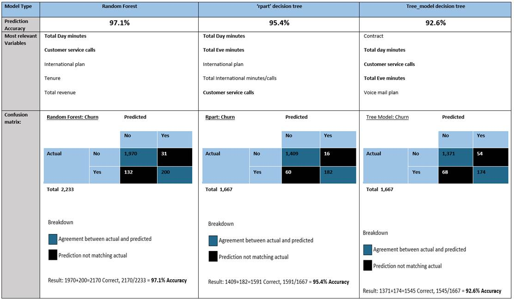

</head>

<body lang=EN-US link="#000000" vlink="#954F72" style='tab-interval:.5in'>

<b>Telco
Churn</b>

<b>Story: 14% customers
left (483 of 3,333), </b>Can we use machine learning (ML) to help inform on why they may
have churned/left and reduce future churn?<b> </b>

<b>Approach:</b>&nbsp; Use exploratory
data analysis (EDA), visualizations ML to understanding data relating to Telco
churn. Demonstrate understanding of key churn data variables and provide
prediction model for churn.

<b>Data</b> set from: <a
href="https://www.kaggle.com/pangkw/telco-churn/version/3">https://www.kaggle.com/pangkw/telco-churn/version/3</a>

Understand using ML
which data features in the Telco churn are significant to predicting churn. The
data we have is 33 features with 3,333 rows/observations, of Telco data with
churn results. The data provided has <b>14% (483)</b> of the total records that
churned so this will be somewhat of a constraint in our ML research. First to
understand the data we will use tools such as R and excel to explore. 

The dependent variable
in our exercise is the Churn value of ‘Yes’ or ‘No’, the independent variables
are the remaining data elements that may have an impact on the dependent
variable. One independent variable we can rule out is the Phone service data
element which is set to ‘Yes’ in every record, indicating it would have no
impact on the Churn since it is the same value each time. What will be of key
importance to us is will one or more independent variables show more important
than the rest.

<b>Model
results</b>

&nbsp;<!--[if gte vml 1]><v:shapetype id="_x0000_t75"
 coordsize="21600,21600" o:spt="75" o:preferrelative="t" path="m@4@5l@4@11@9@11@9@5xe"
 filled="f" stroked="f">
 <v:stroke joinstyle="miter"/>
 <v:formulas>
  <v:f eqn="if lineDrawn pixelLineWidth 0"/>
  <v:f eqn="sum @0 1 0"/>
  <v:f eqn="sum 0 0 @1"/>
  <v:f eqn="prod @2 1 2"/>
  <v:f eqn="prod @3 21600 pixelWidth"/>
  <v:f eqn="prod @3 21600 pixelHeight"/>
  <v:f eqn="sum @0 0 1"/>
  <v:f eqn="prod @6 1 2"/>
  <v:f eqn="prod @7 21600 pixelWidth"/>
  <v:f eqn="sum @8 21600 0"/>
  <v:f eqn="prod @7 21600 pixelHeight"/>
  <v:f eqn="sum @10 21600 0"/>
 </v:formulas>
 <v:path o:extrusionok="f" gradientshapeok="t" o:connecttype="rect"/>
 <o:lock v:ext="edit" aspectratio="t"/>
</v:shapetype><v:shape id="Picture_x0020_1" o:spid="_x0000_i1041" type="#_x0000_t75"
 style='width:834pt;height:487.5pt;visibility:visible;mso-wrap-style:square'>
 <v:imagedata src="README_files/image001.png" o:title=""/>
</v:shape><![endif]--><![if !vml]><![endif]>

<b>Recommendations
and usage scenarios:</b>

<b>1.</b><b>&nbsp;&nbsp;&nbsp;&nbsp;&nbsp; </b>The models
could be used on new customers to understand if they may be more likely to
churn

<b>2.</b><b>&nbsp;&nbsp;&nbsp;&nbsp;&nbsp; </b>The models
agree on many of the same data elements having significance to churn

<b>a.</b><b>&nbsp;&nbsp;&nbsp;&nbsp;&nbsp; </b>Understand
and promote those features that are significant factors to churn behavior.

<b>Follow
up and additional recommended work:</b>

1.&nbsp;&nbsp;&nbsp;&nbsp;&nbsp; Principle Component Analysis (PCA)
code is included and working

2.&nbsp;&nbsp;&nbsp;&nbsp;&nbsp; Next step of combining the PCA and
sending PCA data in the Tree based models is a next step

3.&nbsp;&nbsp;&nbsp;&nbsp;&nbsp; Logistics regression code is
included. Model was run but accuracy was so low that it is not included in the
results

a.&nbsp;&nbsp;&nbsp;&nbsp;&nbsp;&nbsp; Accuracy
could be low because of the number of independent variables in the data. 

b.&nbsp;&nbsp;&nbsp;&nbsp;&nbsp; Research
indicated that with so many independent variables the Tree based models would
be the best approach for machine learning.

<b>References:</b>

1.&nbsp;&nbsp;&nbsp;&nbsp;&nbsp;
Cirillo, A. (2017). <i>R Data Mining.</i>
Birmingham, UK. Packt Publishing

2.&nbsp;&nbsp;&nbsp;&nbsp;&nbsp;
Lantz, B. (2015). <i>Machine Learning with R - Second Edition.</i>
Birmingham, UK. Packt Publishing

3.&nbsp;&nbsp;&nbsp;&nbsp;&nbsp;
Schmuller, J. (2018). <i>R Projects For
Dummies</i>. Hoboken, NJ. John Wiley &amp; Sons Inc.

4.&nbsp;&nbsp;&nbsp;&nbsp;&nbsp;
PCA example<b> </b><a
href="https://www.analyticsvidhya.com/blog/2016/03/practical-guide-principal-component-analysis-python/"><u>https://www.analyticsvidhya.com/blog/2016/03/practical-guide-principal-component-analysis-python/</u></a>

<b>5.</b><b>&nbsp;&nbsp;&nbsp;&nbsp;&nbsp;
</b>Logistic regression sample <b>&nbsp;</b><a
href="https://www.r-bloggers.com/how-to-perform-a-logistic-regression-in-r/"><u>https://www.r-bloggers.com/how-to-perform-a-logistic-regression-in-r/</u></a>

6.&nbsp;&nbsp;&nbsp;&nbsp;&nbsp;
Tree based modeling tutorial <a
href="https://www.analyticsvidhya.com/blog/2016/04/complete-tutorial-tree-based-modeling-scratch-in-python/"><u>https://www.analyticsvidhya.com/blog/2016/04/complete-tutorial-tree-based-modeling-scratch-in-python/</u></a>&nbsp;&nbsp; --- Tree base modeling tutorial

7.&nbsp;&nbsp;&nbsp;&nbsp;&nbsp;
Titanic Tutorial for R uses cool examples and graphics for decision
trees: <a
href="https://trevorstephens.com/kaggle-titanic-tutorial/getting-started-with-r/"><u>https://trevorstephens.com/kaggle-titanic-tutorial/getting-started-with-r/</u></a>

8.&nbsp;&nbsp;&nbsp;&nbsp;&nbsp;
Example project from past practicum that I am using as a layout
reference. Please advise if this example has issues you would recommend
improvements on. 

<a
href="https://github.com/KeanuNotReeves/practicum-trad-projections"><u>https://github.com/KeanuNotReeves/practicum-trad-projections</u></a>

9.&nbsp;&nbsp;&nbsp;&nbsp;&nbsp; Basic
R example for decision tree:&nbsp; <a
href="https://rpubs.com/SANPANDE/221595"><u>https://rpubs.com/SANPANDE/221595</u></a>

10.&nbsp; My
Github for Practicum 2: <a
href="https://github.com/mdegrado/TelcoChurn"><u>https://github.com/mdegrado/TelcoChurn</u></a>&nbsp;
- In Progress

11.&nbsp; My
Gibhub for Practicum 1: <a
href="https://github.com/mdegrado/Wine-reviews-analysis-and-visualization"><u>https://github.com/mdegrado/Wine-reviews-analysis-and-visualization</u></a>

<b>Appendix</b>

<b>&nbsp;</b>

<b>

</body>

</html>
